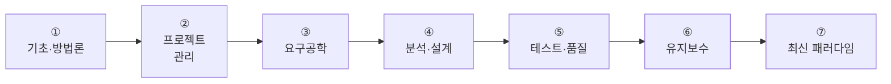
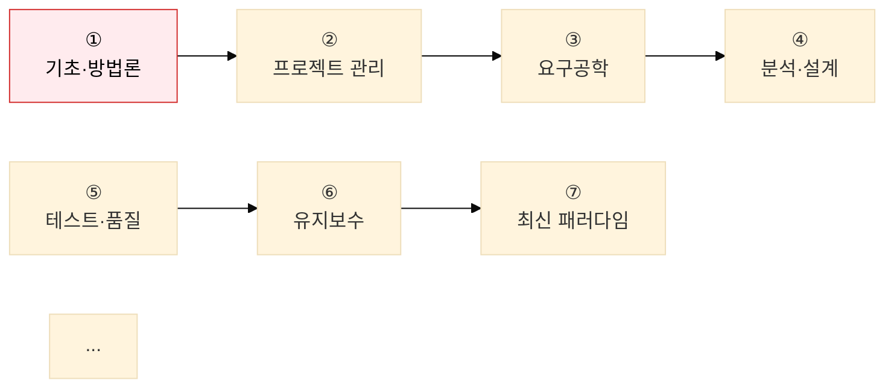
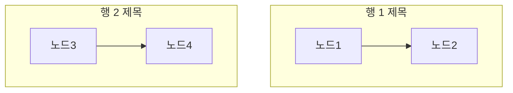

# Mermaid 2행 로드맵 렌더링 오류 수정 내역

**작성일**: 2026-05-28  
**커밋**: `ddec7bd`  
**영향 파일**: 1개

---

## 1. 오류 현상

소프트웨어공학 학습 로드맵 다이어그램이 렌더링되지 않고  
Mermaid 코드가 **텍스트 그대로** 화면에 출력됨.

```
%%{init: { 'theme': 'base', 'themeVariables': { 'edgeLabelBackground': '#fff' }}}%%
flowchart TD
    subgraph R1["1단계 — 기초에서 설계까지"]
    ...
```

발생 위치:
- `content/docs/01-software-engineering/_index.md`
- 섹션: **학습 로드맵 — 7단계 흐름**

---

## 2. 시도 이력 및 각 단계별 문제점

### 1차 시도 — 원래 단일 행 (기준선)



**결과**: 렌더링은 정상이나 7개 노드가 1줄에 나열되어 **가로 스크롤 필요, 가독성 저하**.

---

### 2차 시도 — `flowchart TD` + 서브그래프 `direction LR` + 크로스 노드 연결

```mermaid
flowchart TD
    subgraph R1["　"]
        direction LR
        A["①"] ... D["④"]
        A --> B --> C --> D
    end
    subgraph R2["　"]
        direction LR
        E["⑤"] ... G["⑦"]
        E --> F --> G
    end
    D --> E    ← 크로스 연결
```

**결과**: `D --> E` 크로스 연결이 서브그래프 내부의 `direction LR` 선언을 **무력화**.  
Mermaid 레이아웃 엔진이 전체를 `TD` 방향으로 처리하여 **세로로 7개 노드 나열**, 스크롤 문제 재발.

**원인 분석**:  
`flowchart TD` 안에서 `subgraph ... direction LR` 을 선언해도, 서브그래프 외부에서  
노드 간 크로스 엣지(`D --> E`)가 존재하면 Dagre 엔진이 TD 방향을 우선 적용함.

---

### 3차 시도 — `flowchart TD` + 서브그래프 간 연결(`R1 --> R2`)

```mermaid
flowchart TD
    subgraph R1["1단계 — 기초에서 설계까지"]
        direction LR
        A["①"] ... D["④"]
        A --> B --> C --> D
    end
    subgraph R2["2단계 — 품질에서 최신 트렌드까지"]
        direction LR
        E["⑤"] ... G["⑦"]
        E --> F --> G
    end
    R1 --> R2    ← 서브그래프 간 연결
```

**결과**: 다이어그램이 렌더링되지 않고 **Mermaid 코드 전체가 텍스트로 출력됨**.

**원인 분석**:  
Mermaid **11.x** 에서 아래 세 가지가 동시에 사용될 때 파싱 오류 발생.

| 요소 | 사용 여부 |
|---|---|
| `flowchart TD` (외부 방향) | ✅ |
| `subgraph ... direction LR` (내부 방향 재선언) | ✅ |
| `R1 --> R2` (서브그래프 간 엣지) | ✅ |

이 조합이 Mermaid 11.x 파서를 오동작시켜 전체 다이어그램을 **렌더링 불가 상태**로 만듦.  
`el.innerHTML` 이 원본 코드 그대로 유지되어 텍스트로 표시됨.

---

## 3. 최종 해결 방법

**서브그래프 완전 제거 + `flowchart LR` + 두 체인 분리 선언**



**동작 원리**:  
`flowchart LR` 에서 **연결되지 않은 두 체인**은 Dagre 레이아웃 엔진이  
자동으로 위아래로 분리 배치함. 추가 설정 없이 2행 가로 레이아웃 달성.

```
① → ② → ③ → ④      ← 행 1 (Dagre 자동 배치)
⑤ → ⑥ → ⑦          ← 행 2
```

---

## 4. 시도별 비교표

| 차수 | 방식 | 렌더링 | 레이아웃 | 채택 |
|:---:|---|:---:|---|:---:|
| 1차 | `flowchart LR` 단일 체인 7개 | ✅ | 1행 가로 — 스크롤 필요 | ❌ |
| 2차 | `flowchart TD` + subgraph + `D-->E` | ✅ | 세로 7개 — 스크롤 필요 | ❌ |
| 3차 | `flowchart TD` + subgraph + `R1-->R2` | ❌ raw text | — | ❌ |
| **최종** | `flowchart LR` + 두 체인 분리 | ✅ | **2행 가로 — 스크롤 없음** | ✅ |

---

## 5. 재발 방지 규칙

### 금지 패턴 — 3종 동시 사용 금지

```
# 금지 — Mermaid 11.x 파싱 오류 유발
flowchart TD
    subgraph R1["..."]
        direction LR   ← 내부 방향 재선언
        ...
    end
    subgraph R2["..."]
        direction LR
        ...
    end
    R1 --> R2          ← 서브그래프 간 엣지
```

| 금지 조합 | 이유 |
|---|---|
| `flowchart TD` + `direction LR` + 서브그래프 간 엣지 | Mermaid 11.x 파싱 오류 → raw text 출력 |
| `flowchart TD` + `direction LR` + 크로스 노드 엣지 | `direction LR` 무력화 → 세로 렌더링 |

### 다행 가로 레이아웃 권장 패턴

**방법 1 — 두 체인 분리 (권장)**

```mermaid
flowchart LR
    A["노드1"] B["노드2"] C["노드3"] D["노드4"]
    E["노드5"] F["노드6"] G["노드7"]
    A --> B --> C --> D
    E --> F --> G
```

Dagre 엔진이 끊긴 체인을 자동으로 위아래 2행으로 배치.

**방법 2 — subgraph 순수 시각 그룹 (연결 없음)**



서브그래프 간 엣지(`R1 --> R2`) 없이 시각적 그룹만 사용.  
→ 두 서브그래프가 나란히(LR 방향) 또는 위아래(TD 방향)로 배치될 수 있음.  
**연결 엣지를 추가하면 Mermaid 11.x에서 오류 발생하므로 절대 금지.**

---

## 6. 자동 검출 스크립트

아래 패턴(오류 유발 3종 조합)이 재발하는지 확인하는 스캔 명령어.

```bash
# flowchart TD + direction LR + 서브그래프 간 엣지 패턴 탐지
python3 - << 'EOF'
import os, re

danger = []
for root, dirs, files in os.walk("content"):
    for fn in files:
        if not fn.endswith(".md"):
            continue
        path = os.path.join(root, fn)
        with open(path, encoding="utf-8") as f:
            text = f.read()
        blocks = re.findall(r"```mermaid(.*?)```", text, re.DOTALL)
        for block in blocks:
            has_td = bool(re.search(r"flowchart\s+TD", block))
            has_dir_lr = bool(re.search(r"direction\s+LR", block))
            has_sg_edge = bool(re.search(r"\b[A-Z][A-Z0-9]*\s*--[->]", block) and
                               re.search(r"\bend\b", block))
            if has_td and has_dir_lr and has_sg_edge:
                danger.append(path)
                break

if danger:
    print("⚠️  위험 패턴 발견:")
    for p in danger:
        print(f"  {p}")
else:
    print("✅ 위험 패턴 없음")
EOF
```

출력이 `✅ 위험 패턴 없음` 이면 동일 패턴 없음.
