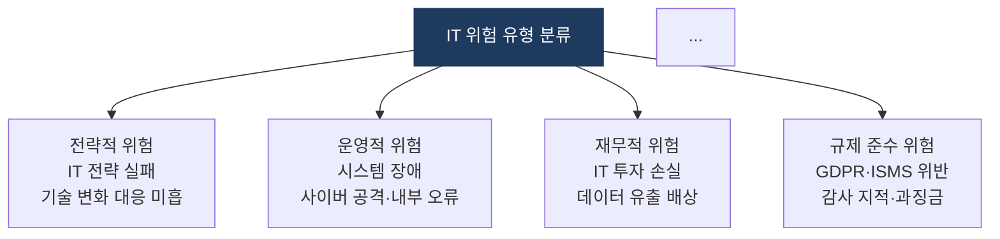
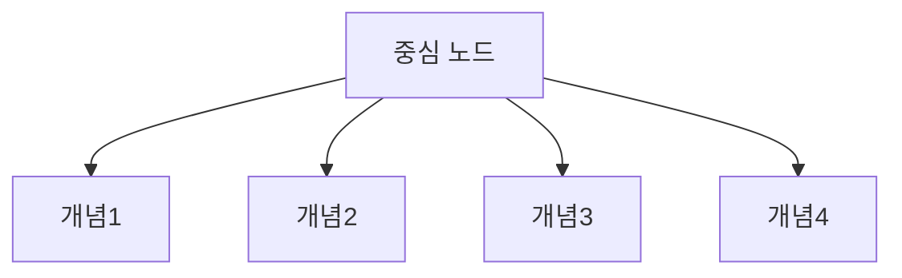
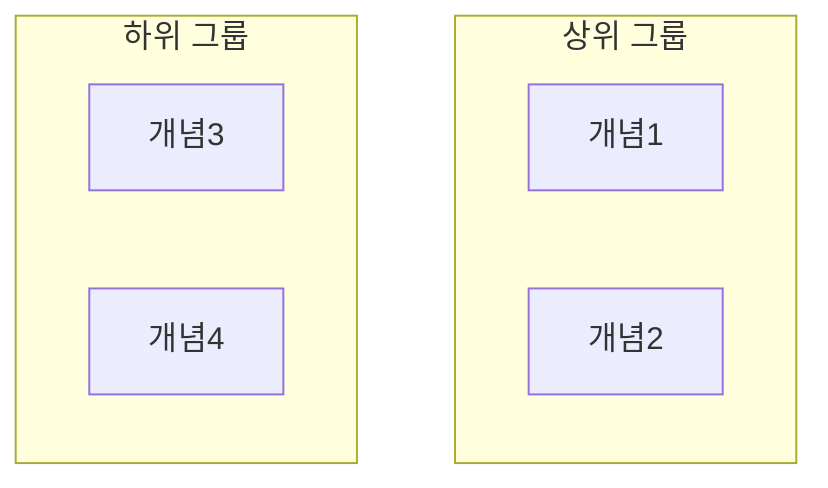

# Mermaid 문법 오류 수정 내역

**작성일**: 2026-05-25  
**커밋**: `adaca6a`  
**영향 파일**: 9개

---

## 1. 오류 현상

Hugo 사이트에서 아래 페이지에 Mermaid 다이어그램 렌더링 오류 발생.

```
Syntax error in text
mermaid version 11.15.0
```

최초 발견 위치:
- `content/docs/06-it-management/04-business-continuity/erm.md`
- 섹션: **나. IT 위험 유형 분류 및 위험 대응 전략**

---

## 2. 오류 원인

### 근본 원인

`subgraph` 블록 내에서 두 개의 노드 정의를 **같은 줄(동일 라인)**에 선언한 것이 원인.  
Mermaid **11.x** 버전에서 이 구문을 파싱 오류로 처리.

### 오류 코드 패턴

```mermaid
flowchart TD
    subgraph R1["　"]
        direction LR
        A["노드1 텍스트"] B["노드2 텍스트"]   ← 두 노드가 같은 줄 → 오류
    end
    subgraph R2["　"]
        direction LR
        C["노드3 텍스트"] D["노드4 텍스트"]   ← 동일 문제
    end
```

### 오류 발생 경위

`it-professional-content` 스킬의 **2×2 그리드 다이어그램 패턴**에서 유래.  
해당 패턴은 4개 개념을 2행 2열로 배치하기 위해 `subgraph` + 동일 줄 노드 선언을 사용했으나, Mermaid 11.x 파서가 이를 문법 오류로 간주.

```markdown
<!-- 스킬 문서상의 2×2 그리드 예시 (오류 발생) -->
flowchart TD
    subgraph R1["　"]
        direction LR
        A["개념1"] B["개념2"]   ← 동일 줄 선언이 문제
    end
```

---

## 3. 수정 방법

### erm.md — 레이아웃 전면 교체

`subgraph` 2×2 그리드를 **hub-and-spoke(허브-스포크) TD 레이아웃**으로 교체.

**수정 전**:
```mermaid
flowchart TD
    subgraph R1["　"]
        direction LR
        A["전략적 위험<br/>..."] B["운영적 위험<br/>..."]
    end
    subgraph R2["　"]
        direction LR
        C["재무적 위험<br/>..."] D["규제 준수 위험<br/>..."]
    end
    style R1 fill:none,stroke:none
    style R2 fill:none,stroke:none
    ...
```

**수정 후**:


### 나머지 8개 파일 — 노드 줄 분리

동일 줄에 선언된 두 노드를 **별도 줄로 분리**.

**수정 전**:
```
        A["노드1 텍스트"] B["노드2 텍스트"]
```

**수정 후**:
```
        A["노드1 텍스트"]
        B["노드2 텍스트"]
```

Python 스크립트로 전체 문서를 스캔하여 일괄 자동 수정 적용.

---

## 4. 수정 파일 목록

| 파일 경로 | 오류 위치 | 수정 방법 |
|---|---|---|
| `content/docs/06-it-management/04-business-continuity/erm.md` | 나. IT 위험 유형 분류 | subgraph → hub-and-spoke 교체 |
| `content/docs/03-network/05-wireless-mobile/5g-6g.md` | 가. 5G 3대 시나리오 | 동일 줄 노드 → 별도 줄 분리 |
| `content/docs/03-network/05-wireless-mobile/iot-wireless.md` | 가. 근거리 무선 통신 분류 | 동일 줄 노드 → 별도 줄 분리 |
| `content/docs/04-security/01-cryptography/symmetric-crypto.md` | 나. 주요 알고리즘 분류 | 동일 줄 노드 → 별도 줄 분리 |
| `content/docs/05-computer-architecture/04-process-thread/thread.md` | 가. 프로세스 vs 스레드 | 동일 줄 노드 → 별도 줄 분리 |
| `content/docs/05-computer-architecture/05-concurrency-deadlock/deadlock.md` | 가. 교착 상태 4대 조건 | 동일 줄 노드 → 별도 줄 분리 |
| `content/docs/05-computer-architecture/05-concurrency-deadlock/synchronization.md` | 나. 동기화 메커니즘 분류 | 동일 줄 노드 → 별도 줄 분리 |
| `content/docs/07-emerging-tech/04-metaverse-iot/metaverse-digital-twin.md` | 가. XR 기술 분류 | 동일 줄 노드 → 별도 줄 분리 |
| `content/docs/08-algorithms/01-data-structures/nonlinear-structures.md` | 나. 힙·그래프 구조 | 동일 줄 노드 → 별도 줄 분리 |

---

## 5. 재발 방지 규칙

앞으로 Mermaid 다이어그램 작성 시 아래 규칙을 추가로 준수한다.

### 금지 패턴

```
# 금지 — 동일 줄에 두 노드 정의
A["텍스트1"] B["텍스트2"]
```

### 허용 패턴

```
# 허용 — 별도 줄에 각 노드 정의
A["텍스트1"]
B["텍스트2"]
```

### 4개 개념을 2×2 배치하는 권장 대안

**방법 1 — hub-and-spoke (권장)**


**방법 2 — 순차 LR 나열**


**방법 3 — subgraph 내 노드를 별도 줄로 분리**


---

## 6. 자동 검출 스크립트

이후 동일 패턴이 재발하는지 확인하는 스캔 명령어.

```bash
grep -rn '' content/docs/ | \
  python3 -c "
import sys, re
for line in sys.stdin:
    if re.search(r'\[\"[^\"]*\"\]\s+[A-Z][A-Z0-9]*\[\"', line):
        print(line.rstrip())
"
```

출력이 없으면 동일 패턴 없음.
