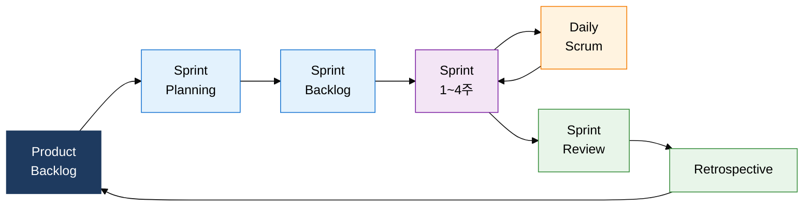
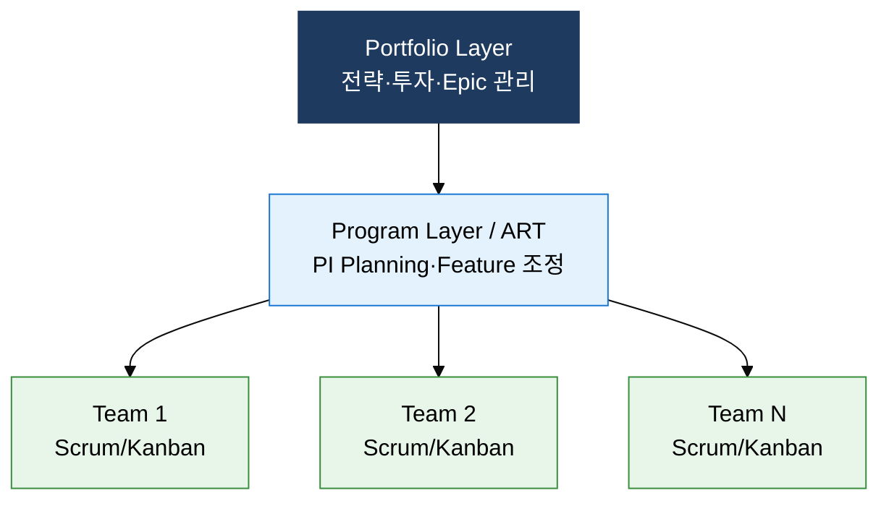

## I. 변화에 유연한 반복·협업 개발, 애자일 방법론의 개요

**정의**:  
반복적 개발 주기와 고객 협업을 핵심 메커니즘으로 변화에 유연하게 대응하며 소프트웨어 가치를 지속 전달하는 개발 방법론  
- 2001년 Agile Manifesto에서 17인의 소프트웨어 전문가가 선언한 4대 가치·12대 원칙 기반  
- Scrum·XP·Kanban·SAFe 등 다양한 프레임워크로 구현되며 팀 단위부터 기업 전체 스케일까지 적용  
- 1~4주의 Sprint(Iteration) 단위로 작동하는 소프트웨어를 반복 릴리즈하여 리스크를 조기에 가시화  

**특징**:  
( **적응적 계획** ) 고정된 요구사항 대신 변화를 환영하고 Sprint마다 우선순위를 재조정하는 유연한 계획 체계  
( **지속적 피드백** ) Sprint Review·Daily Stand-up 등 정례 이벤트를 통해 고객과 팀이 즉각 피드백을 교환  
( **작동 소프트웨어 우선** ) 포괄적 문서보다 실제 작동하는 Increment를 주기적으로 제공하여 가치를 직접 검증  

---

## II. 애자일 방법론의 핵심 구성 체계

### 가. 애자일 핵심 가치와 Scrum 프레임워크 구조

| 구분 | 항목 | 설명 |
|---|---|---|
| **역할** | Product Owner (PO) | 제품 비전 정의, Product Backlog 우선순위 결정, 비즈니스 가치 극대화 책임 |
| **역할** | Scrum Master (SM) | 애자일 원칙 수호, 장애 요인 제거, 팀이 자기조직화 할 수 있도록 코칭 |
| **역할** | Development Team | 3~9명 자기조직화 팀, Sprint Backlog 실행, Increment 완성 책임 |
| **이벤트** | Sprint Planning | Sprint 목표·범위 결정, Product Backlog에서 Sprint Backlog 항목 선정 |
| **이벤트** | Daily Stand-up | 15분 일일 동기화, 어제·오늘·장애 3가지 질문으로 진행 상황 공유 |
| **이벤트** | Sprint Review | Sprint 종료 시 Increment 시연, 이해관계자 피드백 수렴 |
| **이벤트** | Retrospective | 팀 프로세스 개선점 도출, 다음 Sprint에 반영할 Action Item 확정 |
| **산출물** | Product Backlog | 요구사항 전체 목록, User Story 형식, PO가 우선순위 관리 |
| **산출물** | Sprint Backlog | 현 Sprint에서 완료할 Task 목록, 팀이 자율 관리 |
| **산출물** | Increment | 각 Sprint 종료 시 완성된 작동 소프트웨어, DoD 충족 필수 |
| **산출물** | Burndown Chart | 남은 작업량을 시간 축으로 시각화, Sprint 진행 상황 추적 |

---

### 나. XP 실천 규정과 대규모 애자일 프레임워크 비교

| 구분 | Scrum | XP | Kanban | SAFe / LeSS |
|---|---|---|---|---|
| **적용 규모** | 소~중규모 단일 팀 | 소규모 개발팀 | 팀~서비스 단위 | 중대형 조직·엔터프라이즈 |
| **핵심 메커니즘** | Sprint 반복·역할 분리 | TDD·페어 프로그래밍·CI | WIP 제한·Pull 시스템 | PI Planning·ART·포트폴리오 계층 |
| **주요 산출물** | Product Backlog·Increment·Burndown | 테스트 코드·통합 빌드·리팩터링 결과 | Kanban Board·누적 흐름도 | PI Roadmap·Feature·Program Increment |
| **특징** | 역할·이벤트·산출물 명확히 정의, 학습 곡선 낮음 | 기술 실천 규정 강조, 코드 품질·TDD·페어 프로그래밍 | 유연한 흐름 관리, 변경에 즉각 대응, 병목 시각화 | 대규모 정렬·거버넌스 제공, LeSS는 단일 Backlog 단순화 |
| **XP 5대 가치** | — | 의사소통·단순성·피드백·용기·존중 | — | — |
| **확장 방식** | 다수 팀 조율 구조 부재 | — | — | SAFe: 3계층 / LeSS: 단일 PO 다수 팀 |

---

## III. 애자일 방법론 도입의 기대효과 및 활용 방안

| 구분 | 주요 기대효과 | 활용 및 실무 적용 방안 |
|---|---|---|
| **프로세스** | Sprint 단위 반복으로 요구사항 변경을 조기에 수용하고 납기 리스크를 주기적으로 감소 | Product Backlog 우선순위를 Sprint마다 재검토하고 Definition of Done 기준을 명문화하여 품질 기준 확보 |
| **기술** | TDD·CI·리팩터링 등 XP 실천 규정 적용으로 코드 품질과 기술 부채 관리 수준 향상 | Jenkins·GitHub Actions 기반 CI/CD 파이프라인과 SonarQube 정적 분석을 Sprint 사이클에 내재화 |
| **조직·문화** | 자기조직화 팀 운영으로 구성원 자율성·책임감·심리적 안전감 향상 및 지식 공유 활성화 | Retrospective 결과를 Action Item으로 추적하고 페어 프로그래밍·모빙 프로그래밍으로 집단 코드 소유 실현 |
| **전략·스케일** | SAFe·LeSS 적용으로 수십~수백 명 규모에서도 전략 목표와 팀 실행 간 정렬 유지 | 분기 단위 PI Planning으로 ART 전체 로드맵을 가시화하고 Portfolio Kanban으로 Epic 흐름을 전략 수준에서 관리 |
