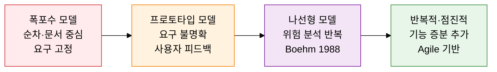
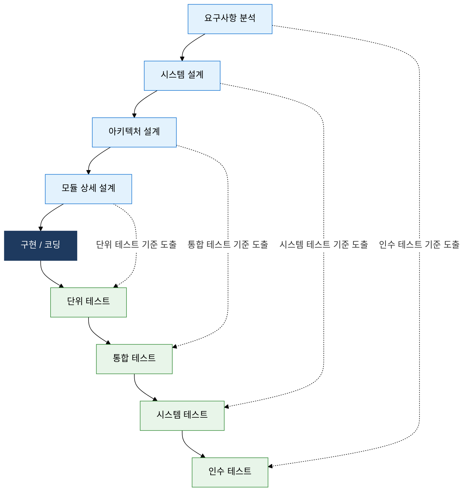

## I. 프로젝트 특성에 맞는 개발 흐름을 선택하는 전략, SDLC 모델 유형의 개요

**정의**:  
소프트웨어 개발의 전 단계(요구 → 설계 → 구현 → 테스트 → 유지보수)를 체계화한 **생명주기 모델의 유형 집합**으로, 프로젝트 특성에 맞는 흐름을 선택하여 품질과 예측 가능성을 확보하는 프레임워크  
- 요구사항 명확도·변경 빈도·리스크 수준에 따라 적합한 모델이 달라짐  
- 폭포수·프로토타입·나선형·V-모델·반복적 모델로 대표되며 각각 고유한 피드백 구조를 가짐  
- 모델 선택은 단순 기법 채택이 아니라 개발 전략 결정으로, 프로젝트 성공률에 직접 영향

**특징**:  
( **다양성** ) 단일 표준이 없으며 요구사항 안정성·팀 규모·리스크 허용도에 따라 최적 모델이 다름  
( **순차 vs 반복** ) 폭포수계는 단방향 순차 흐름, 나선형·반복적 모델은 피드백 루프 기반 점진 개발  
( **검증 내재화** ) V-모델은 각 개발 단계에 대응하는 테스트 단계를 명시적으로 정의하여 결함을 조기 탐지

## II. SDLC 모델 유형의 핵심 구성 체계

### 가. 모델 유형별 특성 및 적용 시나리오

| 모델 | 핵심 특성 | 적합한 적용 시나리오 |
|:---:|:---|:---|
| **폭포수** | 요구→설계→구현→테스트의 단방향 순차 흐름, 각 단계 완료 후 다음 진행 | 요구사항이 명확하고 변경 가능성이 낮은 정부·국방 시스템 |
| **프로토타입** | 초기 시제품을 빠르게 제작해 사용자 피드백을 반영한 후 본 개발 수행 | 요구사항이 불명확하거나 UI/UX 검증이 선행되어야 하는 신규 서비스 |
| **나선형** | 계획→위험분석→개발→평가의 4사분면 반복, 대형·고위험 프로젝트에 적합 | 리스크가 높은 대규모 시스템(항공·의료·금융 핵심 인프라) |
| **반복적·점진적** | 전체 기능을 소규모 이터레이션으로 분할하여 동작 가능한 증분을 반복 납품 | 요구사항 변경이 잦고 빠른 피드백이 필요한 웹·모바일 서비스 |

### 나. V-모델과 반복적 모델의 검증 체계 비교

| 검증 단계 | 대응 개발 단계 | 검증 유형 | 핵심 확인 항목 |
|:---:|:---|:---:|:---|
| **단위 테스트** | 모듈 상세 설계 | Verification | 개별 모듈의 로직 정확성, 경계값·예외 처리 |
| **통합 테스트** | 아키텍처 설계 | Verification | 모듈 간 인터페이스·데이터 흐름 정합성 |
| **시스템 테스트** | 시스템 설계 | Validation | 전체 시스템의 기능·성능·보안 요구 충족 여부 |
| **인수 테스트** | 요구사항 분석 | Validation | 사용자 요구사항 및 비즈니스 목표 달성 여부 |

## III. SDLC 모델 유형 도입의 기대효과 및 활용 방안

| 구분 | 주요 기대효과 | 활용 및 실무 적용 방안 |
|:---:|:---|:---|
| **리스크 관리** | 나선형 모델의 반복 위험 분석으로 고위험 요소를 조기에 식별·완화 | 프로젝트 초기 위험 목록 작성 후 매 이터레이션에서 위험도 재평가 |
| **품질 보증** | V-모델의 개발-테스트 단계 1:1 대응으로 결함 탐지 시점을 앞당김 | 각 설계 단계 완료 시 테스트 케이스를 선제적으로 작성하는 TDD 병행 |
| **요구사항 대응** | 프로토타입·반복적 모델로 요구사항 불명확성을 사용자 피드백으로 해소 | 스프린트마다 동작 가능한 증분을 시연하여 요구사항 확인·변경을 즉시 반영 |
| **프로젝트 예측성** | 폭포수 모델의 단계별 산출물 기반으로 진척도·비용을 명확히 추적 | WBS 기반 마일스톤 관리와 EVM(획득가치관리)을 결합하여 편차 조기 감지 |
