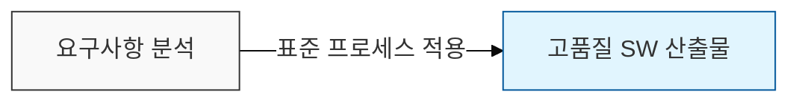
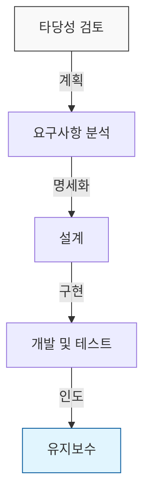

## I. 소프트웨어 품질 보증의 근간, SDLC 개요

**정의**:  
소프트웨어 기획부터 폐기까지 전 과정을 체계적으로 관리하기 위한 **프로세스 모델**의 표준 체계  

**특징**:  
( **품질 확보** ) 표준화된 단계를 거쳐 소프트웨어의 신뢰성 및 가독성 향상  
( **관리 효율** ) 단계별 산출물을 기반으로 개발 진척도 관리 및 위험 최소화  
( **의사소통** ) 사용자, 분석가, 개발자 간의 공통된 이해 기반 마련  

## II. SDLC의 상세 메커니즘 및 주요 단계

### 가. SDLC의 단계별 프로세스 메커니즘

### 나. SDLC의 주요 단계별 핵심 활동 및 산출물
| 단계 | 핵심 활동 | 주요 산출물 |
|:---:|:---|:---|
| **계획** | 타당성 조사, 프로젝트 일정 및 예산 수립 | 프로젝트 계획서, 타당성 보고서 |
| **분석** | 사용자 요구사항 수집 및 명세화 | 요구사항 정의서, Use-Case 모델 |
| **설계** | 시스템 아키텍처, UI/UX, DB 스키마 설계 | 시스템 설계서, 상세 설계서 |
| **구현** | 코딩 및 단위 테스트 실시 | 소스코드, 실행 파일 |
| **테스트** | 통합 테스트, 시스템 테스트, 인수 테스트 | 테스트 결과 보고서, 결함 보고서 |
| **유지보수** | 결함 수정 및 성능 개선, 업데이트 | 유지보수 이력서 |

## III. SDLC 모델의 유형 비교: Waterfall vs Agile

| 비교 항목 | 폭포수(Waterfall) 모델 | 애자일(Agile) 모델 |
|:---:|:---|:---|
| **관리 철학** | 계획 중심 ( **Plan-Driven** ) | 가치 중심 ( **Value-Driven** ) |
| **개발 방식** | 선형 순차적 진행 ( **Linear** ) | 반복적 점진적 개발 ( **Iterative** ) |
| **요구사항** | 초기 고정 ( **Frozen** ) | 지속적 변경 ( **Flexible** ) |
| **고객 참여** | 초기 및 최종 단계 집중 | 전체 개발 과정에 상시 참여 |
| **장점** | 구조가 단순하고 관리가 용이함 | 변화하는 시장 요구에 빠른 대응 가능 |
| **단점** | 후반부 요구 변경 시 막대한 비용 발생 | 프로젝트 관리의 복잡도 증가 우려 |

## IV. 기술사적 관점의 SDLC 전략
- 최근 복잡해지는 비즈니스 환경에 따라 단순 모델 적용보다는 **하이브리드** 방식의 도입이 증가하고 있습니다.
- "Project Tailoring"을 통해 조직의 역량과 프로젝트 특성에 맞는 최적의 SDLC 선정이 성공적인 소프트웨어 프로젝트의 **핵심 성공 요인**입니다.
