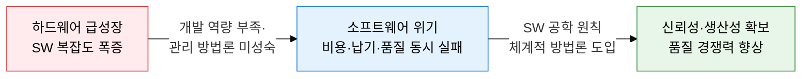
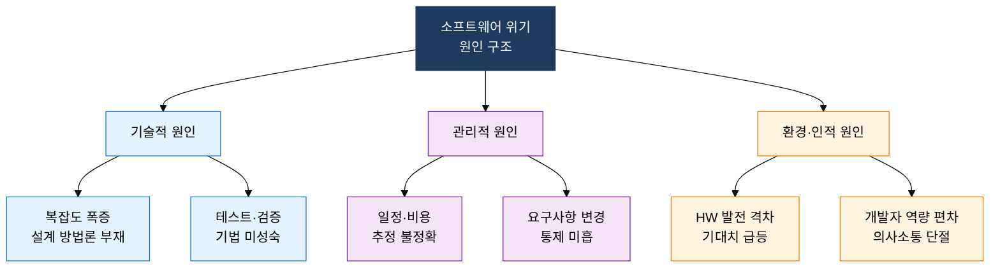
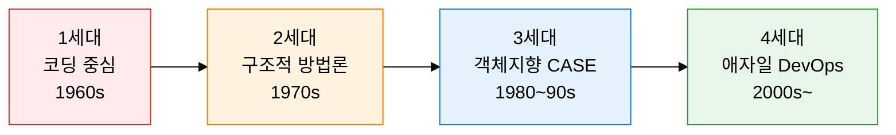

## I. 납기·비용·품질 3중 실패로 드러난 SW 개발 역량의 한계, 소프트웨어 위기의 개요

**정의**:  
1960년대 하드웨어 발전 속도에 비해 소프트웨어 개발 역량이 뒤처지면서 발생한 **비용 초과·납기 지연·품질 저하**의 구조적 문제 현상  
- 1968년 NATO 소프트웨어 공학 회의에서 공식 제기된 개념으로, 소프트웨어 공학 탄생의 직접적 계기  
- 개발 규모가 커질수록 복잡도가 기하급수적으로 증가하는 **복잡성 장벽**이 핵심 원인  
- Brooks's Law("지연된 프로젝트에 인력을 추가하면 더 늦어진다")를 탄생시킨 역사적 현상  

**특징**:  
( **가시성 결여** ) 소프트웨어는 물리적 실체가 없어 진척도·품질 측정이 어렵고 문제를 조기 발견하기 곤란  
( **복잡성 폭증** ) 기능 요구 증가에 따라 코드 복잡도가 비선형적으로 증가하여 예측·통제 불가 상황 발생  
( **반복 재현** ) 규모·도메인에 무관하게 동일 패턴의 실패가 반복되는 구조적·만성적 현상  

## II. 소프트웨어 위기의 원인 구조와 공학적 해결 체계

### 가. 소프트웨어 위기의 원인 분류 및 주요 증상

| 원인 구분 | 핵심 원인 | 주요 증상 |
|:---:|:---|:---|
| **기술적** | 설계 방법론 부재, 복잡도 관리 실패 | 코드 스파게티화, 유지보수 불가 상태 |
| **관리적** | 비현실적 일정·예산, 요구사항 미통제 | 납기 지연, 프로젝트 취소·실패 |
| **환경적** | HW 발전 격차, 사용자 기대치 급등 | SW 규모 급증, 성능 불만족 |
| **인적** | 개발자 역량 편차, 팀 간 의사소통 단절 | 결함 밀도 증가, 협업 충돌 |

### 나. 소프트웨어 공학적 극복 전략 및 방법론 진화

| 해결 전략 | 핵심 방법론 및 표준 | 기대 효과 |
|:---:|:---|:---|
| **프로세스 표준화** | SDLC, CMMI, ISO/IEC 12207 | 개발 예측 가능성 향상, 품질 기준 통일 |
| **설계 방법론 도입** | 구조적·객체지향·컴포넌트 기반 설계 | 복잡도 분해, 모듈 재사용성 향상 |
| **반복·점진적 개발** | Scrum, Kanban, XP, 린 개발 | 요구사항 변경 대응력 확보 |
| **자동화·DevOps** | CI/CD, 자동화 테스트, 코드 리뷰 | 결함 조기 탐지, 배포 주기 단축 |

## III. 소프트웨어 위기 대응의 기대효과 및 활용 방안

| 구분 | 주요 기대효과 | 활용 및 실무 적용 방안 |
|:---:|:---|:---|
| **품질 관리** | 체계적 방법론 적용으로 결함 밀도 감소 및 신뢰성 확보 | CMMI 수준 진단 후 단계적 프로세스 개선 로드맵 수립 |
| **프로젝트 관리** | WBS·EVM 기반 일정·비용 추정 정확도 향상 | Function Point 규모 산정 및 리스크 대응 계획 수립 |
| **기술 역량** | 재사용 가능한 컴포넌트·아키텍처 자산 축적 | 내부 프레임워크 표준화 및 설계 패턴 라이브러리 구축 |
| **조직 문화** | 학습하는 조직 문화 정착으로 반복 실패 방지 | 회고(Retrospective) 주기화 및 지식 관리 시스템 도입 |
