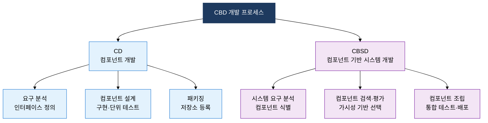

## I. 분석 패러다임의 세대 전환으로 재사용성을 극대화한, 전통적 개발 방법론의 개요

**정의**:  
소프트웨어 개발의 분석·설계 패러다임이 **프로세스 중심 → 데이터 중심 → 객체 중심 → 컴포넌트 조립** 순으로 진화해 온 방법론 체계  
- 각 세대는 이전 방법론의 한계(재사용성·변경 대응·복잡도)를 극복하는 방향으로 발전  
- 구조적·정보공학·객체지향·CBD 방법론은 현재도 도메인 특성에 따라 선택적으로 활용  
- CBD는 재사용 가능한 컴포넌트를 블랙박스·화이트박스·그레이박스로 분류하여 조립 전략을 체계화

**특징**:  
( **패러다임 연속성** ) 각 방법론은 독립적이지 않고 이전 세대의 핵심 개념을 계승하며 분석 단위만 확장  
( **도구 연계** ) DFD·ERD·UML 등 각 방법론 고유의 모델링 표기법이 설계 산출물의 정밀도를 결정  
( **재사용 극대화** ) CBD는 컴포넌트 인터페이스 명세와 가시성 분류로 조립·교체·확장을 표준화

## II. 전통적 개발 방법론의 핵심 구성 체계

### 가. 전통적 방법론의 패러다임 진화 (구조적→정보공학→OO→CBD)

| 방법론 | 핵심 분석 대상 | 대표 기법·산출물 | 특징 |
|:---:|:---|:---|:---|
| **구조적** | 프로세스(기능 흐름) | DFD, 구조도, 프로세스 명세서 | 기능 분해 중심, 데이터와 프로세스가 분리되어 유지보수 취약 |
| **정보공학** | 데이터·프로세스 동시 분석 | ISP, ERD, CRUD 매트릭스 | 엔터티와 프로세스를 통합 관리, 전사 정보 아키텍처 기반 |
| **객체지향** | 객체(데이터+행위 캡슐화) | UML 클래스·시퀀스 다이어그램 | 캡슐화·상속·다형성으로 재사용성 향상, CBD의 직접 기반 |
| **CBD** | 컴포넌트(재사용 단위) | 컴포넌트 명세서, 인터페이스 정의 | CD + CBSD 이중 구조, 블랙·화이트·그레이박스 가시성 분류 |

### 나. CBD의 핵심 개념 및 컴포넌트 가시성 분류

| 가시성 유형 | 정의 | 재사용 전략 | 장단점 |
|:---:|:---|:---|:---|
| **블랙박스** | 내부 구현을 완전히 숨기고 인터페이스만 공개 | 변경 없이 그대로 조립(As-Is 재사용) | 재사용 용이, 내부 수정 불가로 요구 불일치 시 대안 없음 |
| **화이트박스** | 소스코드까지 완전 공개, 내부 수정 허용 | 소스 수정 후 재조립(수정 재사용) | 유연한 커스터마이징, 수정 시 호환성·유지보수 부담 증가 |
| **그레이박스** | 제한적 내부 접근, 설정·파라미터 수준 수정 허용 | 파라미터·설정 조정 후 재사용 | 블랙·화이트의 절충, 실무에서 가장 빈번히 활용되는 형태 |

## III. 전통적 개발 방법론 도입의 기대효과 및 활용 방안

| 구분 | 주요 기대효과 | 활용 및 실무 적용 방안 |
|:---:|:---|:---|
| **분석 정확도** | 방법론 고유 모델링 기법으로 요구사항의 누락·모호성을 구조적으로 제거 | 정보공학 방법론의 ERD와 CRUD 매트릭스를 활용한 데이터 중심 요구 검증 수행 |
| **재사용성** | CBD 컴포넌트 저장소 구축으로 유사 프로젝트의 개발 공수를 30~50% 절감 | 블랙박스 컴포넌트 우선 선택 원칙 수립 후 그레이→화이트박스 순으로 커스터마이징 허용 |
| **유지보수성** | 객체지향 캡슐화·다형성으로 변경 영향 범위를 최소화하여 유지보수 비용 절감 | UML 클래스 다이어그램 기반 의존성 분석으로 변경 시 영향 모듈 사전 식별 및 회귀 테스트 범위 결정 |
| **전사 표준화** | 방법론 체계 도입으로 개발팀 간 산출물 형식·품질이 통일되어 조직 역량 축적 | 사내 표준 방법론 가이드라인 수립 및 PMO 주도의 방법론 준수 여부 품질 게이트 운영 |
