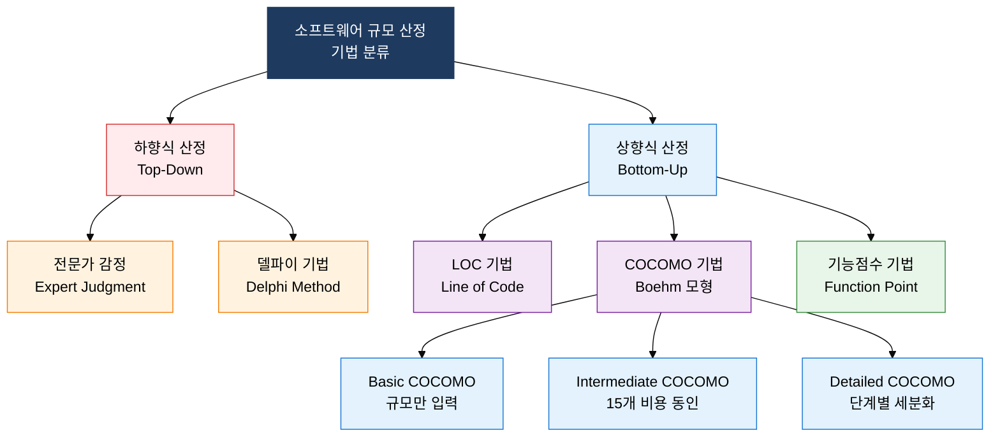
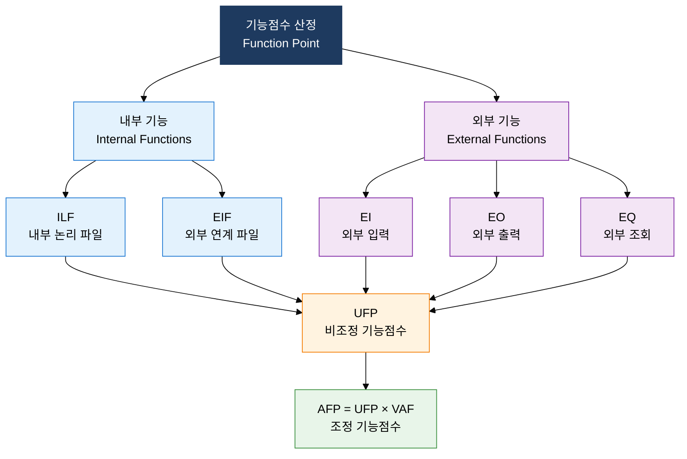

## I. 기능 기반 정량화로 개발 규모를 객관화하는 산정 체계, 소프트웨어 규모 산정의 개요

**정의**:  
하향식·상향식 접근법과 기능점수(FP) 기법을 통해 소프트웨어 개발 규모를 정량화하여 예산·일정 계획의 신뢰성을 확보하는 산정 체계  
- 전문가 감정·델파이(하향식)와 LOC·COCOMO·FP(상향식)로 산정 정확도를 단계적으로 향상  
- 기능점수(FP)는 구현 언어와 무관하게 기능 관점에서 규모를 측정하는 국제 표준 산정 방식  
- UFP(비조정 기능점수)에 VAF(가치조정인수)를 적용하여 AFP(조정 기능점수)를 산출하는 2단계 구조  

**특징**:  
( **언어 독립성** ) 기능점수 기법은 구현 기술·언어와 무관하게 사용자 기능 관점에서 규모를 측정  
( **3점 산정** ) 낙관·최빈·비관 추정치를 가중 평균하여 불확실성을 통계적으로 반영하는 PERT 기반 산정  
( **복잡도 보정** ) COCOMO 프로젝트 유형(Organic·Semi-detached·Embedded) 및 FP 복잡도 가중치로 환경 차이를 보정  

---

## II. 소프트웨어 규모 산정의 핵심 구성 체계

### 가. 규모 산정 기법 분류 (하향식 vs 상향식)

| 기법명 | 유형 | 핵심 접근법 | 장점 | 단점 |
|---|---|---|---|---|
| **전문가 감정** | 하향식 | 전문가 경험 기반 직관적 산정 | 신속, 초기 단계 적용 가능 | 주관적, 편향 발생 가능 |
| **델파이 기법** | 하향식 | 익명 전문가 반복 설문으로 합의 도달 | 집단 편향 감소, 독립적 의견 수렴 | 시간 소요, 촉진자 역량 의존 |
| **LOC 기법** | 상향식 | 낙관·최빈·비관 3점 산정 후 가중 평균 | 구체적 측정, PERT 연동 용이 | 언어·구현 방식에 따라 편차 큼 |
| **COCOMO** | 상향식 | 프로젝트 유형별 계수 적용 수식 산정 | 과거 데이터 기반 객관성 | 수식 파라미터 조직별 보정 필요 |
| **기능점수(FP)** | 상향식 | 5대 기능 유형 식별·가중치 합산 | 언어 독립, 국제 표준(IFPUG) | 요구사항 명확성 전제, 학습 비용 |

### 나. 기능점수(FP) 기법의 상세 구조

| 기능 유형 | 정의 | 단순 가중치 | 보통 가중치 | 복잡 가중치 |
|---|---|---|---|---|
| **ILF (내부 논리 파일)** | 애플리케이션이 유지 관리하는 사용자 식별 논리 데이터 그룹 | 7 | 10 | 15 |
| **EIF (외부 연계 파일)** | 타 애플리케이션이 관리하고 본 앱에서 참조하는 논리 데이터 그룹 | 5 | 7 | 10 |
| **EI (외부 입력)** | 외부에서 데이터를 수신하여 ILF를 변경하는 기본 프로세스 | 3 | 4 | 6 |
| **EO (외부 출력)** | 데이터·파생 정보를 외부로 전송하는 기본 프로세스 (계산 포함) | 4 | 5 | 7 |
| **EQ (외부 조회)** | 데이터를 조회하여 반환하나 ILF 변경 없는 기본 프로세스 | 3 | 4 | 6 |

> **AFP 산정 공식**: AFP = UFP × VAF (VAF = 0.65 + 0.01 × Σ14개 일반 시스템 특성 점수)

---

## III. 소프트웨어 규모 산정 도입의 기대효과 및 활용 방안

| 구분 | 주요 기대효과 | 활용 및 실무 적용 방안 |
|---|---|---|
| **전략적** | 기능 기반 객관적 규모 산정으로 발주자·수주자 간 계약 분쟁 예방 및 신뢰 확보 | SW 사업 대가 산정 가이드(과기정통부) 기준 FP 기반 단가 계약 적용 |
| **운영적** | 3점 산정·COCOMO 모형으로 프로젝트 예산·일정 계획의 통계적 신뢰구간 확보 | 델파이 기법으로 전문가 합의 도출 후 LOC/FP로 상호 검증하는 이중 산정 체계 운영 |
| **기술적** | COCOMO 비용 동인 분석을 통해 프로젝트 리스크 요인 사전 식별 및 대응 계획 수립 | Basic → Intermediate → Detailed COCOMO 단계적 정밀화로 설계 진행에 따른 산정 갱신 |
| **조직적** | 완료 프로젝트 FP·실제 공수 데이터 축적으로 조직 고유 생산성 지표(FP/MM) 수립 | 프로젝트 이력 DB 구축, 신규 프로젝트 산정 시 유사 프로젝트 FP 데이터 참조 활용 |
