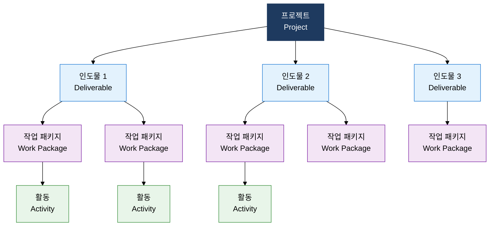
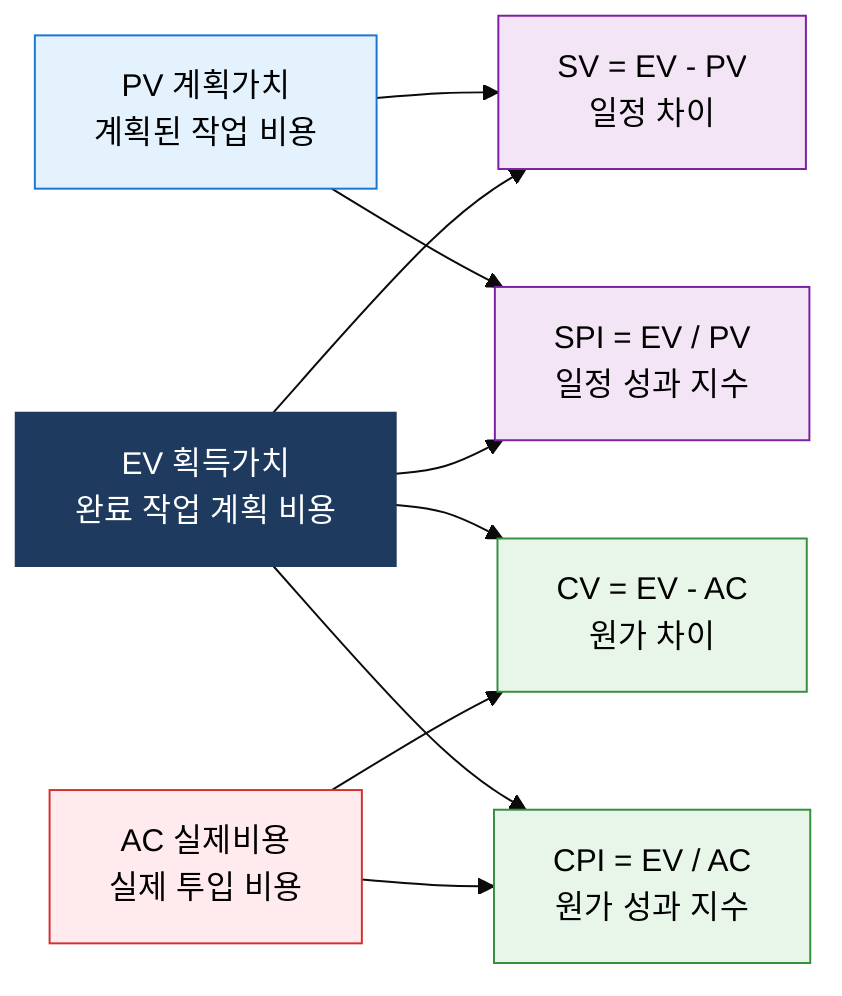

## I. 한시적 목표를 3대 제약 균형으로 달성하는 관리 체계, 프로젝트 관리의 개요

**정의**:  
PMBOK 7th의 12대 원칙과 8대 성과 영역을 적용하여 한시적·유일한 산출물 목표를 달성하는 프로젝트 관리 체계  
- 프로젝트는 종료 시점이 명확한 한시적 노력이며, 반복 운영(Operations)과 본질적으로 구분됨  
- 범위(Scope)·일정(Schedule)·원가(Cost) 3대 제약은 상호 연동되어 하나의 변경이 나머지에 영향을 미침  
- PMBOK 7th는 프로세스 중심에서 원칙 및 성과 영역 중심으로 전환하여 애자일 환경까지 포괄함  

**특징**:  
( **한시성** ) 명확한 시작·종료 시점을 가지며 운영과 달리 반복되지 않는 고유한 노력  
( **통합 제약 관리** ) 범위·일정·원가의 상호 트레이드오프를 균형 있게 조율하는 3중 제약 원칙  
( **성과 중심 전환** ) PMBOK 7th는 투입·프로세스 대신 비즈니스 가치 실현을 최종 성공 기준으로 정의  

---

## II. 프로젝트 관리의 핵심 구성 체계

### 가. PMBOK 7th 원칙과 3대 제약조건 관리

| 제약 영역 | 핵심 기법 | 주요 산출물 |
|---|---|---|
| **범위(Scope)** | WBS 100% 규칙, Scope Creep 방지, 요구사항 추적 매트릭스 | WBS 사전, 범위 기준선, 요구사항 문서 |
| **일정(Schedule)** | CPM(주공정 산출), PERT 3점 산정, CCM(주공정 사슬), 자원 레벨링 | 일정 기준선, 네트워크 다이어그램, 마일스톤 목록 |
| **원가(Cost)** | EVM(획득가치관리), 상향식 산정, 예비비 분석(CV·SV·CPI·SPI) | 원가 기준선, 예산 현황 보고서, EAC 예측치 |

### 나. EVM(획득가치관리) 지표 및 분석 체계

| 지표명 | 공식 | 양수/1 이상의 의미 | 음수/1 미만의 의미 | 활용 방안 |
|---|---|---|---|---|
| **CV (원가 차이)** | EV - AC | 예산 절감 (비용 효율) | 예산 초과 (원가 위기) | 즉시 원가 증가 원인 분석 및 시정 조치 |
| **SV (일정 차이)** | EV - PV | 일정 선행 (진도 양호) | 일정 지연 (납기 위험) | 자원 재배치 또는 일정 압축 기법 적용 |
| **CPI (원가 성과 지수)** | EV / AC | 1원 투입 시 1원 이상 성과 | 1원 투입 시 1원 미만 성과 | EAC 예측 및 잔여 예산 통제 기준 |
| **SPI (일정 성과 지수)** | EV / PV | 계획 대비 일정 선행 | 계획 대비 일정 지연 | 주공정 활동 집중 관리 및 Fast-tracking 적용 |
| **EAC (완료 시 예상 비용)** | BAC / CPI | 예산 내 완료 예상 | 예산 초과 완료 예상 | 상위 보고 및 예산 재승인 요청 기준 |

---

## III. 프로젝트 관리 도입의 기대효과 및 활용 방안

| 구분 | 주요 기대효과 | 활용 및 실무 적용 방안 |
|---|---|---|
| **전략적** | 비즈니스 목표와 프로젝트 산출물의 정렬을 통해 투자 대비 가치 실현 극대화 | PMBOK 7th 성과 영역 기반 프로젝트 헌장 수립, 이해관계자 참여 전략 수립 |
| **운영적** | WBS·CPM·EVM 통합으로 범위·일정·원가 3대 제약을 실시간 가시화 및 통제 | 주간 EVM 보고 체계 구축, CPI·SPI 임계치(0.9 미만) 기준 조기 경보 시스템 운영 |
| **기술적** | Scope Creep 방지와 WBS 100% 규칙 적용으로 요구사항 누락·변경 리스크 감소 | 요구사항 추적 매트릭스(RTM) 유지, 변경 통제 위원회(CCB) 운영으로 범위 기준선 보호 |
| **조직적** | 프로젝트 종료 후 교훈 학습(Lessons Learned) 축적으로 조직 역량 지속 성장 | PMO 중심 프로젝트 수행 데이터 통합 관리, PMIS 도구 기반 성과 지표 이력 관리 |
