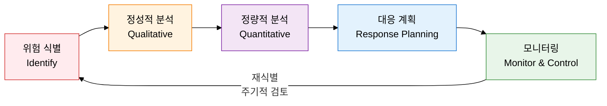
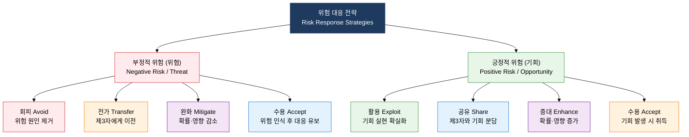

## I. 확률-영향 분석으로 불확실성을 선제 통제하는 관리 체계, 위험 관리의 개요

**정의**:  
위험 식별·정성적·정량적 분석·대응 계획·모니터링의 5단계 프로세스로 프로젝트 불확실성을 체계적으로 통제하는 관리 체계  
- 정성적 분석은 확률-영향 매트릭스로 위험을 우선순위화하고, 정량적 분석은 EMV·몬테카를로로 수치화  
- 부정적 위험(위협)과 긍정적 위험(기회) 각각 4가지 대응 전략을 구분하여 적용  
- 대응 조치 후 잔여위험(Residual Risk)과 대응으로 새로 발생하는 2차위험(Secondary Risk)을 별도 관리  

**특징**:  
( **이중 관점** ) 위험을 위협(부정적)과 기회(긍정적)로 구분하여 회피뿐 아니라 기회 극대화 전략도 병행  
( **정량적 수치화** ) EMV와 몬테카를로 시뮬레이션으로 위험의 재무적 영향을 수치로 표현하여 의사결정 근거 확보  
( **잔여·2차 위험** ) 대응 후에도 남는 잔여위험과 대응으로 생기는 2차위험까지 추적 관리하는 완전성 원칙 적용  

---

## II. 위험 관리의 핵심 구성 체계

### 가. 위험 관리 프로세스 및 분석 체계

| 분석 유형 | 사용 기법 | 출력물 | 적용 시점 |
|---|---|---|---|
| **정성적 분석** | 확률-영향 매트릭스(P-I Matrix), 위험 분류, RBS(위험 분류 체계) | 우선순위화 위험 목록, 고위험 식별 | 위험 식별 직후, 자원 할당 전 |
| **정량적 분석** | EMV(기대화폐가치), 민감도 분석(토네이도 차트), 몬테카를로 시뮬레이션 | 수치화된 위험 영향, 확률 분포, P80 예비비 산정 | 고위험 항목 대상, 예산·일정 확정 전 |
| **대응 계획** | 회피·전가·완화·수용(위협), 활용·공유·증대·수용(기회) | 위험 대응 계획, 위험 오너 지정 | 정성적·정량적 분석 완료 후 |
| **모니터링** | 위험 감사, 편차 및 추세 분석, 예비비 분석 | 위험 현황 보고서, 잔여위험 목록, 2차위험 식별 | 프로젝트 실행 전 기간 주기적 수행 |

### 나. 위험 대응 전략 분류 체계

| 전략명 | 구분 | 정의 | 실무 예시 | 비용 수준 |
|---|---|---|---|---|
| **회피 (Avoid)** | 위협 | 위험 원인 자체를 제거하거나 프로젝트 계획 변경 | 검증 안 된 신기술 → 검증된 기술 스택으로 교체 | 높음 |
| **전가 (Transfer)** | 위협 | 위험의 재무적 결과를 제3자에게 이전 | 보험 가입, 고정가 계약, 하도급 계약 | 중간 (보험료) |
| **완화 (Mitigate)** | 위협 | 위험 발생 확률 또는 영향을 허용 수준으로 감소 | 프로토타입 개발, 테스트 강화, 병렬 작업 | 중간 |
| **수용 (Accept)** | 위협 | 위험을 인식하고 발생 시 대응하거나 예비비 확보 | 예비 일정·예산 확보, 비상 계획(Contingency Plan) 수립 | 낮음 |
| **활용 (Exploit)** | 기회 | 기회가 반드시 실현되도록 불확실성 제거 | 최고 역량 인력 투입으로 조기 완료 기회 확실화 | 높음 |
| **공유 (Share)** | 기회 | 기회 포착에 더 적합한 제3자와 공동 추진 | 전문 파트너와 컨소시엄 구성, 조인트벤처 | 중간 |
| **증대 (Enhance)** | 기회 | 기회 발생 확률 또는 긍정적 영향을 증가 | 핵심 자원 조기 확보, 전략적 투자로 기회 확대 | 중간 |
| **수용 (Accept)** | 기회 | 기회를 적극 추구하지 않고 발생 시 취득 | 기회 발생 모니터링, 별도 자원 투입 없이 대기 | 낮음 |

---

## III. 위험 관리 도입의 기대효과 및 활용 방안

| 구분 | 주요 기대효과 | 활용 및 실무 적용 방안 |
|---|---|---|
| **전략적** | 확률-영향 분석 기반 위험 우선순위화로 제한된 자원을 고위험 영역에 집중 배분 | P-I 매트릭스 분기별 갱신, 임원 보고용 Top 5 위험 현황판 운영 |
| **운영적** | EMV·몬테카를로 시뮬레이션으로 예비비(Contingency Reserve) 규모를 통계적으로 산정 | P80 시뮬레이션 기준 예비비 책정, 위험 소멸 시 예비비 단계적 해제 절차 적용 |
| **기술적** | 잔여위험 및 2차위험 추적 관리로 대응 조치 후 새롭게 생기는 위험 사각지대 제거 | 위험 등록부(Risk Register)에 잔여위험·2차위험 필드 추가, 위험 오너 책임 할당 |
| **조직적** | 위험 식별·대응 이력 데이터 축적으로 유사 프로젝트의 선제적 위험 관리 역량 강화 | 완료 프로젝트 위험 교훈(Lessons Learned) DB화, 위험 체크리스트(RBS) 조직 표준화 |
