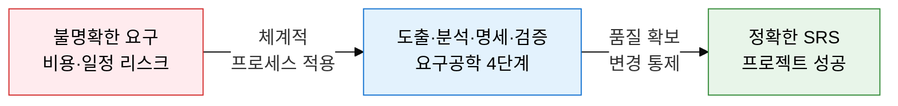
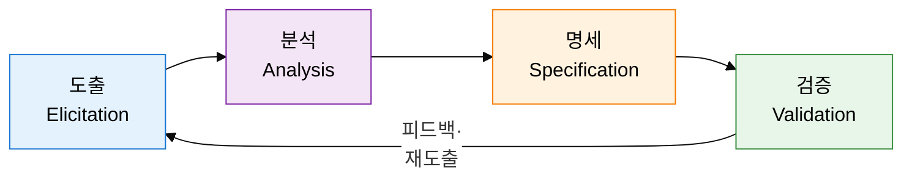
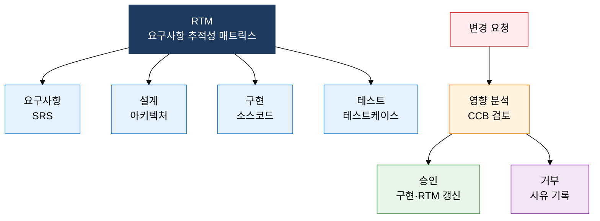

## I. 요구사항을 명세·검증으로 완성하는, 요구공학의 개요

**정의**:  
이해관계자의 요구를 체계적으로 도출·분석·명세·검증하여 SRS를 산출하는 소프트웨어 공학 프로세스  
- 기능적·비기능적 요구사항을 모두 포괄하며 전체 SDLC의 품질 기반을 형성  
- 추적성 매트릭스(RTM)로 요구사항과 설계·구현·테스트를 연결 관리  
- 변경통제위원회(CCB)를 통해 요구사항 변경의 영향을 분석하고 통제  

**특징**:  
( **체계성** ) 도출→분석→명세→검증의 반복 사이클로 요구사항 완전성 보장  
( **추적성** ) RTM으로 요구사항과 산출물 간 양방향 추적 가능  
( **검증성** ) 인스펙션·워크스루·동료검토로 SRS의 정확성과 일관성 확인  

---

## II. 요구공학의 핵심 구성 체계

### 가. 요구공학 4단계 프로세스 및 도출 기법

| 도출 기법 | 특징 | 적합한 상황 | 주요 산출물 |
|---|---|---|---|
| **인터뷰** | 이해관계자와 1:1 심층 대화 | 핵심 이해관계자 의견 수렴 | 인터뷰 기록, 요구 목록 |
| **설문** | 다수 사용자 의견 정량 수집 | 광범위한 사용자 분포 | 통계 분석 보고서 |
| **워크숍** | 이해관계자 집단 토론 | 상충 요구 조율 필요 시 | 합의된 요구 목록 |
| **브레인스토밍** | 자유로운 아이디어 발산 | 창의적 기능 발굴 | 아이디어 목록 |
| **프로토타이핑** | UI/UX 시제품으로 확인 | 요구가 불명확할 때 | 프로토타입, 피드백 |
| **페르소나** | 가상 사용자 유형 정의 | 사용자 중심 설계 | 페르소나 프로파일 |
| **민족지학** | 현장 관찰·업무 분석 | 암묵적 업무 프로세스 파악 | 업무 흐름 기술서 |

---

### 나. 요구사항 추적성 및 변경 관리 체계

| 검토 기법 | 형식성 | 참여자 | 준비물 | 비용 |
|---|---|---|---|---|
| **인스펙션** | 매우 높음 (공식 절차) | 작성자·진행자·검토자·기록자 | 체크리스트, SRS 전문 | 높음 |
| **워크스루** | 중간 (발표 형식) | 작성자·동료·관리자 | SRS 초안 | 중간 |
| **동료검토** | 낮음 (비공식) | 작성자·1~2인 동료 | SRS 초안 | 낮음 |

---

## III. 요구공학 도입의 기대효과 및 활용 방안

| 구분 | 주요 기대효과 | 활용 및 실무 적용 방안 |
|---|---|---|
| **품질** | SRS 완결성·일관성·검증가능성 확보로 결함 조기 제거 | 인스펙션 체크리스트로 SRS 품질 항목별 검증 후 서명 |
| **추적성** | RTM으로 요구사항↔설계↔코드↔테스트 전 구간 연결 | 요구사항 ID 부여 후 JIRA/Confluence와 연동 관리 |
| **변경 통제** | CCB 승인 프로세스로 무분별한 범위 확장(Scope Creep) 방지 | 변경 요청서 양식 표준화 및 영향 분석 보고 의무화 |
| **리스크** | 초기 요구 오류 발견으로 후기 수정 비용 절감 | 프로토타이핑·페르소나 기법으로 잠재 Gap 사전 식별 |
