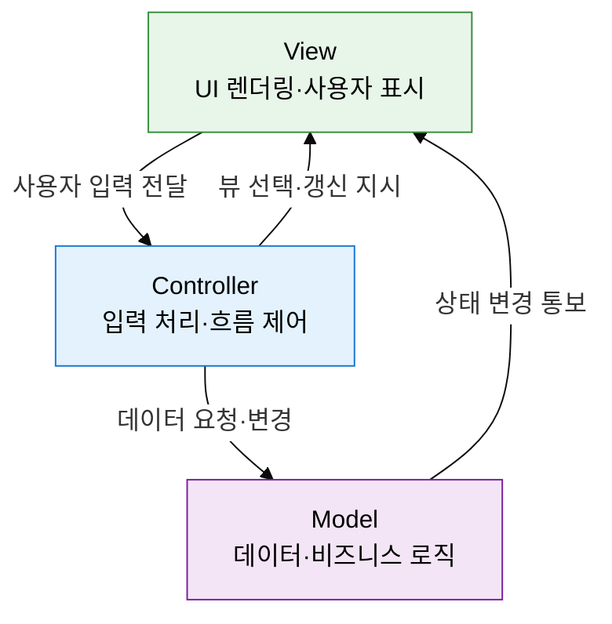
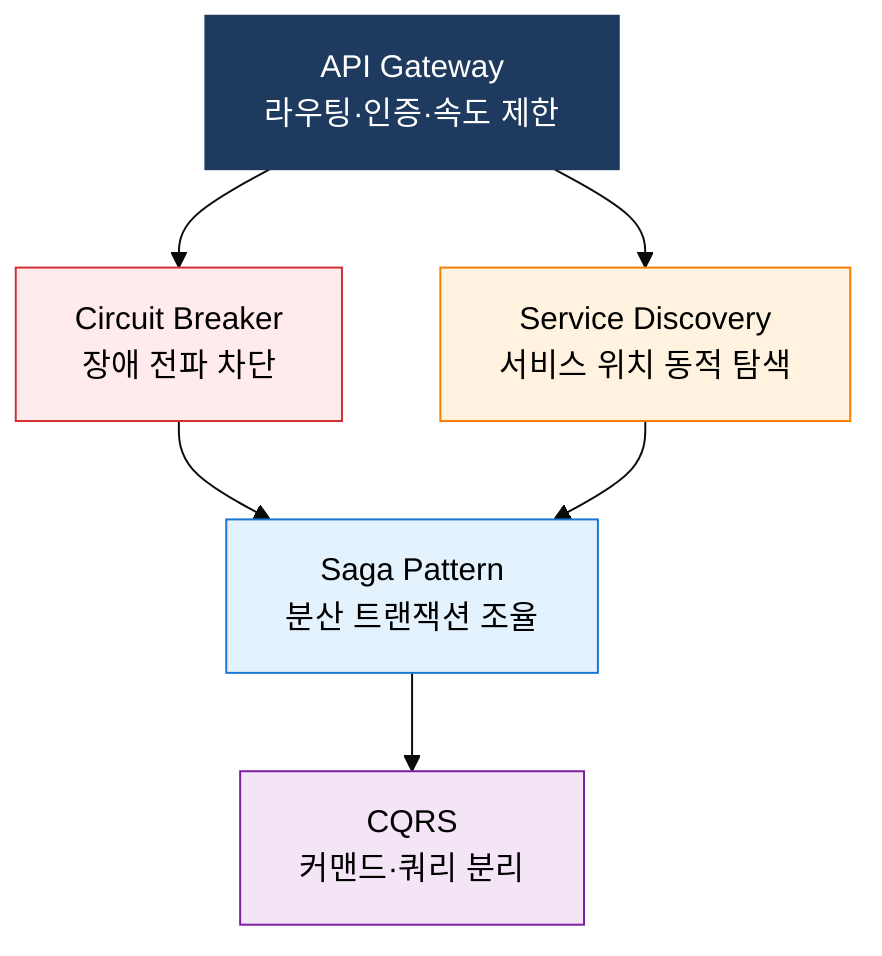

## I. 시스템 구조를 전략적으로 설계하는 틀, 아키텍처 스타일 및 패턴의 개요

**정의**:  
반복적으로 검증된 구조적 설계 해법을 체계화하여 소프트웨어 품질 속성을 달성하는 설계 전략  
- 시스템 전체의 구성 요소 배치·책임 분리·통신 방식을 규정하는 상위 설계 결정  
- 유지보수성·확장성·테스트 용이성 등 품질 속성에 직접 영향을 미치는 핵심 산출물  
- 요구사항 분석 이후 상세 설계 이전 단계에서 선택하며, 이후 변경 비용이 매우 높음  

**특징**:  
( **관심사 분리** ) 각 계층·컴포넌트가 단일 책임을 가져 변경 영향을 국소화  
( **재사용성** ) 검증된 패턴을 반복 적용하여 설계 시간과 결함을 줄임  
( **품질 트레이드오프** ) 패턴마다 성능·복잡도·개발 속도 간 트레이드오프가 존재  

---

## II. 아키텍처 스타일 및 패턴의 핵심 구성 체계

### 가. 전통 아키텍처 패턴 (Layered, MVC, MVVM)

| 패턴명 | 구성 요소 | 핵심 원칙 | 적용 프레임워크 | 장단점 |
|---|---|---|---|---|
| **Layered** | Presentation / Business Logic / Data Access / DB | 계층 간 단방향 의존, 관심사 분리 | Spring MVC, .NET, Django | 장: 명확한 역할 분리 / 단: 계층 간 호출 오버헤드 |
| **MVC** | Model / View / Controller | Model과 View의 분리, Controller 중재 | Spring MVC, Rails, ASP.NET | 장: 역할 명확, 테스트 용이 / 단: Controller 비대화 위험 |
| **MVVM** | Model / View / ViewModel | 양방향 데이터 바인딩, ViewModel이 상태 관리 | React(+Redux), Vue, Angular | 장: 선언형 UI, 테스트 용이 / 단: 바인딩 디버깅 복잡 |
| **Pipe-Filter** | Source / Filter / Pipe / Sink | 독립 필터 체인, 데이터 변환 스트림 | Unix 파이프, ETL, 컴파일러 | 장: 필터 재조합 용이 / 단: 공유 상태 처리 어려움 |
| **Client-Server** | Client / Server / Network | 요청-응답, 서버 중앙 집중 | Web, REST API, gRPC | 장: 중앙 관리 용이 / 단: 서버 단일 장애점 위험 |

---

### 나. MSA 핵심 개념 및 모놀리식과의 비교

| 비교 항목 | 모놀리식 | MSA |
|---|---|---|
| **배포 단위** | 전체 애플리케이션 단일 배포 | 서비스별 독립 배포 |
| **기술 스택** | 단일 언어·프레임워크 강제 | 서비스별 최적 기술 선택 가능 |
| **확장성** | 전체 수평 확장 (비효율) | 병목 서비스만 선택적 확장 |
| **데이터 관리** | 단일 공유 DB | 서비스별 독립 DB (Eventually Consistent) |
| **장애 격리** | 하나의 버그가 전체 다운 위험 | Circuit Breaker로 장애 전파 차단 |
| **적합 시나리오** | 소규모 팀, 초기 스타트업, 단순 도메인 | 대규모 팀, 고가용성 요구, 빠른 배포 주기 |

---

## III. 아키텍처 스타일 및 패턴 도입의 기대효과 및 활용 방안

| 구분 | 주요 기대효과 | 활용 및 실무 적용 방안 |
|---|---|---|
| **유지보수성** | 계층·컴포넌트 분리로 변경 영향 범위 최소화, 코드 가독성 향상 | Layered 패턴 적용 후 각 계층 단위 테스트 작성, SonarQube로 의존성 위반 탐지 |
| **확장성** | MSA 도입으로 트래픽 급증 서비스만 선택적 스케일아웃 가능 | Kubernetes HPA로 서비스별 오토스케일링 구성, API Gateway 도입으로 트래픽 제어 |
| **팀 생산성** | 서비스 경계 명확화로 팀 간 독립 개발·배포 사이클 확보 | 도메인 기반 팀 구조 (Conway의 법칙 활용), 서비스별 CI/CD 파이프라인 구성 |
| **장애 복원력** | Circuit Breaker·Saga 패턴으로 분산 환경 장애 전파 차단 | Resilience4j·Hystrix 라이브러리 도입, Chaos Engineering으로 장애 시나리오 검증 |
