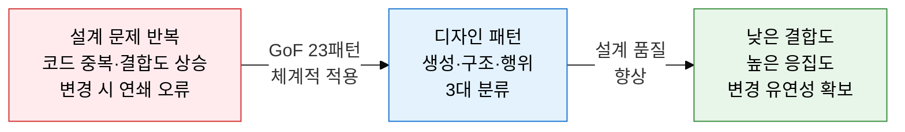
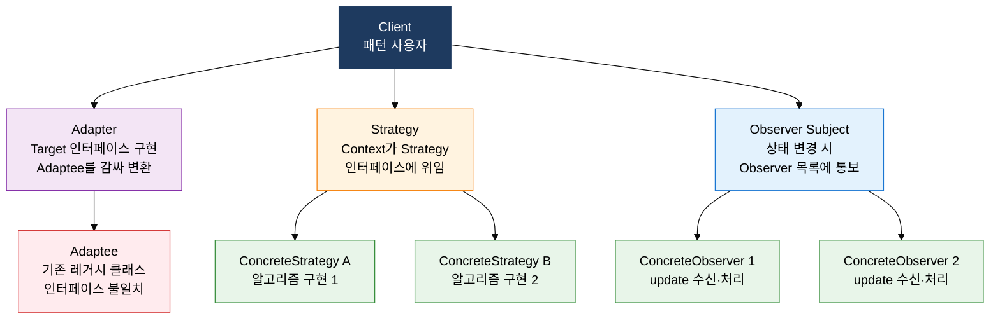

## I. 반복 문제에 대한 검증된 설계 해법, 디자인 패턴의 개요

**정의**:  
Erich Gamma 외 3인(GoF)이 반복 출현하는 설계 문제에 대한 23가지 재사용 가능한 해법을 체계화한 설계 언어  
- 생성(Creational) 5개, 구조(Structural) 7개, 행위(Behavioral) 11개로 분류  
- 구체적 코드가 아닌 클래스·객체 간 관계·역할·협력 방식을 기술하는 추상 설계 청사진  
- 설계자 간 공통 어휘를 제공하여 의사소통 비용을 절감하고 코드 리뷰 효율을 향상  

**특징**:  
( **재사용성** ) 검증된 해법을 반복 적용하여 설계 오류와 개발 시간을 줄임  
( **유연성** ) 인터페이스 기반 설계로 구현체 교체 없이 동작 변경 가능  
( **의사소통** ) "Observer 패턴 적용"처럼 패턴명으로 복잡한 설계를 즉시 공유  

---

## II. 디자인 패턴의 핵심 구성 체계

### 가. GoF 패턴 3대 분류 체계

```mermaid
%%{init: { 'theme': 'base', 'themeVariables': { 'edgeLabelBackground': '#fff' }}}%%
flowchart TD
    ROOT["GoF 23 디자인 패턴"]

    ROOT --> CR["생성 패턴<br/>Creational 5개"]
    ROOT --> ST["구조 패턴<br/>Structural 7개"]
    ROOT --> BH["행위 패턴<br/>Behavioral 11개"]

    CR --> C1["Singleton<br/>유일 인스턴스"]
    CR --> C2["Factory Method<br/>생성 위임"]
    CR --> C3["Abstract Factory<br/>관련 객체군 생성"]
    CR --> C4["Builder<br/>단계별 복잡 객체"]
    CR --> C5["Prototype<br/>복제"]

    ST --> S1["Adapter<br/>인터페이스 변환"]
    ST --> S2["Proxy<br/>대리자"]
    ST --> S3["Decorator<br/>동적 기능 추가"]
    ST --> S4["Facade<br/>단순화 인터페이스"]

    BH --> B1["Observer<br/>이벤트 통지"]
    BH --> B2["Strategy<br/>알고리즘 교체"]
    BH --> B3["Template Method<br/>알고리즘 골격"]
    BH --> B4["State<br/>상태 전이"]

    style ROOT fill:#1E3A5F,stroke:#1E3A5F,color:#fff
    style CR fill:#E3F2FD,stroke:#1976D2,color:#000
    style ST fill:#F3E5F5,stroke:#7B1FA2,color:#000
    style BH fill:#FFF3E0,stroke:#F57C00,color:#000
    style C1 fill:#E3F2FD,stroke:#1976D2,color:#000
    style C2 fill:#E3F2FD,stroke:#1976D2,color:#000
    style C3 fill:#E3F2FD,stroke:#1976D2,color:#000
    style C4 fill:#E3F2FD,stroke:#1976D2,color:#000
    style C5 fill:#E3F2FD,stroke:#1976D2,color:#000
    style S1 fill:#F3E5F5,stroke:#7B1FA2,color:#000
    style S2 fill:#F3E5F5,stroke:#7B1FA2,color:#000
    style S3 fill:#F3E5F5,stroke:#7B1FA2,color:#000
    style S4 fill:#F3E5F5,stroke:#7B1FA2,color:#000
    style B1 fill:#FFF3E0,stroke:#F57C00,color:#000
    style B2 fill:#FFF3E0,stroke:#F57C00,color:#000
    style B3 fill:#FFF3E0,stroke:#F57C00,color:#000
    style B4 fill:#FFF3E0,stroke:#F57C00,color:#000
```

| 패턴명 | 목적 | 적용 상황 | 핵심 구조 |
|---|---|---|---|
| **Singleton** | 클래스 인스턴스를 오직 하나만 생성 보장 | DB 연결 풀, 로그 관리자, 설정 객체 | private 생성자 + static 인스턴스 반환 메서드 |
| **Factory Method** | 객체 생성 책임을 서브클래스로 위임 | 제품 종류가 런타임에 결정될 때 | Creator 추상 클래스 + ConcreteCreator 서브클래스 |
| **Abstract Factory** | 관련 객체군을 일관성 있게 생성 | UI 테마 세트, 플랫폼별 위젯 생성 | AbstractFactory 인터페이스 + 구체 팩토리 구현 |
| **Builder** | 복잡한 객체를 단계별로 조립 | 생성자 매개변수 다수, 선택적 필드 많을 때 | Director + Builder 인터페이스 + ConcreteBuilder |
| **Prototype** | 기존 객체를 복제하여 새 객체 생성 | 초기화 비용이 크고 유사 객체 반복 생성 시 | clone() 메서드, 깊은 복사(Deep Copy) 구현 |

---

### 나. 핵심 구조·행위 패턴 상세

| 패턴명 | 문제 해결 | 핵심 구조 | 활용 예시 | 시험 포인트 |
|---|---|---|---|---|
| **Adapter** | 인터페이스 불일치로 협력 불가 | Target 인터페이스 ← Adapter(Adaptee 위임) | 레거시 라이브러리 통합, JDBC 드라이버 | 클래스 어댑터(상속) vs 객체 어댑터(위임) 차이 |
| **Proxy** | 원본 객체 접근 제어·지연 로딩 필요 | Client → Proxy(Subject 구현) → RealSubject | 이미지 지연 로딩, 접근 권한 제어, 캐싱 | Virtual·Remote·Protection Proxy 3종 구분 |
| **Decorator** | 상속 없이 런타임에 기능 동적 추가 | Component 인터페이스 + Decorator 래핑 체인 | Java InputStream 체인, UI 위젯 꾸미기 | 상속과 달리 조합으로 기능 확장, 다중 중첩 가능 |
| **Observer** | 1:N 상태 변경 통보, 느슨한 결합 | Subject(attach/notify) + Observer(update) | 이벤트 리스너, MVC의 Model→View 갱신 | Pull 방식 vs Push 방식 통보 전략 차이 |
| **Strategy** | 알고리즘을 런타임에 교체 가능하도록 | Context + Strategy 인터페이스 + Concrete 구현체 | 정렬 알고리즘 교체, 결제 수단 변경 | if-else 조건문을 패턴으로 대체, OCP 실현 |
| **Template Method** | 알고리즘 골격 고정, 세부 구현만 위임 | AbstractClass(final 템플릿) + hook 메서드 | 프레임워크 훅, JUnit의 setUp/tearDown | 상속 기반, Factory Method와 함께 자주 출제 |
| **State** | 상태에 따라 동작이 달라지는 객체 | Context + State 인터페이스 + ConcreteState | 주문 상태 머신, TCP 연결 상태 전이 | if-else 상태 분기를 State 객체로 캡슐화 |

---

## III. 디자인 패턴 도입의 기대효과 및 활용 방안

| 구분 | 주요 기대효과 | 활용 및 실무 적용 방안 |
|---|---|---|
| **설계 품질** | 낮은 결합도·높은 응집도 달성, OCP·DIP 원칙 자동 실현 | 코드 리뷰 시 패턴 명칭으로 설계 의도 공유, SonarQube로 결합도 지표 측정 |
| **유지보수성** | 패턴 경계 내에서 변경 국소화, 신규 기능 추가 시 기존 코드 수정 최소화 | Strategy로 알고리즘 교체 설계, Decorator로 기능 확장 시 기존 클래스 보존 |
| **팀 생산성** | 공통 설계 어휘 확보로 의사소통 비용 절감, 온보딩 시간 단축 | 코드베이스 내 패턴 적용 위치를 문서화, 설계 리뷰에서 패턴 이름으로 토론 |
| **시험 대비** | GoF 3분류·패턴 목적·구조·적용 상황이 기술사 1교시 단골 출제 영역 | Singleton·Observer·Strategy·Adapter·Decorator 5개 패턴 UML 클래스 다이어그램 암기 |
