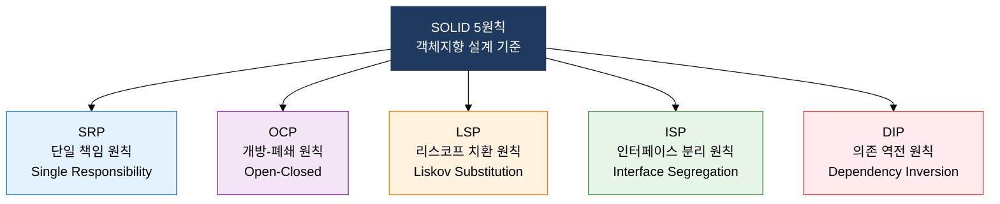
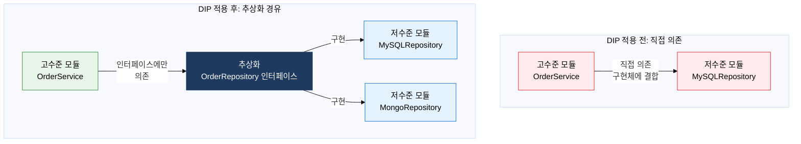

## I. 변경에 강한 객체지향 설계를 이끄는 5원칙, SOLID의 개요

**정의**:  
Robert C. Martin이 정의한 객체지향 설계의 5가지 핵심 원칙으로 유지보수성·확장성·테스트 가능성을 달성하는 설계 지침  
- SRP·OCP·LSP·ISP·DIP 각 원칙의 앞 글자를 따서 명명한 설계 표준  
- 클래스·모듈·컴포넌트 단위 설계 결정에 적용하며, GoF 패턴 적용의 이론적 기반  
- 원칙 준수 여부를 코드 리뷰·정적 분석 도구로 측정하고 리팩토링 방향 결정에 활용  

**특징**:  
( **변경 최소화** ) 각 원칙이 변경 영향 범위를 좁혀 수정 비용과 회귀 결함을 줄임  
( **추상화 기반** ) 인터페이스·추상 클래스 중심 설계로 구현체 교체와 확장을 자유롭게 함  
( **상호 보완** ) 5원칙이 독립적이지 않고 OCP를 실현하는 데 나머지 원칙들이 협력함  

---

## II. SOLID 원칙의 핵심 구성 체계

### 가. SOLID 원칙의 목적과 S·O·L 상세 (SRP, OCP, LSP)

| 원칙명 | 핵심 정의 | 위반 예시 | 적용 방법 |
|---|---|---|---|
| **SRP** | 클래스는 변경 이유가 오직 하나여야 함 | User 클래스가 인증·저장·이메일 발송을 모두 담당 | 역할별 클래스 분리: UserAuth / UserRepository / EmailService |
| **OCP** | 기존 코드를 수정하지 않고 새 기능을 추가할 수 있어야 함 | 도형 종류 추가 시 AreaCalculator의 if-else 분기 수정 필요 | Shape 인터페이스 + 다형성으로 새 도형 추가 시 기존 코드 무변경 |
| **LSP** | 하위 타입은 상위 타입을 완전히 대체할 수 있어야 함 | Rectangle을 상속한 Square가 setWidth 호출 시 높이도 변경되어 전제 위반 | 상속보다 인터페이스 분리·컴포지션 활용, 상위 타입 계약(선조건·후조건) 보장 |

---

### 나. I·D 원칙 상세 및 SOLID 종합 적용 (ISP, DIP)

| 원칙명 | 핵심 정의 | 위반 예시 | 적용 방법 |
|---|---|---|---|
| **ISP** | 클라이언트가 사용하지 않는 인터페이스 메서드에 의존을 강요하지 말 것 | Printer 인터페이스에 print/fax/scan 모두 선언 → fax 불필요한 SimplePrinter도 fax 구현 강제 | 역할별 인터페이스 분리: Printable / Faxable / Scanable |
| **DIP** | 고수준 모듈과 저수준 모듈 모두 추상화에 의존해야 하며, 구현체에 직접 의존 금지 | Service 클래스가 new MySQLRepository()로 구현체를 직접 생성·참조 | DI 컨테이너(Spring IoC)로 의존성 주입, 인터페이스 기반 참조 |

**SOLID 5원칙 종합 비교**

| 원칙명 | 핵심 키워드 | 위반 증상 | 해결 패턴 |
|---|---|---|---|
| **SRP** | 단일 변경 이유 | God Class, 하나의 클래스에 수천 줄 | 역할 분리, Facade 패턴 |
| **OCP** | 확장 열림·수정 닫힘 | 기능 추가마다 기존 if-else 수정 | Strategy·Template Method 패턴, 다형성 |
| **LSP** | 하위 타입 대체 가능 | 하위 클래스 사용 시 상위 타입 보장 깨짐 | 상속 대신 컴포지션, 인터페이스 계약 명세 |
| **ISP** | 필요한 인터페이스만 의존 | 빈 메서드 구현, UnsupportedOperationException | 인터페이스 세분화, 역할 인터페이스 분리 |
| **DIP** | 추상화에 의존 | new 구현체() 직접 생성, 테스트 어려움 | DI(의존성 주입), IoC 컨테이너, Factory 패턴 |

---

## III. SOLID 원칙 도입의 기대효과 및 활용 방안

| 구분 | 주요 기대효과 | 활용 및 실무 적용 방안 |
|---|---|---|
| **설계 유연성** | 변경 요구사항 수용 시 기존 코드 수정 최소화, 새 기능을 확장으로만 추가 | OCP 준수 설계 후 신규 기능을 새 클래스 추가로만 구현, 기존 코드 회귀 테스트 부담 감소 |
| **테스트 용이성** | DIP 적용으로 Mock 객체 주입 가능, 단위 테스트 격리 실현 | Spring @MockBean·Mockito로 저수준 모듈 목킹, SRP 준수로 테스트 대상 범위 명확화 |
| **협업 효율** | SRP·ISP 준수로 클래스 책임 명확, 팀원 간 코드 이해도와 리뷰 속도 향상 | 코드 리뷰 체크리스트에 SOLID 위반 항목 포함, 정적 분석 도구(Checkstyle·PMD)로 자동 탐지 |
| **시험 대비** | 5원칙 정의·위반 사례·해결 방안이 기술사 1·2교시 핵심 출제 영역 | 각 원칙별 위반 코드 → 개선 코드 변환 예시 암기, GoF 패턴과의 연관 관계 정리 |
