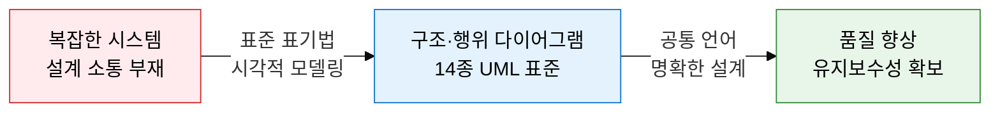
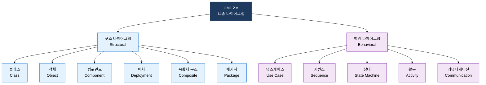
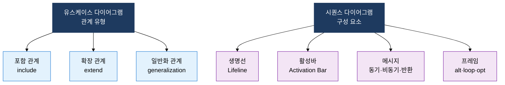

## I. 객체지향 설계를 시각으로 표준화하는, UML의 개요

**정의**:  
OMG(Object Management Group)가 표준화한 객체지향 분석·설계의 시각적 모델링 언어  
- 구조 다이어그램(6종)과 행위 다이어그램(7종)으로 소프트웨어 시스템 전체를 표현  
- 요구사항 분석부터 배포 구성까지 SDLC 전 단계에서 산출물로 활용  
- 개발자·설계자·고객 간 공통 표기법으로 의사소통 오류를 최소화  

**특징**:  
( **표준성** ) OMG 공식 표준으로 도구·언어 독립적인 범용 모델링 표기 제공  
( **포괄성** ) 정적 구조와 동적 행위를 14종 다이어그램으로 전방위 표현  
( **추적성** ) 유스케이스→클래스→시퀀스→배치 다이어그램 간 설계 추적 가능  

---

## II. UML의 핵심 구성 체계

### 가. UML 다이어그램 분류 체계 (구조 vs 행위)

| 다이어그램 | 표현 대상 | 주요 요소 | 활용 시점 |
|---|---|---|---|
| **클래스** | 클래스 속성·메서드·관계 | 연관·집합·합성·상속·의존·실체화 | 분석·설계 단계 핵심 산출물 |
| **객체** | 클래스 인스턴스 상태 | 객체명:클래스명, 속성값 | 특정 시점 시스템 상태 표현 |
| **컴포넌트** | 독립 배포 가능한 SW 단위 | 컴포넌트, 인터페이스, 포트 | 컴포넌트 기반 설계·아키텍처 |
| **배치** | 물리 H/W와 SW 매핑 | 노드, 아티팩트, 통신 경로 | 인프라·배포 환경 설계 |
| **패키지** | 네임스페이스·모듈 그룹 | 패키지, 의존, 병합, 임포트 | 대규모 시스템 모듈 분리 |

---

### 나. 핵심 행위 다이어그램 - 시퀀스와 유스케이스

| 다이어그램 | 표현 대상 | 핵심 요소 | 시험 출제 포인트 |
|---|---|---|---|
| **유스케이스** | 액터와 시스템 기능 관계 | 액터, 유스케이스, include/extend/일반화 | include vs extend 차이, 경계(boundary) |
| **시퀀스** | 객체 간 메시지 시간 순서 | 생명선, 활성바, 동기·비동기 메시지, 프레임 | alt·loop·opt 프레임, 생명선 파괴 |
| **상태** | 객체 상태 전이 사이클 | 상태, 전이, 이벤트, 가드, 액션 | 진입·탈출 액션, 합성 상태 |
| **활동** | 업무 흐름·병렬 처리 | 시작·종료, 포크·조인, 수영레인, 결정 | 포크·조인 병렬성, 수영레인 역할 분리 |
| **커뮤니케이션** | 객체 간 협력·메시지 순서 | 객체, 링크, 번호 붙은 메시지 | 시퀀스 다이어그램과의 차이점 |

---

## III. UML 도입의 기대효과 및 활용 방안

| 구분 | 주요 기대효과 | 활용 및 실무 적용 방안 |
|---|---|---|
| **의사소통** | 개발자·설계자·고객 간 공통 언어로 오해·누락 최소화 | 요구사항 확정 전 유스케이스 다이어그램으로 기능 범위 합의 |
| **설계 품질** | 클래스 다이어그램으로 관계·의존성 가시화하여 결합도 분석 | SOLID 원칙 준수 여부를 클래스 다이어그램으로 설계 리뷰 |
| **추적성** | 유스케이스→클래스→시퀀스→배치 연계로 요구-구현 추적 | RTM과 UML 다이어그램 연결하여 변경 영향 범위 즉시 파악 |
| **유지보수** | 배치 다이어그램으로 인프라 구조 문서화하여 운영 효율 향상 | 활동·상태 다이어그램으로 업무 프로세스 자동화 분석 수행 |
