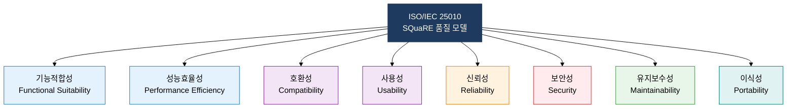
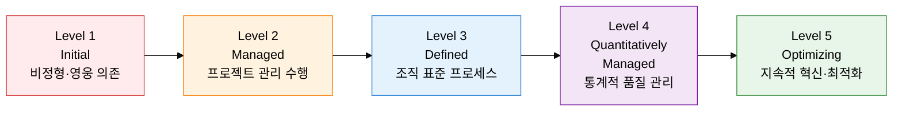

## I. 제품 품질과 프로세스 능력을 국제 표준으로 측정하는, 소프트웨어 품질 표준의 개요

**정의**:  
ISO/IEC·CMMI·SPICE 등의 국제 표준으로 소프트웨어 제품 품질과 프로세스 능력을 객관적으로 평가하는 체계  
- 제품 품질(ISO/IEC 25010), 생명주기 프로세스(ISO/IEC 12207), 프로세스 성숙도(CMMI, SPICE)를 각각 정의  
- 조직의 현 수준을 진단하고 개선 로드맵을 수립하는 근거로 활용  
- 발주기관·감리기관·인증기관이 요구하는 컴플라이언스 기준으로 사용  

**특징**:  
( **다층적 표준 구조** ) 제품·프로세스·조직 역량을 별도 표준으로 계층화하여 각각 측정 가능  
( **성숙도 기반 개선** ) CMMI·SPICE의 단계별 성숙도로 현 수준 진단 및 목표 수준 설정 지원  
( **국제 상호 인정** ) ISO 기반 표준으로 글로벌 발주·입찰·인증 과정에서 동등하게 인정  

---

## II. 소프트웨어 품질 표준의 핵심 구성 체계

### 가. ISO/IEC 25010 품질 특성 체계

| 특성명 | 정의 | 세부 속성 | 측정 지표 예시 |
|---|---|---|---|
| **기능적합성** | 명시된 기능 요구를 충족하는 정도 | 기능 완전성, 기능 정확성, 기능 적절성 | 요구 기능 충족률, 기능 오류 건수 |
| **성능효율성** | 자원 사용 대비 성능 수준 | 시간 특성, 자원 활용성, 용량 | 응답 시간(ms), CPU·메모리 점유율 |
| **호환성** | 다른 시스템·제품과 공존·상호운용 | 공존성, 상호운용성 | API 연동 성공률, 표준 프로토콜 준수 여부 |
| **사용성** | 사용자가 목표를 효과적으로 달성하는 정도 | 적합 인식성, 학습성, 운용성, 접근성 | 태스크 완료율, 사용자 오류 빈도 |
| **신뢰성** | 조건·기간 내 기능을 유지하는 정도 | 성숙성, 가용성, 결함 허용성, 복구성 | MTBF, 가용률(%), 복구 시간(RTO) |
| **보안성** | 인가되지 않은 접근·변조를 방어하는 정도 | 기밀성, 무결성, 부인방지성, 책임추적성, 인증성 | 취약점 건수, 침투 테스트 통과율 |
| **유지보수성** | 변경·개선·수정의 용이성 | 모듈성, 재사용성, 분석성, 변경성, 시험성 | 변경 소요 시간, 코드 복잡도(CC) |
| **이식성** | 다른 환경으로 이전하는 용이성 | 적응성, 설치성, 대체성 | 환경 이전 성공률, 재설치 소요 시간 |

---

### 나. CMMI 성숙도 모델과 SPICE 비교

| 비교 항목 | CMMI | SPICE (ISO/IEC 15504) |
|---|---|---|
| **개발 기관** | SEI(카네기멜론 대학) / CMMI Institute | ISO/IEC JTC1/SC7 |
| **목적** | 조직의 소프트웨어 개발 역량 성숙도 평가 및 개선 | 프로세스 수행 능력 평가 및 개선 |
| **평가 구조** | 단계적(Staged) / 연속적(Continuous) 표현 | 프로세스 차원 × 능력 수준 2차원 구조 |
| **성숙도/능력 단계 수** | 5단계 (Level 1~5) | 6단계 (Level 0~5) |
| **적용 범위** | 소프트웨어, 시스템, 하드웨어, 서비스, IT (CMMI V2) | 소프트웨어 프로세스 (ISO/IEC 12207 프로세스 참조) |
| **활용 현황** | 미국 국방부 조달 요건, 국내 SW 사업자 역량 등급 | 유럽·국내 공공 SI 사업, 자동차(Automotive SPICE) |
| **핵심 구성** | 프로세스 영역(PA), 목표(Goal), 실천(Practice) | 프로세스 속성(PA), 기반 실천(BP), 작업 산출물(WP) |
| **인증 방식** | 심사팀 평가 후 성숙도 레벨 인증 | 독립 평가자 감정 후 프로세스별 능력 수준 판정 |

---

## III. 소프트웨어 품질 표준 도입의 기대효과 및 활용 방안

| 구분 | 주요 기대효과 | 활용 및 실무 적용 방안 |
|---|---|---|
| **제품 품질** | ISO/IEC 25010 8대 특성 기반으로 품질 속성을 객관적으로 측정·비교 | 요구사항 정의 시 품질 특성 목표값 설정, 테스트 계획에 특성별 측정 지표 반영 |
| **프로세스 개선** | CMMI·SPICE 성숙도 진단으로 취약 프로세스 식별 및 개선 우선순위 결정 | 현재 수준(AS-IS) 평가 후 목표 수준(TO-BE) 로드맵 수립, PA별 개선 과제 도출 |
| **조달·컴플라이언스** | ISO/IEC 12207 프로세스 준수로 발주기관·감리기관 요구사항 충족 | 생명주기 프로세스별 산출물 목록 정의, 감리 체크리스트에 표준 준거 항목 반영 |
| **경쟁력 강화** | CMMI Level 3 이상 인증으로 공공·방산·금융 SW 사업 입찰 우위 확보 | CMMI 심사 대비 PAL(Process Asset Library) 구축, Automotive SPICE 적용으로 차량 SW 수출 지원 |
