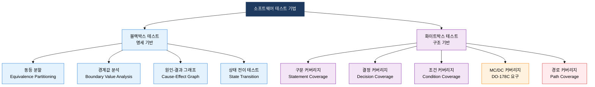
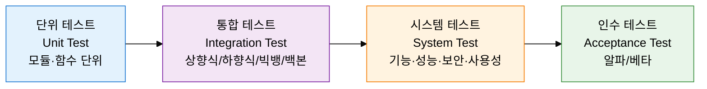

## I. 결함 조기 발견으로 품질을 보증하는, 소프트웨어 테스트의 개요

**정의**:  
명세·구조·경험 기반의 기법으로 결함을 조기에 발견하고 소프트웨어 품질을 보증하는 검증 활동  
- 테스트는 결함의 존재를 증명하며, 결함 부재를 완전히 증명할 수 없음  
- Verification(검증)과 Validation(확인)을 모두 포함하는 포괄적 품질 활동  
- V-모델에 따라 개발 단계별로 대응하는 테스트 단계가 존재함  

**특징**:  
( **결함 집중** ) 소수 모듈에 결함이 집중되는 살충제 패러독스 원리 적용  
( **정황 의존성** ) 도메인·위험도·표준에 따라 테스트 기법과 강도가 달라짐  
( **오류 부재의 오류** ) 결함 없음이 사용자 요구 충족을 보장하지 않음  

---

## II. 소프트웨어 테스트의 핵심 구성 체계

### 가. 블랙박스 vs 화이트박스 테스트 기법 체계

| 커버리지 유형 | 측정 기준 | 강도 레벨 | 활용 기준/표준 |
|---|---|---|---|
| 구문(Statement) 커버리지 | 실행된 문장 수 / 전체 문장 수 | Level 1 (최저) | 일반 상용 소프트웨어 |
| 결정(Decision/Branch) 커버리지 | 참·거짓 분기 실행 여부 | Level 2 | DO-178C Level D, IEC 62304 |
| 조건(Condition) 커버리지 | 개별 조건 참·거짓 실행 여부 | Level 3 | 보안·신뢰성 요구 시스템 |
| MC/DC 커버리지 | 각 조건이 독립적으로 결정에 영향 | Level 4 (높음) | DO-178C Level A/B, 항공·철도 |
| 다중 조건(Multiple Condition) | 조건 조합 전수 실행 여부 | Level 5 | 원자력·의료기기(극고위험) |
| 경로(Path) 커버리지 | 가능한 모든 실행 경로 | Level 6 (최고) | 이론적 완전성(실용 불가) |

---

### 나. V-모델 기반 단계별 테스트 및 정적 테스트

| 기법명 | 형식성 | 진행 방식 | 주요 참가자 | 산출물 | 비용 |
|---|---|---|---|---|---|
| **인스펙션** | 매우 높음 | 역할 분담 체크리스트 기반 공식 검토 | 작성자, 검토자(다수), 중재자, 서기 | 결함 목록, 인스펙션 보고서 | 높음 |
| **워크스루** | 중간 | 작성자가 직접 설명·시연 진행 | 작성자, 동료 리뷰어(2~5명) | 이슈 목록, 개선 의견서 | 중간 |
| **리뷰** | 낮음 | 비공식 의견 교환 및 피드백 | 작성자, 동료 1~2명 | 검토 의견(비정형) | 낮음 |
| **정적 분석** | 자동화 | 도구 기반 코드 자동 분석 | 개발자, QA 엔지니어 | 정적 분석 리포트 | 매우 낮음 |
| **단위 테스트** | 높음 | xUnit 프레임워크로 자동 실행 | 개발자 | 테스트 결과 리포트 | 중간 |
| **회귀 테스트** | 높음 | 변경 후 기존 기능 재검증 자동화 | QA, CI/CD 파이프라인 | 회귀 테스트 리포트 | 중간 |

---

## III. 소프트웨어 테스트 도입의 기대효과 및 활용 방안

| 구분 | 주요 기대효과 | 활용 및 실무 적용 방안 |
|---|---|---|
| **품질 보증** | 결함을 조기 단계에서 발견하여 수정 비용을 최소화 | V-모델 기반 단계별 테스트 계획 수립, 단위·통합·시스템 테스트 순차 수행 |
| **위험 관리** | MC/DC·경계값 분석으로 고위험 기능의 결함 예방 | 위험도 기반 테스트(Risk-Based Testing) 적용, 핵심 모듈 집중 커버리지 확보 |
| **자동화 효율** | 회귀 테스트 자동화로 반복 검증 비용 절감 및 CI/CD 통합 | xUnit·Selenium·JMeter 등 자동화 도구 도입, 빌드 파이프라인에 테스트 게이트 삽입 |
| **컴플라이언스** | DO-178C·IEC 62304 등 안전 표준 준수 근거 확보 | 커버리지 측정 리포트 생성, 인스펙션 체크리스트 기반 공식 검토 기록 보관 |
