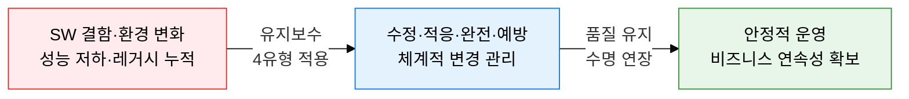
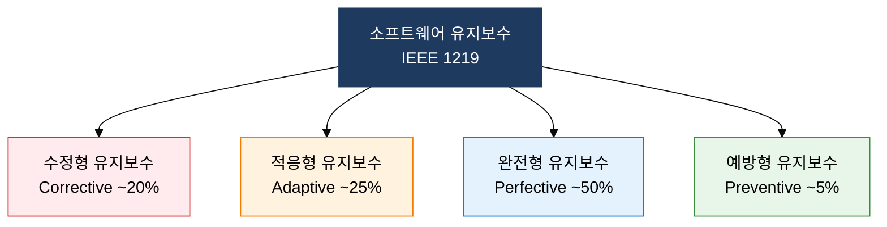
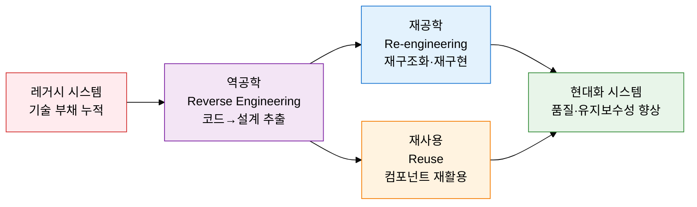

## I. 변경 통제로 SW 수명을 연장하는, 소프트웨어 유지보수의 개요

**정의**:  
인도 후 발생하는 결함 수정·환경 적응·기능 개선·예방 활동으로 SW 품질과 수명을 유지하는 공학적 프로세스  
- IEEE 1219 표준에 따라 수정형·적응형·완전형·예방형 4가지 유형으로 분류  
- 전체 SW 생명주기 비용의 60~80%를 차지하는 핵심 단계  
- 레거시 현대화(3R)와 리팩토링을 통해 기술 부채를 체계적으로 관리  

**특징**:  
( **비용 집중성** ) SW 개발 비용보다 유지보수 비용이 더 크며, 완전형이 전체의 약 50%를 차지  
( **변경 위험성** ) 모든 변경은 예상치 못한 결함(회귀 오류)을 유발할 수 있어 체계적 통제 필요  
( **품질 연속성** ) 리팩토링과 예방형 유지보수를 통해 SW 에이징을 억제하고 품질을 지속 보장  

---

## II. 소프트웨어 유지보수의 핵심 구성 체계

### 가. 유지보수 유형 분류 및 비용 구조

| 유형 | 정의 | 원인 | 비중 | 예시 |
|---|---|---|---|---|
| **수정형** | 운영 중 발견된 오류·결함 수정 | 잔존 버그, 설계 결함 | 약 20% | NullPointerException 수정, 로직 오류 패치 |
| **적응형** | 환경 변화에 대응한 SW 수정 | OS 업그레이드, 법령 개정, HW 교체 | 약 25% | Java 버전 마이그레이션, 개인정보보호법 반영 |
| **완전형** | 성능 개선 및 신기능 추가 | 사용자 요구 증가, 경쟁 환경 변화 | 약 50% | 검색 기능 추가, 응답 속도 최적화 |
| **예방형** | 미래 결함 방지를 위한 선제 조치 | SW 에이징, 기술 부채 누적 | 약 5% | 코드 리팩토링, 문서 현행화, 테스트 자동화 |

---

### 나. 레거시 현대화(3R) 전략 및 리팩토링

**레거시 현대화 3R 전략**

| 전략 | 정의 | 입력 | 출력 | 적용 시점 |
|---|---|---|---|---|
| **역공학** | 기존 SW에서 설계·요구사항을 역으로 추출 | 소스 코드, 실행 파일 | 설계 문서, 요구사항 명세 | 문서 부재 레거시 분석 시 |
| **재공학** | 역공학 후 재구조화하여 새로운 SW 생성 | 기존 설계+역공학 결과 | 현대화된 신규 시스템 | 완전한 재개발보다 리스크 최소화 필요 시 |
| **재사용** | 기존 컴포넌트를 새 시스템에 그대로 활용 | 검증된 모듈·라이브러리 | 재활용 컴포넌트 | 신뢰성 높은 기존 자산 보유 시 |

**주요 리팩토링 기법**

| 코드 스멜 | 증상 | 리팩토링 기법 |
|---|---|---|
| **중복 코드** | 동일 로직이 여러 곳에 반복 존재 | Extract Method, Pull Up Method |
| **긴 메서드** | 하나의 메서드가 너무 많은 역할 수행 | Extract Method, Decompose Conditional |
| **거대 클래스** | 하나의 클래스에 과도한 책임 집중 | Extract Class, Extract Subclass |
| **과도한 매개변수** | 메서드 파라미터 4개 이상 | Introduce Parameter Object, Preserve Whole Object |
| **산탄총 수술** | 하나의 변경이 여러 클래스에 영향 | Move Method, Move Field, Inline Class |

---

## III. 소프트웨어 유지보수 도입의 기대효과 및 활용 방안

| 구분 | 주요 기대효과 | 활용 및 실무 적용 방안 |
|---|---|---|
| **품질 안정성** | 체계적 결함 수정으로 운영 중단 최소화, 회귀 오류 사전 차단 | 수정형 유지보수 프로세스 표준화, 회귀 테스트 자동화 파이프라인 구축 |
| **기술 부채 관리** | 리팩토링·예방형 유지보수로 코드 복잡도 억제, SW 에이징 방지 | 기술 부채 등록부 운영, 스프린트마다 리팩토링 시간 할당(20% 룰) |
| **레거시 현대화** | 3R 전략 적용으로 기존 자산 보호하며 점진적 현대화 달성 | 역공학으로 설계 문서 복원, 마이크로서비스 전환 시 재공학 기법 적용 |
| **비용 최적화** | 완전형 유지보수 집중 투자로 비즈니스 가치 극대화, 불필요한 수정 비용 절감 | 유지보수 유형별 예산 배분 최적화, KPI 기반 유지보수 효과성 측정 |
