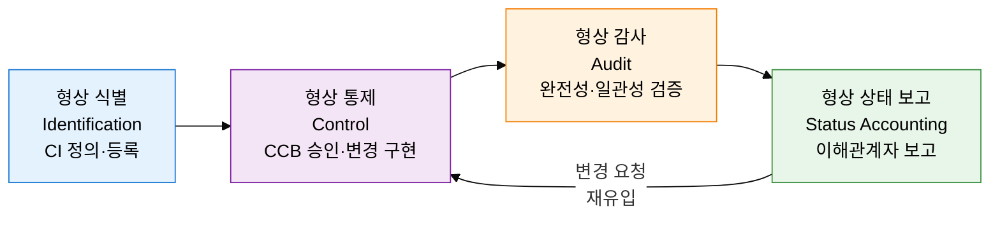
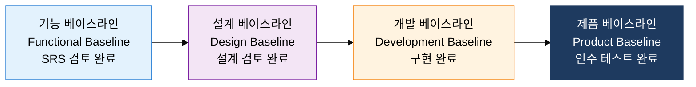

## I. 변경 통제로 산출물 무결성을 보장하는, 소프트웨어 형상 관리의 개요

**정의**:  
SW 생명주기 전반에 걸쳐 형상 항목을 식별·통제·감사·보고하여 산출물의 무결성과 추적성을 보장하는 관리 체계  
- IEEE 828 표준 기반으로 CI(Configuration Item) 단위로 변경을 체계적으로 관리  
- CCB(변경통제위원회) 승인을 통해 무단 변경을 차단하고 베이스라인 안정성 유지  
- 버전 관리 도구(Git 등)와 연계하여 변경 이력 자동 추적 및 롤백 지원  

**특징**:  
( **변경 가시성** ) 모든 변경 요청과 승인 내역을 추적하여 누가·언제·왜 변경했는지 투명하게 관리  
( **베이스라인 안정성** ) 단계별 베이스라인 설정으로 검증된 기준선을 보호하고 무단 변경 차단  
( **감사 추적성** ) 형상 감사를 통해 산출물의 완전성·일관성을 주기적으로 검증하고 인증 기반 마련  

---

## II. 소프트웨어 형상 관리의 핵심 구성 체계

### 가. 형상 관리 4단계 절차 및 CCB 체계

| 단계 | 주요 활동 | 참여자 | 산출물 |
|---|---|---|---|
| **형상 식별** | 관리 대상 CI 목록 정의, 명명 규칙 수립, 버전 체계 확립 | 형상 관리자, 프로젝트 관리자 | CI 목록, 형상 관리 계획서 |
| **형상 통제** | 변경 요청서 접수→영향 분석→CCB 심의→승인/반려→구현→검증 | CCB, 개발팀, 형상 관리자 | 변경 요청서, CCB 회의록, 변경 이력 |
| **형상 감사** | 기능 형상 감사(FCA: 요구사항 충족 여부), 물리 형상 감사(PCA: 문서 일치 여부) | QA팀, 형상 관리자, 고객 | 감사 보고서, 불일치 목록 |
| **형상 상태 보고** | 현재 CI 버전·변경 이력·미결 변경 요청 현황을 이해관계자에게 보고 | 형상 관리자, PMO | 형상 상태 보고서, 변경 현황 대시보드 |

---

### 나. 형상 베이스라인과 Git Flow 전략

**형상 베이스라인 4단계**

| 베이스라인 | 설정 시점 | 기준 문서 | 통제 대상 |
|---|---|---|---|
| **기능 베이스라인** | 요구사항 검토 완료 후 | SRS(소프트웨어 요구사항 명세서) | 기능 요구사항, 인터페이스 요구사항 |
| **설계 베이스라인** | 설계 검토(CDR) 완료 후 | SDD(소프트웨어 설계 문서) | 아키텍처 설계, 모듈 설계, DB 스키마 |
| **개발 베이스라인** | 단위·통합 테스트 완료 후 | 소스 코드, 빌드 산출물 | 소스 코드, 실행 파일, 테스트 케이스 |
| **제품 베이스라인** | 인수 테스트 완료 후 | 최종 제품 패키지 | 배포 패키지, 사용자 매뉴얼, 운영 문서 |

**Git Flow 브랜치 전략**

| 브랜치 | 역할 | 시작점 | 병합 대상 | 수명 |
|---|---|---|---|---|
| **main** | 운영 배포 코드, 항상 배포 가능 상태 유지 | 초기 생성 | - | 영구 |
| **develop** | 다음 릴리스 개발 통합 브랜치 | main | main (릴리스 시) | 영구 |
| **feature** | 개별 기능 개발 브랜치 | develop | develop | 기능 완료 시 삭제 |
| **release** | 릴리스 준비, QA 및 버그 수정 | develop | main, develop | 릴리스 완료 시 삭제 |
| **hotfix** | 운영 긴급 버그 수정 | main | main, develop | 수정 완료 시 삭제 |

---

## III. 소프트웨어 형상 관리 도입의 기대효과 및 활용 방안

| 구분 | 주요 기대효과 | 활용 및 실무 적용 방안 |
|---|---|---|
| **변경 통제** | CCB 기반 승인 프로세스로 무단 변경 차단, 변경 리스크 사전 분석 가능 | 변경 요청서 표준 양식 적용, 영향 분석 체크리스트 운영, CCB 정례 회의 제도화 |
| **품질 추적성** | 베이스라인 단위 감사로 산출물 완전성 보장, 결함 원인 추적 및 재발 방지 | 단계 전환 시 형상 감사 의무화, FCA/PCA 체크리스트 자동화 도구 연계 |
| **버전 관리** | Git Flow 전략으로 병렬 개발과 안정적 릴리스 동시 달성, 롤백 신속 대응 | Git Flow 도입 및 브랜치 보호 규칙 설정, CI/CD 파이프라인 브랜치 전략 연동 |
| **규정 준수** | ISO 9001·CMMI 등 품질 인증 요건 충족, 납품 시 형상 이력 증빙 제공 | 형상 관리 도구(Git, SVN, Jira) 연계 감사 로그 자동 생성, 감사 대응 보고서 자동화 |
