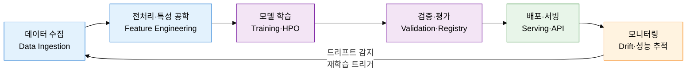
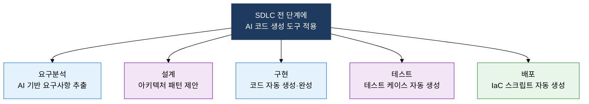

## I. ML·LLM 모델을 코드처럼 버전 관리하고 운영하는 엔지니어링 실천, MLOps·LLMOps의 개요

**정의**:  
ML·LLM 모델의 개발→배포→모니터링 전 과정을 자동화하고 데이터·모델·코드를 통합 버전 관리하여 AI 시스템의 신뢰성과 재현성을 확보하는 엔지니어링 방법론  
- MLOps는 DevOps의 원칙을 ML 파이프라인에 적용하여 실험 추적·모델 서빙·재학습 자동화를 포괄  
- LLMOps는 MLOps를 확장하여 프롬프트 버전 관리·할루시네이션 탐지·토큰 비용 최적화 등 LLM 고유 이슈를 추가 처리  
- AI 코드 생성 도구(GitHub Copilot, Claude Code 등)가 SDLC 전 단계에 영향을 미치며 새로운 품질 관리 전략 요구  

**특징**:  
( **재현성 보장** ) 데이터·코드·하이퍼파라미터·환경을 모두 버전 관리하여 실험 결과를 언제든 재현 가능  
( **모델 드리프트 감지** ) 프로덕션 데이터 분포 변화를 실시간 모니터링하여 성능 저하를 조기 탐지·재학습 트리거  
( **비용-품질 균형** ) LLM 토큰 비용·지연시간·품질 지표를 동시에 추적하여 최적 모델 선택 및 캐싱 전략 수립  

---

## II. MLOps·LLMOps의 핵심 구성 체계

### 가. MLOps 파이프라인 구조 및 핵심 구성 요소

| 항목 | MLOps | LLMOps |
|---|---|---|
| **대상 모델** | 전통 ML 모델 (분류·회귀·추천) | 대규모 언어 모델 (GPT·Claude·Llama 등) |
| **파이프라인 특징** | 데이터 수집→특성 공학→학습→배포 순환 | 프롬프트 설계→RAG 구성→Fine-tuning→평가 순환 |
| **핵심 도구** | MLflow(실험 추적)·DVC(데이터 버전)·Kubeflow·Airflow | LangSmith·Weights&Biases·PromptLayer·LlamaIndex |
| **주요 이슈** | 데이터 종속성·파이프라인 불안정·모델 드리프트 | 할루시네이션 탐지·프롬프트 버전 관리·토큰 비용 최적화 |
| **모니터링 지표** | 정확도·F1·데이터 분포 변화(PSI)·지연시간 | BLEU·ROUGE·G-Eval·토큰 비용·할루시네이션율 |

---

### 나. AI 코드 생성의 SDLC 영향과 품질 관리

| 단계 | AI 도구 활용 방안 | 기대 효과 | 위험 요소 | 대응 전략 |
|---|---|---|---|---|
| **요구분석** | 자연어 요구사항을 유스케이스·사용자 스토리로 자동 변환 | 요구사항 누락 감소·문서화 시간 단축 | 맥락 오해로 인한 잘못된 요구사항 추출 | 도메인 전문가 검토·요구사항 추적 매트릭스 병용 |
| **설계** | 패턴 추천·API 설계·ERD·시퀀스 다이어그램 자동 생성 | 설계 대안 탐색 시간 단축·지식 재사용 | 특정 패턴 편향·비최적 아키텍처 수용 | 아키텍처 리뷰 보드(ARB) 검토 의무화 |
| **구현** | GitHub Copilot·Cursor·Claude Code로 코드 자동 완성·생성 | 반복 코드 작성 시간 50% 이상 단축 | 보안 취약점 코드 생성·저작권 이슈·무비판적 수용 | SAST 통합·코드 리뷰 필수화·라이선스 스캔 |
| **테스트** | 유닛·통합·엣지 케이스 테스트 코드 자동 생성 | 테스트 커버리지 향상·테스트 작성 부담 감소 | 표면적 테스트·실제 결함 미탐지 가능성 | 뮤테이션 테스트로 테스트 품질 검증 |
| **배포** | Terraform·Kubernetes 매니페스트·Dockerfile 자동 생성 | IaC 작성 시간 단축·표준화된 인프라 구성 | 보안 그룹 과도 허용·비용 최적화 미흡 | 보안 정책 스캔(Checkov)·비용 추산 도구 병용 |

---

## III. MLOps·LLMOps 도입의 기대효과 및 활용 방안

| 구분 | 주요 기대효과 | 활용 및 실무 적용 방안 |
|---|---|---|
| **재현성·거버넌스** | 실험 조건·데이터·모델을 완전 추적하여 감사 대응과 규제 준수 가능, AI 신뢰성 확보 | MLflow·DVC로 실험 메타데이터와 데이터셋 버전을 자동 기록하고 모델 레지스트리에서 승인된 모델만 프로덕션 배포 |
| **운영 자동화** | 모델 재학습·배포·롤백을 파이프라인으로 자동화하여 AI 시스템 운영 인력 부담 최소화 | 데이터 드리프트 감지 시 Kubeflow 파이프라인이 자동으로 재학습을 트리거하고 A/B 테스트로 신모델 검증 후 배포 |
| **LLM 비용 최적화** | 토큰 사용량·지연시간·품질을 동시 추적하여 최적 모델 선택과 프롬프트 압축으로 비용 절감 | 프롬프트 캐싱·의미 캐싱(Semantic Cache) 적용, 경량 모델 라우팅으로 비용 대비 품질 균형점 자동 탐색 |
| **AI 코드 품질** | AI 코드 생성 도구 도입으로 개발 생산성을 향상시키면서 보안·저작권 위험을 체계적으로 통제 | SAST·SCA를 CI 파이프라인에 필수 게이트로 통합하고 AI 생성 코드 비율·결함 밀도를 별도 지표로 추적 |
