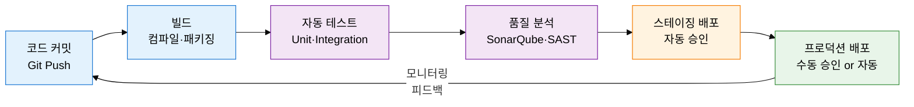
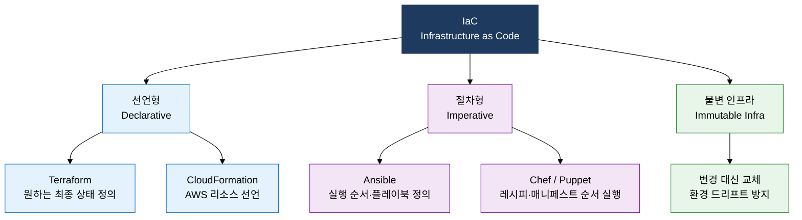

## I. 개발-운영 사일로 제거로 배포 속도와 품질을 동시 달성, DevOps 및 CI/CD의 개요

**정의**:  
개발(Dev)과 운영(Ops) 간 사일로를 제거하고 자동화된 CI/CD 파이프라인으로 소프트웨어 품질과 배포 속도를 동시에 달성하는 문화·실천 방법론  
- CALMS(Culture·Automation·Lean·Measurement·Sharing) 프레임워크를 기반으로 조직 문화부터 도구까지 통합  
- 코드 커밋부터 프로덕션 배포까지 전 과정을 자동화하여 릴리스 주기를 일·주 단위로 단축  
- IaC(Infrastructure as Code)로 환경 일관성을 확보하여 "내 로컬에서는 됩니다" 문제를 근본 해결  

**특징**:  
( **자동화 우선** ) 빌드·테스트·배포 전 과정을 파이프라인으로 자동화하여 인적 오류와 배포 지연 제거  
( **피드백 단축** ) 코드 커밋 후 수분 내 테스트 결과 확인, 결함을 조기에 발견하고 수정 비용 최소화  
( **불변 인프라** ) 환경을 코드로 정의하고 수정이 아닌 교체(Immutable Infrastructure)로 드리프트 방지  

---

## II. DevOps 및 CI/CD의 핵심 구성 체계

### 가. DevOps 문화(CALMS)와 CI/CD 파이프라인 구조

| 단계 | 자동화 범위 | 핵심 활동 | 배포 승인 방식 | 주요 도구 |
|---|---|---|---|---|
| **CI (지속적 통합)** | 코드 커밋~테스트 결과 | 빌드·유닛 테스트·코드 품질 분석·취약점 스캔 | 자동 (파이프라인 통과 시) | Jenkins, GitHub Actions, GitLab CI |
| **CD (지속적 제공)** | CI 이후~스테이징 배포 | 통합 테스트·성능 테스트·스테이징 환경 배포 | 수동 승인 후 프로덕션 | ArgoCD, Spinnaker, Jenkins |
| **CD (지속적 배포)** | 프로덕션까지 완전 자동 | 카나리·블루-그린 배포·자동 롤백·모니터링 | 완전 자동 (조건 기반) | ArgoCD, Flux, Kubernetes |

---

### 나. IaC 개념 및 DevOps 도구 생태계

| 카테고리 | 대표 도구 | 핵심 기능 |
|---|---|---|
| **소스 관리** | Git, GitHub, GitLab | 코드 버전 관리·브랜치 전략·코드 리뷰 |
| **CI 엔진** | Jenkins, GitHub Actions, GitLab CI | 빌드·테스트 파이프라인 자동 실행 |
| **CD / 배포** | ArgoCD, Spinnaker, Flux | GitOps 기반 지속적 배포·롤백 |
| **컨테이너** | Docker, Kubernetes, Helm | 애플리케이션 패키징·오케스트레이션 |
| **모니터링** | Prometheus, Grafana, ELK Stack | 메트릭·로그·알림·대시보드 |
| **IaC** | Terraform, Ansible, CloudFormation | 인프라 코드화·프로비저닝 자동화 |

---

## III. DevOps 및 CI/CD 도입의 기대효과 및 활용 방안

| 구분 | 주요 기대효과 | 활용 및 실무 적용 방안 |
|---|---|---|
| **배포 속도** | 릴리스 주기를 월·분기 단위에서 일·주 단위로 단축, 시장 요구에 신속 대응 | 트렁크 기반 개발(Trunk-Based Development)과 피처 플래그를 결합하여 안전한 고빈도 배포 실현 |
| **품질 안정성** | 자동화 테스트로 회귀 결함을 조기 탐지하고 프로덕션 장애율 대폭 감소 | CI 파이프라인에 SAST·DAST·코드 커버리지 80% 이상 게이트를 설정하여 결함 유입 차단 |
| **운영 효율** | IaC로 환경 프로비저닝 자동화, 수동 설정 오류 제거 및 인프라 비용 최적화 | Terraform으로 멀티 클라우드 인프라를 코드화하고 PR 리뷰로 변경 이력 추적·감사 수행 |
| **조직 문화** | Dev·Ops 협업 강화로 사일로 제거, 장애 대응 시 공동 책임 문화 정착 | 포스트모템(Blameless Post-mortem) 문화 도입과 SRE 원칙 결합으로 지속적 개선 사이클 구축 |
