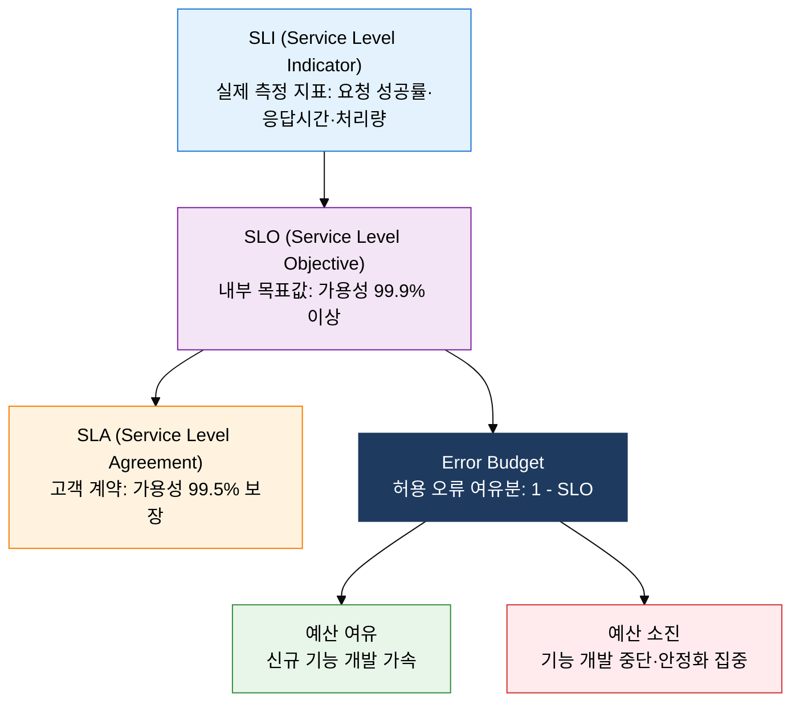
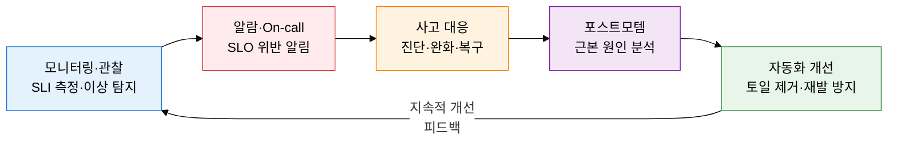

## I. 오류 예산으로 신뢰성과 혁신 속도를 균형 있게 관리, SRE의 개요

**정의**:  
Google이 창안한 소프트웨어 엔지니어링 기법으로 SLx(SLI·SLO·SLA)와 오류 예산(Error Budget)을 통해 서비스 신뢰성을 정량화·관리하는 운영 방법론  
- DevOps의 구체적 구현 방식으로, DevOps가 문화·철학이라면 SRE는 그 실천 방법을 정의  
- 토일(Toil·반복 수동 작업)을 전체 업무의 50% 이하로 제한하고 나머지를 자동화·엔지니어링에 투자  
- 오류 예산 소진 시 신규 기능 개발을 중단하고 안정성 개선에 집중하는 데이터 기반 의사결정 체계 운용  

**특징**:  
( **정량적 신뢰성** ) SLI 측정값·SLO 목표값·SLA 계약으로 신뢰성을 숫자로 정의하고 객관적 의사결정 가능  
( **오류 예산** ) 허용 가능한 다운타임을 예산으로 관리하여 개발팀과 운영팀 간 긴장을 구조적으로 조율  
( **토일 제거** ) 반복·수동 작업을 자동화로 전환하여 엔지니어 역량을 고부가가치 개선 활동에 집중  

---

## II. SRE의 핵심 구성 체계

### 가. SLI/SLO/SLA/Error Budget 체계

| 항목 | 정의 | 설정 주체 | 예시값 | 역할 |
|---|---|---|---|---|
| **SLI** | 서비스 수준을 측정하는 실제 지표 | SRE팀 (기술 측정) | 요청 성공률 99.95%, P99 응답시간 200ms | 신뢰성 현황 객관적 측정 |
| **SLO** | SLI에 대한 내부 목표값·허용 범위 | SRE팀 + 제품팀 협의 | 월간 가용성 99.9% (다운타임 43분 허용) | 신뢰성 목표 설정 및 Error Budget 산출 |
| **SLA** | 고객과의 법적·계약적 서비스 수준 | 비즈니스팀 + 법무팀 | 월간 가용성 99.5% 미달 시 크레딧 지급 | 계약 위반 시 패널티·보상 기준 |
| **Error Budget** | 허용 가능한 오류 여유분 (1 - SLO) | SLO에서 자동 산출 | 99.9% SLO → 0.1% = 월 43분 다운타임 허용 | 개발 속도와 안정성 간 균형 조율 |

---

### 나. SRE vs DevOps 비교 및 핵심 실천 방법

| 관점 | SRE | DevOps | 전통 운영 |
|---|---|---|---|
| **목표** | 신뢰성 정량화·Error Budget 기반 균형 | 개발·운영 사일로 제거·배포 가속 | 시스템 안정적 유지·변경 최소화 |
| **핵심 지표** | SLI·SLO·Error Budget·MTTR | 배포 빈도·변경 실패율·리드타임 | 업타임·MTBF·티켓 해소 시간 |
| **자동화 수준** | 토일 50% 이하 강제·엔지니어링 기반 | CI/CD 파이프라인·IaC 자동화 강조 | 수동 절차·변경 관리 프로세스 중심 |
| **장애 대응** | Blameless 포스트모템·근본 원인 제거 | 빠른 배포로 핫픽스·롤백 용이 | 변경 통제 위원회(CAB) 승인·문서화 |
| **조직 구조** | SRE팀이 운영 책임 공유·임베드 방식 | 개발자가 운영 일부 책임 (You build it, you run it) | 개발·운영 완전 분리·역할 고정 |

---

## III. SRE 도입의 기대효과 및 활용 방안

| 구분 | 주요 기대효과 | 활용 및 실무 적용 방안 |
|---|---|---|
| **신뢰성** | SLI·SLO 정량화로 "충분히 신뢰할 수 있는 서비스" 기준 명확화, 과잉 신뢰성 투자 방지 | 서비스별 SLO 대시보드를 구축하고 Error Budget 잔여량을 스프린트 플래닝에 반영하여 기능 개발 우선순위 자동 조정 |
| **운영 효율** | 토일 제거 자동화로 반복 수동 작업을 엔지니어링 시간으로 전환, 고부가가치 개선 집중 | Runbook 자동화·셀프힐링 스크립트 도입으로 On-call 부담 감소, 엔지니어 번아웃 예방 |
| **사고 관리** | Blameless 포스트모템 문화로 근본 원인 분석과 재발 방지 체계 구축 | 장애 대응 플레이북(IRP)을 코드화하고 Game Day 훈련으로 복구 능력 정기 검증 |
| **조직 협업** | 개발팀과 운영팀이 Error Budget이라는 공통 지표로 긴장 관계를 협력 관계로 전환 | SRE를 제품팀에 임베드(Embedded SRE) 방식으로 배치하여 설계 단계부터 신뢰성 요구사항 반영 |
