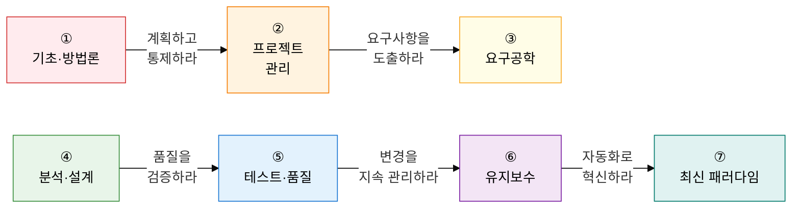

소프트웨어 공학은 **"어떻게 하면 더 좋은 소프트웨어를 더 효율적으로 만들 수 있는가"** 라는 질문에 대한 체계적 답변입니다.  
1968년 소프트웨어 위기를 기점으로 탄생한 이 학문은, 방법론·설계·테스트·품질·운영까지 소프트웨어 전 생명주기를 다룹니다.

## 학습 로드맵 — 7단계 흐름

---

## ① 기초 및 개발 방법론

> **"왜 소프트웨어 공학이 필요한가"** 를 이해하고, 개발 방식의 역사적 진화를 따라갑니다.  
> 소프트웨어 위기 → SDLC 개념 정립 → 모델 다양화 → 전통 방법론 → 애자일 순으로 이어지는 인과 관계를 파악하세요.

| 순서 | 토픽 | 핵심 키워드 | 중요도 |
|:---:|---|---|:---:|
| 1 | [소프트웨어 위기](01-basics/software-crisis) | 1968 NATO, Brooks's Law, 복잡성 장벽 | ★★★ |
| 2 | [SDLC 개요](01-basics/sdlc) | 계획→분석→설계→구현→테스트→유지보수 | ★★★ |
| 3 | [SDLC 모델 유형](01-basics/sdlc-models) | 폭포수, 나선형(Boehm), V-모델, 반복적 | ★★★ |
| 4 | [전통적 개발 방법론](01-basics/traditional-methodology) | 구조적(DFD), 정보공학(ISP), OO, CBD, 컴포넌트 가시성 | ★★☆ |
| 5 | [애자일 방법론](01-basics/agile-methodology) | Manifesto 4가치·12원칙, Scrum, XP, SAFe, LeSS | ★★★ |

**→ 핵심 학습법**: 각 방법론이 **이전 방법론의 어떤 한계를 극복**했는지 비교 중심으로 정리하세요.

---

## ② 프로젝트 관리

> 방법론을 선택했다면, 이제 **실제 프로젝트를 어떻게 이끌 것인가**를 배웁니다.  
> 범위·일정·원가 3대 제약과 EVM 지표는 시험 단골 출제 영역입니다.

| 순서 | 토픽 | 핵심 키워드 | 중요도 |
|:---:|---|---|:---:|
| 6 | [프로젝트 관리](02-project-management/project-management) | PMBOK 7th, WBS, CPM, PERT, EVM(CV·SV·CPI·SPI) | ★★★ |
| 7 | [소프트웨어 규모 산정](02-project-management/estimation) | 델파이, LOC, COCOMO, FP(ILF·EIF·EI·EO·EQ) | ★★★ |
| 8 | [위험 관리](02-project-management/risk-management) | P-I Matrix, EMV, 회피·전가·완화·수용, 활용·공유·증대 | ★★☆ |

**→ 핵심 학습법**: EVM의 `CV = EV - AC`, `CPI = EV / AC` 공식과 해석 방법, FP 산정 절차(UFP × VAF = AFP)를 반드시 암기하세요.

---

## ③ 요구공학

> 개발 실패의 상당수는 **잘못 이해한 요구사항**에서 비롯됩니다.  
> 요구사항을 도출하고 명세하고 검증하는 체계적 프로세스를 학습합니다.

| 순서 | 토픽 | 핵심 키워드 | 중요도 |
|:---:|---|---|:---:|
| 9 | [요구공학](03-requirements/requirements-engineering) | 도출·분석·명세·검증, SRS, RTM, CCB, 인스펙션 | ★★★ |

**→ 핵심 학습법**: 요구공학 4단계 프로세스와 각 단계의 **산출물(SRS·RTM)**이 무엇인지, 인스펙션·워크스루·동료검토의 **차이점**을 정리하세요.

---

## ④ 분석 및 설계

> 요구사항을 **구현 가능한 구조로 변환**하는 단계입니다.  
> UML로 시스템을 모델링하고, 아키텍처 패턴과 디자인 패턴으로 설계의 품질을 높입니다.  
> SOLID는 객체지향 설계의 불변 원칙으로, 시험 빈출 영역입니다.

| 순서 | 토픽 | 핵심 키워드 | 중요도 |
|:---:|---|---|:---:|
| 10 | [UML](04-analysis-design/uml) | 구조(클래스·컴포넌트·배치) vs 행위(유스케이스·시퀀스·상태) | ★★★ |
| 11 | [아키텍처 패턴](04-analysis-design/architecture-patterns) | 계층형, MVC, MVVM, MSA, Saga, CQRS, API Gateway | ★★★ |
| 12 | [디자인 패턴 (GoF)](04-analysis-design/design-patterns) | 생성(Singleton·Factory), 구조(Adapter·Proxy), 행위(Observer·Strategy) | ★★★ |
| 13 | [SOLID 원칙](04-analysis-design/solid-principles) | SRP·OCP·LSP·ISP·DIP, 위반 사례, 해결 패턴 | ★★★ |

**→ 핵심 학습법**: 각 패턴의 **"어떤 문제를 해결하는가"** 와 **"핵심 구조"** 를 한 줄씩 정리하세요. UML 다이어그램은 구조/행위 분류부터 외우세요.

---

## ⑤ 테스트 및 품질 보증

> 구현된 소프트웨어가 **정말 올바르게 동작하는지 검증**합니다.  
> 화이트박스 커버리지 계층(특히 MC/DC)과 CMMI 5단계는 시험 최빈출 토픽입니다.

| 순서 | 토픽 | 핵심 키워드 | 중요도 |
|:---:|---|---|:---:|
| 14 | [소프트웨어 테스트](05-testing-quality/software-testing) | 7원칙, 블랙/화이트박스, MC/DC, V-모델 단계별, 인스펙션 | ★★★ |
| 15 | [소프트웨어 품질 표준](05-testing-quality/quality-standards) | ISO 25010(8특성), CMMI 5단계, SPICE 6단계 | ★★★ |

**→ 핵심 학습법**: 커버리지는 **강도 순서**를 외우세요 (구문 < 결정 < 조건 < MC/DC < 다중조건 < 경로). CMMI는 **각 레벨의 키워드**를 암기하세요.

---

## ⑥ 유지보수 및 형상 관리

> 배포 이후에도 소프트웨어는 살아 있습니다.  
> 변경을 통제하고, 레거시를 현대화하며, 형상 베이스라인으로 무결성을 보장합니다.

| 순서 | 토픽 | 핵심 키워드 | 중요도 |
|:---:|---|---|:---:|
| 16 | [소프트웨어 유지보수](06-maintenance/maintenance) | 수정형·적응형·완전형·예방형, 3R(역공학·재공학·재사용), 리팩토링 | ★★☆ |
| 17 | [소프트웨어 형상 관리](06-maintenance/scm) | 식별→통제(CCB)→감사→보고, 4대 베이스라인, Git Flow | ★★☆ |

**→ 핵심 학습법**: 유지보수 유형의 **비중 순서**(완전형 50% > 적응형 25% > 수정형 20% > 예방형 5%), 3R의 **방향성**(역공학: 코드→설계, 재공학: 역공학 후 재구조화)을 정리하세요.

---

## ⑦ 최신 소프트웨어 엔지니어링 패러다임

> 가장 트렌디하고 **시험 고득점을 결정**하는 영역입니다.  
> DevOps의 문화(CALMS)와 SRE의 정량화(SLI/SLO/SLA/Error Budget)를 명확히 구분하고,  
> MLOps와 LLMOps의 파이프라인 차이를 이해하면 차별화된 답안 작성이 가능합니다.

| 순서 | 토픽 | 핵심 키워드 | 중요도 |
|:---:|---|---|:---:|
| 18 | [DevOps 및 CI/CD](07-modern-paradigm/devops-cicd) | CALMS, CI→CD(제공)→CD(배포), IaC, 불변 인프라 | ★★★ |
| 19 | [SRE](07-modern-paradigm/sre) | SLI·SLO·SLA·Error Budget, Toil 제거, DevOps와의 차이 | ★★★ |
| 20 | [AI 및 데이터 중심 SW공학](07-modern-paradigm/ai-mlops) | MLOps 파이프라인, LLMOps, 모델 드리프트, AI 코드 생성 | ★★★ |

**→ 핵심 학습법**: DevOps(문화·철학)와 SRE(구체적 구현)의 관계를 한 문장으로 설명할 수 있어야 합니다. Error Budget 계산 공식 `1 - SLO` 와 소진 시 대응 전략을 암기하세요.

---

## 기술사 시험 전략

| 출제 패턴 | 핵심 대응 전략 |
|---|---|
| **비교 문제** | 방법론 간·모델 간·표준 간 비교 표 암기 (Waterfall vs Agile, CMMI vs SPICE 등) |
| **계산 문제** | EVM 공식(CV·SV·CPI·SPI), FP 산정 절차, PERT 3점 산정 공식 숙지 |
| **다이어그램 서술** | UML 다이어그램 유형별 구성 요소, SDLC 단계별 흐름, CI/CD 파이프라인 흐름도 |
| **최신 트렌드** | MSA 패턴(Saga·CQRS), MLOps·LLMOps 파이프라인, SRE Error Budget 적용 사례 |
| **정의 + 특징** | 각 토픽의 정의(한 문장) + 특징 3개를 ( **키워드** ) 형식으로 서술하는 연습 |
