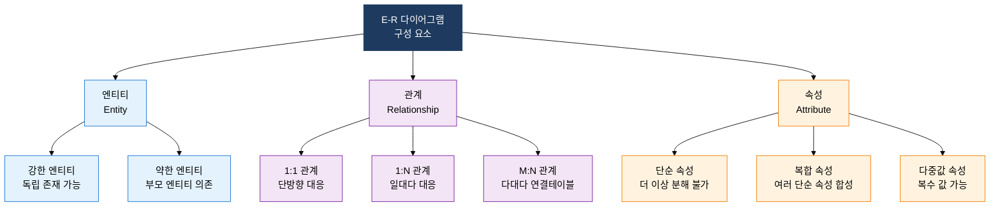
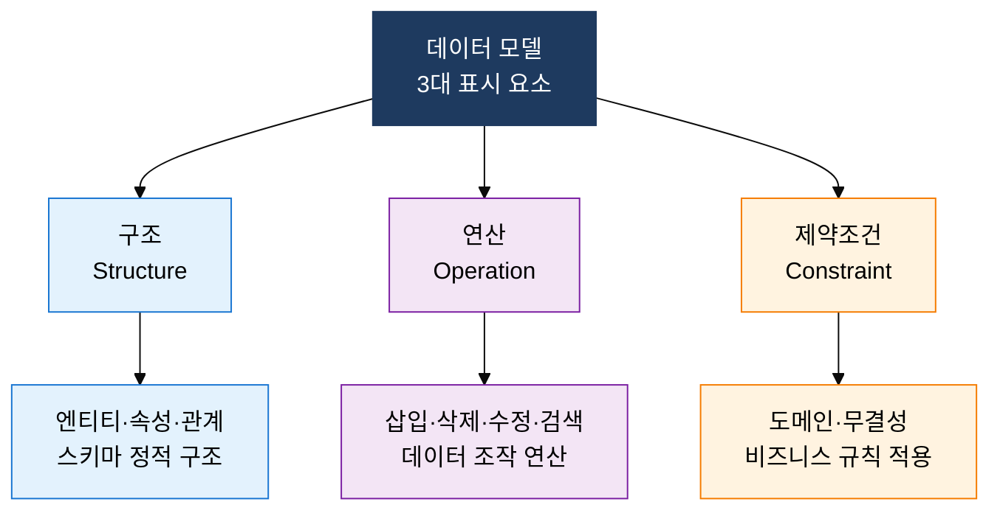

## 1. 현실 세계를 3단계 추상화로 DB 구조로 변환하는 체계적 설계 기법, 데이터 모델링의 개요

**정의**: 현실 세계의 업무 개념과 관계를 개념적·논리적·물리적 3단계로 단계적으로 추상화하여 데이터베이스 구조를 설계하는 체계적 기법.
- 개념적 모델링에서 E-R 다이어그램으로 비즈니스 엔티티·관계를 표현하고, 논리적 모델링에서 릴레이션 스키마로 변환
- 물리적 모델링에서 인덱스·파티션·저장 구조를 결정하여 DBMS 최적화된 최종 스키마 산출
- 요구사항 변경에 유연하게 대응하고 개발팀·도메인 전문가 간 의사소통 도구로 활용

**특징**:
- **단계적 정제**: 추상도가 높은 개념 모델부터 구현 수준의 물리 모델까지 점진적으로 세부화하여 오류를 조기 발견
- **독립적 표현**: 특정 DBMS에 종속되지 않는 논리 모델을 중심으로 물리 모델을 다양한 플랫폼에 매핑 가능
- **커뮤니케이션 수단**: E-R 다이어그램은 비전산 부서 담당자도 이해할 수 있는 공용 언어로 기능하며 요구사항 검증에 활용

---

## 2. 데이터 모델링의 핵심 구성 체계

### 가. 데이터 모델링 3단계 절차와 E-R 다이어그램 구성 요소

**E-R 다이어그램 핵심 구성 요소**

| 모델링 단계 | 산출물 | 주요 활동 | 참여자 |
|:---:|:---|:---|:---|
| **개념적 모델링** | E-R 다이어그램 | 엔티티 식별, 관계 정의, 핵심 속성 도출, 카디널리티 결정 | 업무 담당자, DA |
| **논리적 모델링** | 릴레이션 스키마 | E-R → 테이블 변환, 정규화, PK·FK 정의, 도메인 설정 | DBA, DA |
| **물리적 모델링** | DDL 스크립트 | 인덱스 설계, 파티션 전략, 저장 파라미터, 클러스터링 결정 | DBA, 시스템 엔지니어 |

**E-R 다이어그램 → 릴레이션 스키마 변환 규칙**

| 변환 대상 | 변환 규칙 | 결과 |
|:---:|:---|:---|
| **강한 엔티티** | 엔티티 → 독립 테이블, 기본키 속성 → PK | 단독 테이블 생성 |
| **약한 엔티티** | 부분 키 + 부모 PK → 복합 PK | 부모 FK 포함 테이블 |
| **1:1 관계** | 참여도 낮은 쪽 테이블에 FK 추가 또는 테이블 병합 | FK 추가 또는 단일 테이블 |
| **1:N 관계** | N 쪽 테이블에 1 쪽의 PK를 FK로 추가 | N 쪽에 FK 컬럼 |
| **M:N 관계** | 별도 연결 테이블 생성, 양쪽 PK → 복합 PK | 교차 테이블 생성 |
| **다중값 속성** | 별도 테이블로 분리, 원본 엔티티 PK → FK | 1:N 구조의 별도 테이블 |

---

### 나. 데이터 모델의 표시 요소와 물리 모델링 설계 전략

**물리 모델링 핵심 설계 요소**

| 물리 설계 요소 | 설계 기준 | 성능 효과 | 주의사항 |
|:---:|:---|:---|:---|
| **B-Tree 인덱스** | 카디널리티 높은 컬럼, 범위 검색 조건 | 포인트 검색·범위 검색 10~100배 향상 | DML 성능 저하, 과도한 인덱스 지양 |
| **Bitmap 인덱스** | 카디널리티 낮은 컬럼(성별·상태코드), OLAP | AND/OR 연산 병렬 처리, 집계 쿼리 최적화 | OLTP 환경 부적합, Lock 범위 큼 |
| **Range 파티션** | 날짜·순번 기반 대용량 이력 테이블 | 파티션 프루닝으로 스캔 범위 대폭 축소 | 파티션 키 선정이 성능 결정 |
| **Hash 파티션** | 균등 분산 필요 시, 조인 성능 최적화 | 데이터 편중 없는 균일 분산 보장 | 범위 검색 불가, 파티션 수 2의 배수 권장 |
| **클러스터 인덱스** | 자주 함께 조회되는 테이블 그룹 | 클러스터 키 기반 조인 I/O 최소화 | 클러스터 키 변경 시 데이터 재배치 |

---

## 3. 데이터 모델링 적용의 기대효과 및 활용 방안

| 구분 | 주요 기대효과 | 활용 및 실무 적용 방안 |
|:---:|:---|:---|
| **설계 품질** | 요구사항 오류를 초기 단계에서 발견하여 후속 단계 재작업 비용을 60~80% 절감 | 개념 모델 리뷰 체크리스트 도입, 도메인 전문가와의 E-R 다이어그램 공동 검토 워크숍 운영 |
| **커뮤니케이션** | E-R 다이어그램을 공용 언어로 업무 부서·개발·DBA 간 요구사항 오해 최소화 | 논리 모델 기반 API 계약(Contract) 정의, 마이크로서비스 경계 설계에 도메인 모델 활용 |
| **시스템 유연성** | DBMS 독립적인 논리 모델 유지로 클라우드 전환·멀티 DB 아키텍처 변환 용이 | 논리 모델 리포지터리 관리, DDL 자동 생성 도구(ERwin·DataGrip) 활용으로 물리 모델 자동화 |
| **성능 최적화** | 물리 모델 단계의 인덱스·파티션 사전 설계로 오픈 후 성능 장애 선제 예방 | 쿼리 패턴 분석 기반 인덱스 설계, 대용량 이력 테이블 파티션 전략 수립으로 조회 응답 시간 단축 |
