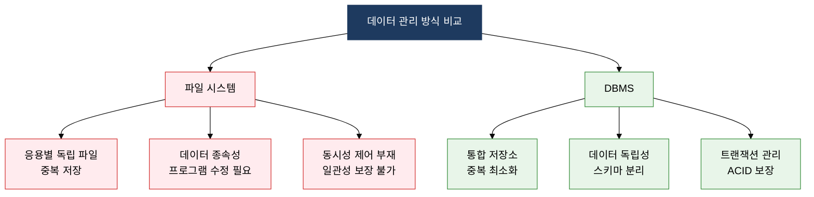
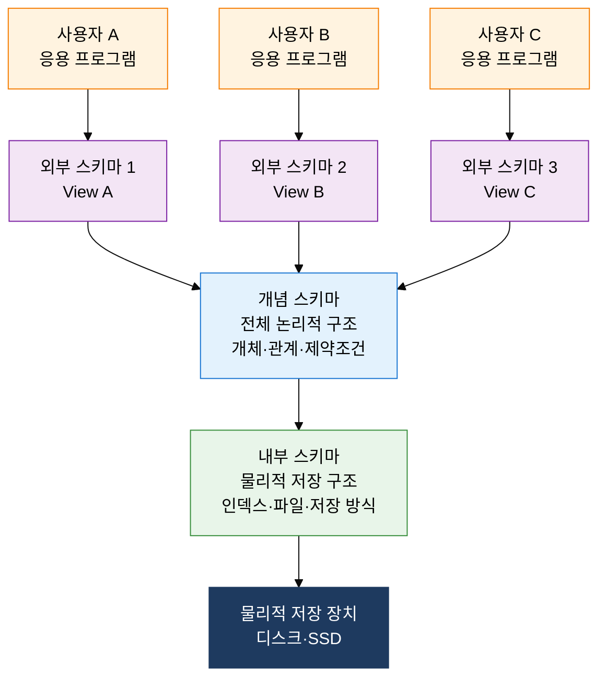

## 1. 데이터 중복·불일치를 구조적으로 제거하는 통합 관리 체계, 데이터베이스 시스템의 개요

**정의**: 조직의 데이터를 통합·공유하여 중복을 최소화하고 일관성을 유지하는 **데이터베이스 관리 시스템(DBMS)**과 이를 지원하는 3단계 스키마 아키텍처 체계.
- 파일 시스템의 데이터 종속성·중복·불일치 문제를 해결하기 위해 등장한 통합 데이터 관리 플랫폼
- ANSI/SPARC(1975)에서 제안한 외부·개념·내부 3계층 구조로 논리적·물리적 데이터 독립성 보장
- 트랜잭션 ACID 속성을 통해 다중 사용자 환경에서 데이터 무결성과 동시성을 동시에 확보

**특징**:
- **데이터 독립성**: 물리적 저장 구조 변경이 응용 프로그램에 영향을 주지 않으며, 논리적 스키마 변경이 사용자 뷰에 영향을 미치지 않는 이중 독립성 구조
- **데이터 공유 및 통합**: 다수 사용자·응용 프로그램이 동일 데이터를 동시에 공유하되 일관성을 유지하는 집중 관리 방식
- **데이터 무결성·보안**: 제약조건·트리거·접근 제어를 통해 부정확한 데이터 입력을 원천 차단하고 권한별 데이터 접근을 통제

---

## 2. 데이터베이스 시스템의 핵심 구성 체계

### 가. 파일 시스템 vs DBMS 비교 분석

| 비교 특성 | 파일 시스템 | DBMS | DBMS 우위 |
|:---:|:---|:---|:---|
| **데이터 중복** | 응용마다 별도 파일 저장, 중복 심각 | 통합 저장소, 중복 최소화 | 저장 공간 절약, 일관성 유지 |
| **데이터 종속성** | 파일 구조 변경 시 응용 프로그램 전면 수정 | 스키마 분리로 독립성 보장 | 유지보수 비용 대폭 절감 |
| **동시 접근** | 잠금 메커니즘 없어 충돌 발생 | 트랜잭션·잠금으로 동시성 제어 | 다중 사용자 안전 지원 |
| **무결성 제어** | 응용 프로그램에서 직접 검증 | 제약조건·트리거로 DB 수준 보장 | 중앙 집중 무결성 관리 |
| **보안 관리** | OS 파일 접근 권한에만 의존 | 사용자·역할 기반 세분화 권한 | 컬럼·행 수준 접근 제어 |
| **장애 복구** | 파일 백업 의존, 부분 복구 불가 | 로그 기반 롤백·롤포워드 지원 | 트랜잭션 단위 원자적 복구 |

---

### 나. ANSI-SPARC 3단계 스키마 아키텍처와 데이터 독립성

| 스키마 계층 | 역할 및 정의 | 사용자 관점 | 독립성 효과 |
|:---:|:---|:---|:---|
| **외부 스키마** | 특정 사용자·응용의 논리적 뷰 정의. 동일 개념 스키마를 다양한 관점으로 재구성 | 일반 사용자, 응용 개발자 | 논리적 독립성 확보: 개념 스키마 변경 시 외부 스키마 매핑만 수정 |
| **개념 스키마** | 조직 전체의 통합 논리적 구조. 엔티티·관계·제약조건 정의 (DBA 관리) | DBA, 데이터 아키텍트 | 두 계층 간 완충재 역할. 물리 변경이 논리에 무영향 |
| **내부 스키마** | 물리적 저장 구조 명세. 레코드 포맷·인덱스·접근 경로 정의 | 시스템 프로그래머, DBMS 엔진 | 물리적 독립성 확보: 저장 구조 변경이 개념 스키마에 무영향 |

**데이터 독립성 유형 비교**

| 구분 | 논리적 독립성 | 물리적 독립성 |
|:---:|:---|:---|
| **정의** | 개념 스키마 변경이 외부 스키마·응용에 무영향 | 내부 스키마 변경이 개념·외부 스키마에 무영향 |
| **실현 방법** | 외부/개념 간 매핑 테이블 수정 | 개념/내부 간 매핑 테이블 수정 |
| **변경 사례** | 테이블 컬럼 추가·삭제, 테이블 분리·통합 | 인덱스 추가, 파티셔닝, 저장 장치 교체 |
| **달성 난이도** | 상대적으로 어렵 (비즈니스 로직 연관) | 상대적으로 용이 (DBMS 엔진 처리) |

---

## 3. 데이터베이스 시스템 도입의 기대효과 및 활용 방안

| 구분 | 주요 기대효과 | 활용 및 실무 적용 방안 |
|:---:|:---|:---|
| **데이터 품질** | 중복 제거·무결성 제약조건으로 신뢰할 수 있는 단일 진실 공급원(SSOT) 확보 | 마스터 데이터 관리(MDM) 구축, 제약조건 기반 데이터 품질 자동 검증 파이프라인 운영 |
| **운영 효율** | 표준화된 SQL 인터페이스로 다양한 응용·사용자가 동일 데이터 공유, 개발 생산성 향상 | ANSI-SPARC 뷰 활용으로 부서별 맞춤 데이터 접근, 공통 데이터 레이어 설계 |
| **변경 유연성** | 논리적·물리적 독립성으로 비즈니스 요구 변경·인프라 교체 시 영향 범위 최소화 | 마이크로서비스 전환 시 스키마 마이그레이션 자동화, 클라우드 DB 이관 리스크 감소 |
| **보안·감사** | 역할 기반 접근 제어(RBAC)·감사 로그로 컴플라이언스 요건 충족 및 내부자 위협 대응 | GDPR·개인정보보호법 대응을 위한 컬럼 레벨 암호화, 접근 이력 감사 추적 체계 구축 |
