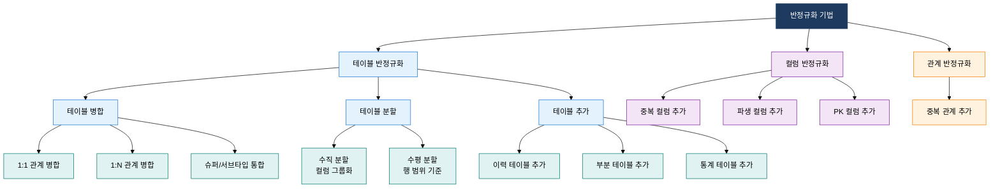

## 1. 조회 성능을 위해 의도적 중복을 허용하는 설계 전략, 반정규화의 개요

**정의**: 정규화로 분리된 릴레이션을 의도적으로 병합하거나 중복 데이터를 추가하여 조회 성능을 향상시키는 데이터베이스 설계 최적화 기법.
- 정규화가 데이터 무결성과 갱신 효율을 극대화하는 반면, 반정규화는 읽기 성능을 최우선으로 하는 상충 설계 전략
- 성능 저하가 명확히 측정되고 다른 해결 방안(인덱스·쿼리 최적화)으로 부족할 때만 선택적으로 적용
- 적용 후 무결성 관리 부담(트리거·배치 동기화)이 증가하므로 정확한 비용·편익 분석이 선행되어야 함

**특징**:
- **성능 vs 무결성 트레이드오프**: 조회 성능 향상과 함께 데이터 중복으로 인한 갱신 이상 위험이 증가하는 불가피한 상충 관계
- **목적성 있는 중복**: 우연히 발생한 설계 오류가 아닌, 성능 목표에 근거한 계획적·문서화된 중복 허용
- **동적 관리 필요**: 중복 데이터를 동기화하기 위한 트리거·배치·애플리케이션 레벨 보완 메커니즘 필수 운영

---

## 2. 반정규화의 핵심 구성 체계

### 가. 반정규화 필요성 판단 기준과 적용 프로세스

**반정규화 적용 판단 기준**

| 판단 기준 | 반정규화 적용 권고 | 반정규화 지양 |
|:---:|:---|:---|
| **조회 빈도** | 동일 조인 쿼리가 전체 쿼리의 80% 이상 | 조회보다 삽입·수정이 빈번한 OLTP 환경 |
| **조인 복잡도** | 5개 이상 테이블 조인, 복잡한 서브쿼리 반복 | 2~3개 테이블의 단순 조인 |
| **응답 시간** | 인덱스·쿼리 최적화 후에도 목표 시간 미달 | 인덱스 추가로 성능 목표 달성 가능 |
| **데이터 변경** | 원본 데이터 변경이 월 1회 이하로 드물 | 실시간으로 빈번하게 변경되는 마스터 데이터 |
| **일관성 허용** | 통계·분석용 데이터로 약간의 지연 허용 가능 | 금융 거래처럼 실시간 정확성이 절대적으로 필요 |

---

### 나. 반정규화 기법 분류 체계

**테이블 반정규화 기법 상세**

| 기법 분류 | 세부 기법 | 적용 기준 | 효과 | 주의사항 |
|:---:|:---|:---|:---|:---|
| **테이블 병합** | 1:1 관계 병합 | 두 테이블을 항상 함께 조회, 각 테이블의 데이터 행 수가 동일 | 조인 제거, I/O 감소 | NULL 컬럼 증가, 페이지 낭비 가능 |
| **테이블 병합** | 1:N 관계 병합 | 자식 테이블 건수가 극히 적고 항상 부모와 함께 조회 | 조인 1회 절감 | 부모 데이터 중복, 갱신 이상 위험 |
| **테이블 병합** | 슈퍼/서브타입 통합 | 서브타입 구분이 2~3개, 전체 조회 빈도가 높음 | 조인 제거, 단순한 쿼리 | NULL 컬럼 다수, 타입 구분 컬럼 필요 |
| **테이블 분할** | 수직 분할 | 자주 쓰는 컬럼과 드물게 쓰는 컬럼이 명확히 구분됨 | 핫 컬럼 I/O 집중, 페이지 효율 향상 | 재조합 시 조인 필요 |
| **테이블 분할** | 수평 분할 | 특정 범위의 행만 집중 조회(최근 1년 이력 등) | 파티션 프루닝 효과, 스캔 범위 축소 | 전체 조회 시 UNION 필요 |
| **테이블 추가** | 이력 테이블 추가 | 원본 테이블 변경 이력이 필요하나 원본에 포함 시 비대화 | 원본 테이블 슬림, 이력 조회 분리 | 동기화 배치·트리거 필수 |
| **테이블 추가** | 부분 테이블 추가 | 전체 컬럼 중 일부 컬럼만 반복 대량 조회 | 스캔 I/O 대폭 감소 | 원본 변경 시 동기화 부담 |
| **테이블 추가** | 통계 테이블 추가 | 합계·평균·최대 등 집계 연산을 실시간 수행 불가한 경우 | 집계 쿼리 응답 시간 획기적 단축 | 집계 주기(실시간/배치) 선택 중요 |

**컬럼·관계 반정규화 기법 상세**

| 기법 분류 | 세부 기법 | 적용 예시 | 효과 | 무결성 관리 방안 |
|:---:|:---|:---|:---|:---|
| **컬럼 반정규화** | 중복 컬럼 추가 | 주문 테이블에 고객명 중복 저장 (조인 없이 고객명 표시) | 고객 테이블 조인 제거 | 고객명 변경 시 트리거로 동기화 |
| **컬럼 반정규화** | 파생 컬럼 추가 | 주문 테이블에 합계금액(단가×수량 계산값) 컬럼 추가 | 매번 계산 연산 불필요 | 원본 데이터 변경 시 파생값 재계산 |
| **컬럼 반정규화** | PK에 의한 컬럼 추가 | 복잡한 복합 FK 대신 단순 대리키(Surrogate Key) 추가 | 조인 조건 단순화, 인덱스 효율 향상 | 대리키와 자연키 이중 유지 관리 |
| **관계 반정규화** | 중복 관계 추가 | A→B→C 경로를 A→C 직접 FK도 추가 | 중간 테이블 거치지 않는 직접 조인 | 중간 관계 변경 시 직접 FK도 갱신 필요 |

---

## 3. 반정규화 적용의 기대효과 및 활용 방안

| 구분 | 주요 기대효과 | 활용 및 실무 적용 방안 |
|:---:|:---|:---|
| **조회 성능** | 복잡한 다중 조인을 단일 테이블 스캔으로 대체하여 쿼리 응답 시간을 수십 배 단축 | OLAP·데이터마트 환경에서 별도 집계 테이블 구축, 배치 갱신 스케줄러로 통계 테이블 주기적 동기화 |
| **시스템 부하** | 조인 연산 감소로 CPU·메모리·I/O 부하를 낮춰 동일 하드웨어에서 더 많은 동시 사용자 처리 가능 | 통계 컬럼 사전 계산으로 OLTP 피크 시간대 집계 쿼리 부하 분산, 읽기 전용 레플리카와 병행 활용 |
| **운영 단순화** | 복잡한 뷰·서브쿼리 없이 단순 쿼리로 데이터 접근 가능하여 개발 생산성 및 유지보수성 향상 | ORM 매핑 복잡도 감소, 리포팅 도구에서 조인 없이 단일 테이블 접근으로 셀프서비스 BI 지원 |
| **아키텍처 최적화** | 정규화 모델(OLTP)과 반정규화 모델(OLAP)을 분리하는 HTAP 아키텍처로 양쪽 요건 동시 충족 | CDC(Change Data Capture) 기반 실시간 데이터 파이프라인으로 OLTP→OLAP 동기화, Lambda/Kappa 아키텍처 구현 |
