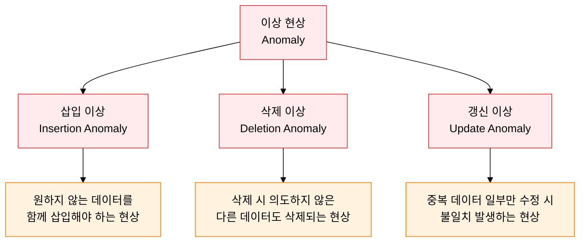
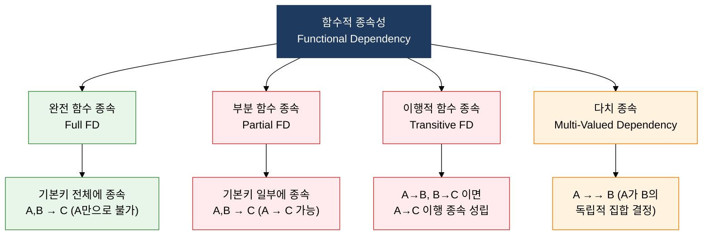

## 1. 함수적 종속성 분석으로 이상 현상을 원천 제거하는 릴레이션 분해 기법, 정규화의 개요

**정의**: 릴레이션 내의 함수적 종속성(FD)을 분석하여 이상 현상을 유발하는 중복 데이터를 제거하고, 보다 작고 잘 정의된 릴레이션으로 무손실 분해하는 체계적 스키마 설계 기법.
- 삽입 이상·삭제 이상·갱신 이상의 3가지 이상 현상을 정규화 단계를 높여 가며 단계적으로 제거
- 완전 함수 종속, 이행적 함수 종속, 다치 종속, 조인 종속 분석이 각 정규화 단계의 핵심 기준
- 높은 정규형일수록 데이터 무결성이 향상되나, 조인 연산 증가로 인한 성능 저하 트레이드오프 발생

**특징**:
- **무손실 분해**: 분해된 릴레이션을 자연 조인(Natural Join)하면 원래 릴레이션을 완전히 복원 가능한 가역적 변환
- **종속성 보존**: 분해 후에도 원래 릴레이션의 함수적 종속성 집합이 유지되어 무결성 제약 보장 지속
- **단계적 적용**: 각 정규형은 전 단계를 포함하는 충족 관계로, 하위 정규형을 만족해야 상위 정규형 달성 가능

---

## 2. 정규화의 핵심 구성 체계

### 가. 이상 현상과 함수적 종속성 유형 분류

**함수적 종속성 유형 분류**

| 이상 현상 유형 | 발생 원인 | 구체적 사례 | 해결 방법 |
|:---:|:---|:---|:---|
| **삽입 이상** | 복합키 일부에 해당 데이터 없을 때 불필요한 더미 데이터 함께 삽입 필요 | 수강 이력 없는 학생 정보를 수강 테이블에 삽입 불가 | 테이블 분리(정규화)로 독립 삽입 가능하게 |
| **삭제 이상** | 특정 레코드 삭제 시 연관된 다른 의미 있는 정보도 함께 소멸 | 마지막 수강 기록 삭제 시 학생 정보도 함께 삭제 | 테이블 분리로 데이터 독립성 확보 |
| **갱신 이상** | 중복 저장된 동일 데이터 일부만 수정 시 나머지와 불일치 발생 | 교수 전화번호 변경 시 수강 테이블 전체 갱신 누락 | 중복 컬럼 제거, 참조 구조로 전환 |

**함수적 종속성 유형 비교**

| FD 유형 | 정의 | 문제점 | 제거 정규형 |
|:---:|:---|:---|:---|
| **완전 함수 종속** | 기본키 전체가 결정자인 경우 (정상) | 없음 | 2NF의 목표 상태 |
| **부분 함수 종속** | 기본키의 진부분집합이 결정자인 경우 | 중복·삽입·삭제 이상 | 2NF에서 제거 |
| **이행적 함수 종속** | A→B, B→C 성립으로 A→C 이행 종속 | 갱신 이상, 중복 | 3NF에서 제거 |
| **다치 종속** | A→→B (A가 B의 독립 집합 결정) | 중복 투플 발생 | 4NF에서 제거 |

---

### 나. 정규화 단계별 분해 기준과 흐름

| 정규형 | 전제 조건 | 분해 기준 | 제거 대상 | 핵심 규칙 |
|:---:|:---|:---|:---|:---|
| **1NF** | 기본 릴레이션 조건 충족 | 모든 속성이 원자값(Atomic Value)이어야 함 | 반복 그룹, 다중값 속성 | 각 셀은 하나의 값만 포함 |
| **2NF** | 1NF 만족 | 기본키에 대해 완전 함수 종속 | 부분 함수 종속 | 복합 기본키에서 일부만으로 결정되는 속성 분리 |
| **3NF** | 2NF 만족 | 기본키에 대해 직접 함수 종속 | 이행적 함수 종속 | 기본키 외 속성 간 함수 종속 제거 |
| **BCNF** | 3NF 만족 | 모든 결정자가 후보키 | 후보키가 아닌 결정자 | 3NF를 만족해도 후보키 여러 개이고 교차 종속 시 위반 |
| **4NF** | BCNF 만족 | 자명하지 않은 다치 종속 제거 | 다치 종속 (MVD) | A →→ B이면 A →→ B와 관련 없는 속성 분리 |
| **5NF** | 4NF 만족 | 조인 종속이 후보키에 의해서만 성립 | 조인 종속 (JD) | 무손실 분해 후 재조인으로만 원본 복원 가능한 구조 |

**정규화 단계별 예시 (수강 릴레이션)**

| 단계 | 릴레이션 구조 | 문제점 | 분해 결과 |
|:---:|:---|:---|:---|
| **비정규형** | 학번, 이름, {과목코드, 과목명, 성적} | 반복 그룹 존재 | 행으로 펼침 필요 |
| **1NF 후** | (학번, 과목코드, 이름, 과목명, 성적) | 학번→이름 부분 FD 존재 | 복합키 (학번, 과목코드) |
| **2NF 후** | 학생(학번, 이름) + 수강(학번, 과목코드, 성적) + 과목(과목코드, 과목명) | 이상 현상 추가 검토 | 3개 테이블로 분리 |
| **3NF 후** | 이행 FD 없으면 동일 구조 유지 | BCNF 위반 여부 검토 | 후보키 중복 시 추가 분해 |

---

## 3. 정규화 적용의 기대효과 및 활용 방안

| 구분 | 주요 기대효과 | 활용 및 실무 적용 방안 |
|:---:|:---|:---|
| **데이터 품질** | 삽입·삭제·갱신 이상 현상 원천 제거로 데이터 일관성 자동 보장, 오류 데이터 유입 차단 | 논리 설계 단계에서 3NF~BCNF 달성 목표 설정, 정규화 체크리스트로 설계 리뷰 수행 |
| **유지보수성** | 최소 중복 구조로 데이터 변경 시 단일 위치만 수정하면 되어 유지보수 공수 절감 | ERD 도구(ERwin·DA#)로 종속성 자동 분석, 정규화 위반 경고 기능 활용 |
| **저장 효율** | 중복 데이터 제거로 물리적 저장 공간 절약 및 I/O 부하 감소 | 대용량 이력 테이블의 중복 컬럼 제거로 스토리지 비용 절감, 압축 효율 향상 |
| **설계 안정성** | 수학적으로 검증된 정규형 이론 적용으로 스키마 변경 영향 범위를 예측 가능하게 최소화 | 마이크로서비스 경계 설계 시 애그리거트별 3NF 보장, API 계약 안정성 향상 |
