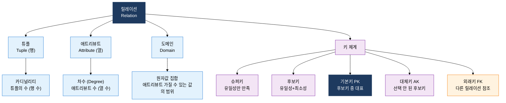
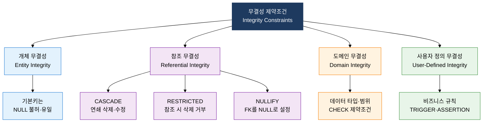
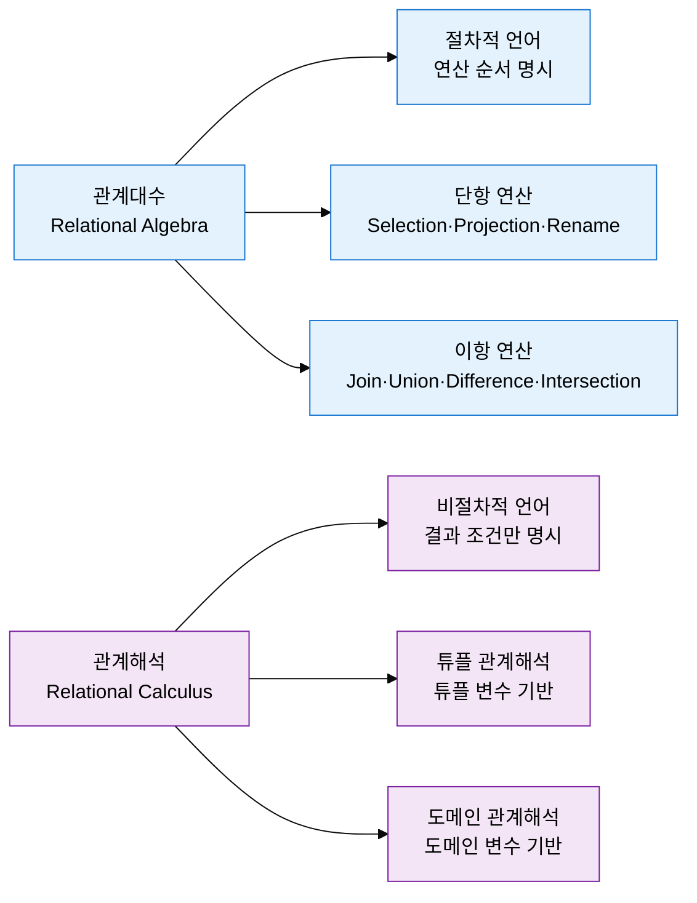

## 1. 수학적 집합론 기반으로 데이터 일관성을 보장하는 릴레이션 이론, 관계형 데이터 모델의 개요

**정의**: E.F. Codd(1970)가 제안한 수학적 집합론을 기반으로 데이터를 2차원 테이블(릴레이션) 형태로 표현하고, 무결성 제약조건과 관계대수 연산으로 데이터를 일관성 있게 관리하는 데이터 모델.
- 데이터와 데이터 관계를 모두 릴레이션(테이블)으로 표현하여 구조적 단순성과 이론적 완결성 동시 확보
- 키(Key) 체계와 무결성 제약조건을 통해 응용 프로그램과 독립적으로 데이터 품질 자동 보장
- 관계대수(Relational Algebra) 기반의 SQL로 비절차적 데이터 접근을 가능하게 하여 생산성 향상

**특징**:
- **데이터의 집합적 처리**: 개별 레코드가 아닌 릴레이션 단위로 데이터를 집합 연산하여 처리 효율과 선언적 접근 가능
- **수학적 이론 기반**: 집합론·1차 술어 논리에 근거한 관계대수·관계해석으로 데이터 조작의 정확성과 최적화 이론 확보
- **물리적 독립성**: 물리적 저장 방법과 무관하게 릴레이션 수준의 논리적 접근만으로 데이터 조작 가능

---

## 2. 관계형 데이터 모델의 핵심 구성 체계

### 가. 릴레이션 구조와 키(Key) 체계

| 릴레이션 구성 요소 | 정의 | 특성 |
|:---:|:---|:---|
| **튜플 (Tuple)** | 릴레이션의 각 행, 실제 데이터 값의 집합 | 순서 없음, 중복 불허 (집합 성질) |
| **애트리뷰트 (Attribute)** | 릴레이션의 각 열, 엔티티의 특성·속성 | 순서 없음, 원자값만 허용 (1NF) |
| **도메인 (Domain)** | 애트리뷰트가 가질 수 있는 원자값의 집합 | 데이터 타입·길이·범위 제한 |
| **차수 (Degree)** | 릴레이션의 애트리뷰트 수 | 스키마 변경 시 변동, 정적 성질 |
| **카디널리티** | 릴레이션의 튜플 수 | DML 연산에 따라 동적 변동 |

**키 체계 비교**

| 키 유형 | 조건 | 특성 | 예시 |
|:---:|:---|:---|:---|
| **슈퍼키** | 유일성 | 최소성 불필요, 상위 개념 | {학번}, {학번+이름} |
| **후보키** | 유일성+최소성 | 기본키 선정 대상 | {학번}, {이메일} |
| **기본키 (PK)** | 유일성+최소성+NOT NULL | 대표 식별자, 중복·NULL 불가 | {학번} |
| **대체키 (AK)** | 유일성+최소성 | 기본키 미선정 후보키 | {이메일} |
| **외래키 (FK)** | 참조 무결성 | 참조 테이블의 PK값 또는 NULL | 수강 테이블의 {학번} |

---

### 나. 무결성 제약조건과 관계대수 vs 관계해석 비교

**무결성 제약조건 상세**

| 무결성 유형 | 정의 및 규칙 | 위반 시 처리 | SQL 구현 |
|:---:|:---|:---|:---|
| **개체 무결성** | 기본키 속성은 NULL 값 불허, 릴레이션 내 중복 불허 | INSERT/UPDATE 거부 | PRIMARY KEY 제약조건 |
| **참조 무결성-CASCADE** | 부모 레코드 삭제·수정 시 자식 레코드도 연쇄 처리 | 자식 레코드 자동 삭제·수정 | ON DELETE/UPDATE CASCADE |
| **참조 무결성-RESTRICTED** | 자식 레코드가 참조 중인 부모 레코드 삭제·수정 거부 | 부모 레코드 조작 거부 | ON DELETE/UPDATE RESTRICT |
| **참조 무결성-NULLIFY** | 부모 레코드 삭제 시 자식의 FK를 NULL로 변경 | FK 컬럼 NULL 처리 | ON DELETE SET NULL |
| **도메인 무결성** | 애트리뷰트 값이 정의된 도메인 범위 내에 속해야 함 | INSERT/UPDATE 거부 | CHECK, DEFAULT, NOT NULL |
| **사용자 정의 무결성** | 비즈니스 규칙 기반 복합 제약 (재고 0 이상 등) | 트리거·애플리케이션 처리 | TRIGGER, ASSERTION |

**관계대수 vs 관계해석 비교**

| 구분 | 관계대수 | 관계해석 |
|:---:|:---|:---|
| **언어 유형** | 절차적 (Procedural) | 비절차적 (Non-Procedural) |
| **표현 방식** | 어떻게(How) 가져올지 연산 순서 명시 | 무엇을(What) 가져올지 조건만 명시 |
| **기반 이론** | 집합론, 대수 연산 | 1차 술어 논리, 논리 수식 |
| **주요 연산** | σ(Selection), π(Projection), ⋈(Join), ∪(Union), -(Difference) | 튜플 변수 조건식, 존재 한정자, 전체 한정자 |
| **SQL 관계** | SQL 내부 최적화·실행 계획의 이론적 기반 | SQL 쿼리 작성 방식과 의미론적 동일 |
| **완전성** | 관계 완전성 (Relationally Complete) | 관계대수와 표현력 동등 |

---

## 3. 관계형 데이터 모델 적용의 기대효과 및 활용 방안

| 구분 | 주요 기대효과 | 활용 및 실무 적용 방안 |
|:---:|:---|:---|
| **데이터 무결성** | 개체·참조·도메인 무결성 자동 보장으로 응용 계층 검증 부담 절감, 데이터 품질 향상 | CASCADE/RESTRICT 정책을 업무 규칙에 맞게 설정, CHECK 제약조건으로 비즈니스 규칙 DB 수준 강제 |
| **표준화 접근** | SQL 표준 인터페이스로 DBMS 종류와 무관하게 동일한 방식의 데이터 접근·조작 가능 | ORM 도구(JPA·Hibernate) 활용으로 릴레이션 모델을 객체 모델과 자동 매핑, 포터빌리티 확보 |
| **이론적 최적화** | 관계대수 기반 쿼리 최적화기(Optimizer)가 최적 실행 계획 자동 선택하여 성능 향상 | 실행 계획 분석(EXPLAIN PLAN)으로 조인 순서·인덱스 활용 최적화, 힌트 절 활용 |
| **설계 검증** | 수학적으로 정의된 정규화 이론 적용으로 이상 현상 원천 제거 및 스키마 품질 보장 | 정규화 단계별 검증 체크리스트 적용, 논리 설계 리뷰에서 무결성 제약조건 충족 여부 확인 |
