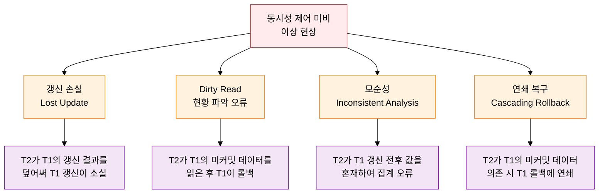
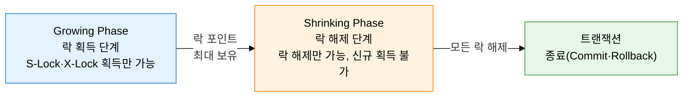

**다중 사용자 동시 접근의 충돌 차단 메커니즘**

## 1. 다중 사용자 동시 접근의 충돌 차단, 동시성 제어의 개요

**정의**: 다수의 트랜잭션이 동시에 데이터베이스에 접근할 때 발생하는 데이터 불일관성 문제를 방지하고 직렬 가능성(Serializability)을 보장하는 DBMS 핵심 제어 기법.
- 동시성 제어 없이 다중 트랜잭션이 같은 데이터를 동시 접근하면 갱신 손실, Dirty Read, 모순성 등 이상 현상 발생
- 로킹(Locking), 타임스탬프 순서화(Timestamp Ordering), 낙관적 기법(Optimistic), MVCC 등 다양한 방법론 존재
- 직렬 가능(Serializable) 스케줄 보장을 궁극적 목표로 하여 동시 실행 결과가 직렬 실행과 동등함을 보증

**특징**:
- **직렬 가능성 보장**: 동시 실행 스케줄이 어떤 직렬 스케줄과 동등한 결과를 보장하여 데이터 일관성을 확보
- **기아·교착상태 관리**: 로킹 기법에서 발생 가능한 교착상태(Deadlock)와 기아(Starvation) 문제를 탐지·해결하는 메커니즘 포함
- **성능-일관성 트레이드오프**: 동시성 제어 강도가 높을수록 일관성이 높아지나 처리량이 감소하므로 업무 특성에 맞는 기법 선택 필요

---

## 2. 동시성 제어의 핵심 구성 체계

### 가. 동시성 미비 시 발생 문제점 4가지

| 문제 유형 | 발생 원인 | 발생 시나리오 | 해결 방법 |
|---|---|---|---|
| **갱신 손실(Lost Update)** | 두 트랜잭션이 동시에 같은 데이터를 Read 후 각자 Write | T1이 X=100 읽음, T2가 X=100 읽음 → T1이 X=150 저장, T2가 X=120 저장 → T1의 갱신(+50) 소실 | 독점 락(X-Lock) 설정으로 직렬 실행 강제 |
| **Dirty Read (현황 파악 오류)** | 커밋되지 않은 데이터를 다른 트랜잭션이 읽음 | T1이 X=200으로 변경 중, T2가 X=200 읽음 → T1이 롤백 → T2는 존재하지 않는 데이터 기반으로 처리 | Read Committed 이상 고립 수준 적용 |
| **모순성(Inconsistent Analysis)** | 트랜잭션 진행 중 다른 트랜잭션이 데이터 변경 | T2가 집계 중 T1이 일부 데이터 갱신 → T2는 갱신 전후 값을 혼재하여 읽어 잘못된 집계 | Repeatable Read 이상 고립 수준 적용 |
| **연쇄 복구 불능(Cascading Rollback)** | 롤백된 트랜잭션의 데이터에 의존한 트랜잭션 연쇄 롤백 필요 | T1의 미커밋 데이터를 T2, T3가 순차적으로 읽고 처리 → T1 롤백 시 T2, T3도 전부 롤백 | Dirty Read 차단(Read Committed 이상) |

---

### 나. 로킹 기법, 2단계 로킹 규약(2PL), 교착상태 및 대안 기법

**락 호환성 매트릭스**

| 요청 \ 보유 | 공유 락 없음 | S-Lock 보유 | X-Lock 보유 |
|:---:|:---:|:---:|:---:|
| **S-Lock 요청** | 허용 | 허용 | 대기 |
| **X-Lock 요청** | 허용 | 대기 | 대기 |

| 기법 | 상세 설명 | 장점 | 단점 |
|---|---|---|---|
| **공유 락(S-Lock)** | Read 연산 시 설정. 다른 트랜잭션의 S-Lock과 공존 가능, X-Lock은 차단 | 읽기 동시성 허용으로 처리량 향상 | X-Lock 대기로 쓰기 지연 가능 |
| **독점 락(X-Lock)** | Write 연산 시 설정. S-Lock과 X-Lock 모두 차단 | 갱신 손실, Dirty Read 완전 차단 | 높은 경쟁 시 처리량 감소 |
| **2단계 로킹(2PL)** | Growing Phase에서 락 획득, Shrinking Phase에서 락 해제만 허용 | 직렬 가능성(Serializability) 보장 | 교착상태 발생 가능, 연쇄 복구 위험 |
| **교착상태(Deadlock)** | T1이 A락 보유·B락 대기, T2가 B락 보유·A락 대기 → 무한 대기 | - | 탐지(Wait-for Graph 사이클 탐색) 후 희생자(Victim) 선정·롤백으로 해소 |
| **타임스탬프 순서화** | 각 트랜잭션에 시작 시간 기반 타임스탬프 부여, 오래된 트랜잭션 우선 | 교착상태 없음 | 기아(Starvation) 위험, 충돌 시 롤백 빈번 |
| **낙관적 검증(OCC)** | Read→Validation→Write 3단계: 충돌 없음을 가정하고 완료 직전 검증 | 충돌 적은 환경에서 높은 처리량 | 충돌 많은 환경에서 롤백 오버헤드 증가 |
| **MVCC** | 데이터 변경 시 새 버전 생성, 읽기는 적합한 버전 참조 (Undo 영역 활용) | 읽기-쓰기 충돌 없음, 높은 동시성 | 버전 관리 오버헤드, 오래된 버전 정리(Vacuum) 필요 |

---

## 3. 동시성 제어 도입의 기대효과 및 활용 방안

| 구분 | 주요 기대효과 | 활용 및 실무 적용 방안 |
|---|---|---|
| **데이터 정합성** | 갱신 손실·Dirty Read·모순성 등 동시성 이상 현상 완전 차단 | 금융·전자상거래의 재고·잔액 처리에 적절한 락 전략 적용하여 정합성 보장 |
| **처리 성능** | MVCC 기반 읽기-쓰기 분리로 읽기 동시성을 높여 전체 처리량 향상 | OLTP 환경에서 MySQL InnoDB·PostgreSQL의 MVCC 기본 설정 활용으로 Read 부하 분산 |
| **교착상태 방지** | Wait-for Graph 탐지와 타임아웃 기반 해소로 시스템 중단 방지 | 애플리케이션 레벨에서 자원 접근 순서를 정형화하고 DB 레벨 데드락 타임아웃 설정으로 이중 방어 |
| **확장성** | 낙관적 동시성 제어·파티셔닝으로 대규모 트랜잭션 처리 가능 | 충돌이 적은 읽기 중심 워크로드에 OCC 적용, 충돌이 많은 쓰기 중심 워크로드에 2PL 적용으로 환경 최적화 |
