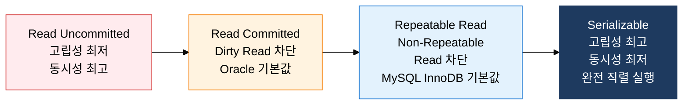

**일관성과 동시성의 균형을 결정하는 4단계 제어 레벨**

## 1. 일관성과 동시성의 균형 조정 레벨, 트랜잭션 고립 수준의 개요

**정의**: SQL 표준(SQL-92)에서 정의한 트랜잭션 간 데이터 가시성의 허용 범위를 4단계로 구분하여 데이터 일관성과 시스템 동시성 처리 성능 간의 트레이드오프를 제어하는 DBMS 설정.
- 고립 수준이 높을수록 데이터 일관성은 향상되지만 락 경쟁 증가로 동시 처리 성능 감소
- 고립 수준이 낮을수록 처리량은 높지만 Dirty Read·Non-Repeatable Read·Phantom Read 이상 현상 허용
- DBMS별로 기본 고립 수준이 다르며(MySQL InnoDB: Repeatable Read, Oracle: Read Committed), 업무 특성에 따라 선택 필요

**특징**:
- **4단계 표준화**: SQL-92 표준으로 Read Uncommitted → Read Committed → Repeatable Read → Serializable 4단계 정의
- **이상 현상 허용 매트릭스**: 각 고립 수준에서 허용·차단되는 3가지 이상 현상(Dirty/Non-Repeatable/Phantom Read)의 조합이 명확히 구분
- **DBMS 구현 다양성**: 표준 정의 외에 각 DBMS가 MVCC 등 자체 구현으로 표준과 다른 동작을 제공하는 경우 존재

---

## 2. 트랜잭션 고립 수준의 핵심 구성 체계

### 가. 고립 수준에 따른 데이터 이상 현상 3가지

```mermaid
%%{init: { 'theme': 'base', 'themeVariables': { 'edgeLabelBackground': '#fff' }}}%%
flowchart TD
    subgraph DR_BOX["Dirty Read 발생 타임라인"]
        direction LR
        T1A["T1: X=100→200 Write<br/>(미커밋 상태)"] --> T2A["T2: X=200 Read<br/>(T1의 미커밋 값 읽기)"]
        T2A --> T1B["T1: Rollback<br/>(X=100으로 복구)"]
        T1B --> RESULT_DR["T2는 존재하지 않는<br/>X=200 기반으로 처리 완료"]
    end
    subgraph NRR_BOX["Non-Repeatable Read 발생 타임라인"]
        direction LR
        T1C["T1: X=100 Read<br/>(첫 번째 조회)"] --> T2B["T2: X=100→200 변경<br/>Commit 완료"]
        T2B --> T1D["T1: X=200 Read<br/>(두 번째 조회, 다른 결과)"]
    end
    subgraph PR_BOX["Phantom Read 발생 타임라인"]
        direction LR
        T1E["T1: 나이 20대 조회<br/>5건 결과"] --> T2C["T2: 나이=25인 행 Insert<br/>Commit 완료"]
        T2C --> T1F["T1: 나이 20대 재조회<br/>6건 결과 (유령 행 출현)"]
    end
    style DR_BOX fill:#FFEBEE,stroke:#D32F2F,color:#000
    style NRR_BOX fill:#FFF3E0,stroke:#F57C00,color:#000
    style PR_BOX fill:#F3E5F5,stroke:#7B1FA2,color:#000
    style T1A fill:#E3F2FD,stroke:#1976D2,color:#000
    style T2A fill:#E3F2FD,stroke:#1976D2,color:#000
    style T1B fill:#FFEBEE,stroke:#D32F2F,color:#000
    style RESULT_DR fill:#FFEBEE,stroke:#D32F2F,color:#000
    style T1C fill:#E3F2FD,stroke:#1976D2,color:#000
    style T2B fill:#FFF3E0,stroke:#F57C00,color:#000
    style T1D fill:#FFEBEE,stroke:#D32F2F,color:#000
    style T1E fill:#E3F2FD,stroke:#1976D2,color:#000
    style T2C fill:#FFF3E0,stroke:#F57C00,color:#000
    style T1F fill:#FFEBEE,stroke:#D32F2F,color:#000
```

| 이상 현상 | 정의 | 발생 조건 | 실무 영향 사례 |
|---|---|---|---|
| **Dirty Read** | 아직 Commit되지 않은 다른 트랜잭션의 변경 데이터를 읽는 현상 | T1이 데이터 변경 중(미커밋), T2가 해당 데이터 읽기 후 T1 롤백 | 롤백될 주문금액을 기준으로 재고 차감 처리 → 재고 오류 발생 |
| **Non-Repeatable Read** | 같은 트랜잭션 내에서 동일 데이터를 반복 조회 시 다른 값이 반환되는 현상 | T1이 데이터 읽는 사이 T2가 해당 데이터를 변경·Commit | 동일 트랜잭션 내 잔액 2회 조회 시 값 불일치 → 이체 로직 오류 |
| **Phantom Read** | 같은 트랜잭션 내에서 범위 조건 쿼리 반복 시 새로운 행이 나타나거나 사라지는 현상 | T1이 범위 조회 사이 T2가 해당 범위 내 행을 Insert·Delete·Commit | 통계 집계 중 새 행 삽입으로 집계값이 달라지는 현상 |

---

### 나. 4단계 고립 수준 상세 비교

**고립 수준별 이상 현상 허용 매트릭스 (기술사 시험 핵심)**

| 고립 수준 | Dirty Read | Non-Repeatable Read | Phantom Read | 구현 메커니즘 | 주요 적용 사례 |
|:---:|:---:|:---:|:---:|---|---|
| **Read Uncommitted** | 허용 | 허용 | 허용 | 락 없이 최신 버전 직접 읽기 | 실시간 통계·로그 분석 등 정확도보다 속도가 중요한 경우 |
| **Read Committed** | **차단** | 허용 | 허용 | 커밋된 최신 버전만 읽기 (Short S-Lock 또는 MVCC) | Oracle·SQL Server 기본값, 일반 OLTP 업무 대부분 |
| **Repeatable Read** | **차단** | **차단** | 허용 | 트랜잭션 시작 시 스냅샷, 읽은 행에 S-Lock 유지 | MySQL InnoDB 기본값, 금융 조회·보고서 생성 |
| **Serializable** | **차단** | **차단** | **차단** | 범위 S-Lock(Next-Key Lock), 완전 직렬 실행 보장 | 회계·정산 등 완전 정합성이 필수인 고위험 트랜잭션 |

> **MySQL InnoDB 특이사항**: Repeatable Read에서 MVCC로 Phantom Read 대부분 차단 (일반 SELECT의 경우). 단, `SELECT ... FOR UPDATE` 등 잠금 읽기 시에는 Phantom Read 발생 가능.

> **Oracle 특이사항**: Read Committed와 Serializable만 지원하며, MVCC 기반으로 Non-Repeatable Read를 Read Committed에서도 Dirty Read만 허용하는 방식으로 구현.

**고립 수준 선택 기준**

| 업무 유형 | 권장 고립 수준 | 선택 이유 |
|---|---|---|
| 실시간 대시보드·모니터링 | Read Uncommitted | 약간의 오차 허용, 최고 성능 필요 |
| 일반 웹 애플리케이션 CRUD | Read Committed | Dirty Read 방지로 기본 정합성 확보, 높은 동시성 유지 |
| 금융 조회·배치 집계 | Repeatable Read | 동일 트랜잭션 내 일관된 조회 결과 보장 |
| 회계 마감·정산·감사 | Serializable | 완전한 직렬 실행으로 정합성 최우선 보장 |

---

## 3. 트랜잭션 고립 수준 적용의 기대효과 및 활용 방안

| 구분 | 주요 기대효과 | 활용 및 실무 적용 방안 |
|---|---|---|
| **데이터 정합성** | 업무 요구에 맞는 이상 현상 차단으로 데이터 신뢰성 확보 | 금융·회계 시스템은 Serializable, 일반 OLTP는 Read Committed로 계층화하여 정합성-성능 최적 균형 달성 |
| **성능 최적화** | 불필요하게 높은 고립 수준 방지로 락 경쟁 감소 및 처리량 향상 | 읽기 전용 리포트 트랜잭션은 Read Committed, 쓰기 집중 트랜잭션은 필요 최소 수준으로 명시적 설정 |
| **장애 대응** | 이상 현상 파악을 통한 데이터 오류 원인 신속 진단 | Non-Repeatable Read·Phantom Read 오류 발생 시 고립 수준 조정으로 즉각 대응 가능한 운영 절차 수립 |
| **표준 준수** | SQL-92 표준 고립 수준 기반으로 DBMS 마이그레이션 시 동작 예측 가능 | DBMS 교체·멀티 DBMS 환경에서 고립 수준 매핑 테이블 작성으로 이기종 환경 정합성 관리 체계화 |
