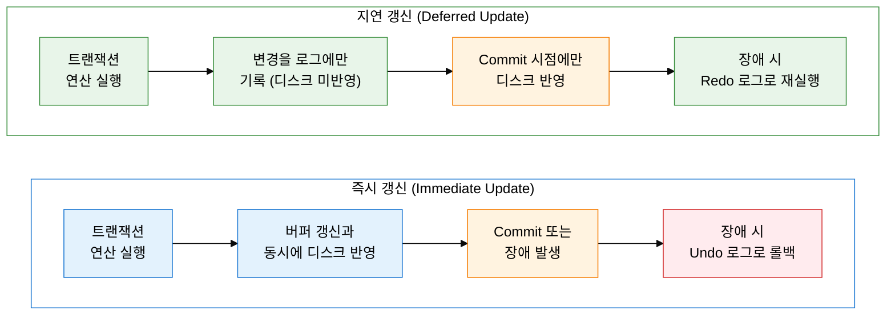
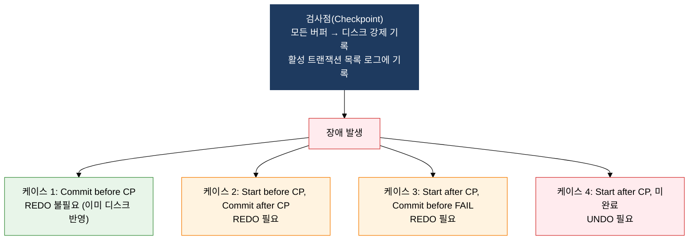

**장애 후 데이터베이스 일관성을 복원하는 로그 기반 메커니즘**

## 1. 장애 후 데이터 일관성 복원 메커니즘, 회복 기법의 개요

**정의**: 데이터베이스 시스템에 장애(시스템 장애·미디어 장애·트랜잭션 장애 등)가 발생했을 때 로그(Log) 정보를 기반으로 REDO·UNDO 연산을 수행하여 데이터베이스를 일관된 상태로 복원하는 DBMS 핵심 메커니즘.
- 회복의 기반은 Write-Ahead Logging(WAL): 데이터 변경 전 반드시 로그를 먼저 기록하는 원칙
- 검사점(Checkpoint) 기법으로 장애 시 회복 범위를 축소하여 회복 시간을 단축
- 즉시 갱신과 지연 갱신 방식에 따라 REDO·UNDO 필요 여부가 달라짐

**특징**:
- **WAL(Write-Ahead Logging) 원칙**: 데이터를 디스크에 쓰기 전에 반드시 로그를 먼저 안정 저장장치에 기록하여 회복 가능성 보장
- **REDO와 UNDO 이중 보완**: 커밋된 트랜잭션은 REDO로 재실행, 미완료 트랜잭션은 UNDO로 롤백하여 어떤 장애 시점에도 일관성 복구 가능
- **체크포인트 기반 회복 범위 최소화**: 전체 로그 재적용 대신 마지막 체크포인트부터 회복 수행하여 복구 시간을 현실적으로 단축

---

## 2. 회복 기법의 핵심 구성 체계

### 가. 로그 기반 회복 메커니즘 (즉시 갱신 vs 지연 갱신)

| 비교 항목 | 즉시 갱신 (Immediate Update) | 지연 갱신 (Deferred Update) |
|---|---|---|
| **갱신 시점** | 연산 실행과 동시에 버퍼→디스크 반영 | 트랜잭션 Commit 시점에만 디스크 반영 |
| **Redo 필요 여부** | 필요 (Commit 후 장애 시 재실행) | 필요 (Commit 후 미반영 데이터 재실행) |
| **Undo 필요 여부** | 필요 (미완료 트랜잭션 롤백) | 불필요 (미완료분은 디스크 미반영이므로) |
| **로그 기록 내용** | Before Image(변경 전) + After Image(변경 후) | After Image(변경 후)만 기록 |
| **장점** | 버퍼 오버플로 시에도 데이터 유지 가능 | Undo 불필요로 회복 로직 단순화 |
| **단점** | Undo 오버헤드 발생, 복잡한 회복 로직 | Commit 전 장애 시 모든 변경 손실 가능 |
| **실제 DBMS 사용** | InnoDB·Oracle 등 대부분의 상용 DBMS | 일부 단순 시스템, 읽기 중심 DB |

**REDO와 UNDO 상세**

| 연산 | 적용 대상 | 수행 내용 | 목적 |
|---|---|---|---|
| **REDO** | 장애 시점 전 Commit 완료된 트랜잭션 | After Image 로그를 기반으로 변경 연산 재실행 | 커밋된 변경이 디스크에 반영되지 않은 경우 복원 |
| **UNDO** | 장애 시점에 미완료 상태였던 트랜잭션 | Before Image 로그를 기반으로 변경 연산 취소 | 미완료 트랜잭션의 부분 반영 데이터 제거 |

---

### 나. 검사점 회복 기법 및 그림자 페이지 기법

**검사점 기준 4가지 회복 케이스**

| 케이스 | 시작 시점 | 종료 시점 | Redo 여부 | Undo 여부 | 이유 |
|:---:|---|---|:---:|:---:|---|
| **1** | 체크포인트 이전 | 체크포인트 이전 Commit | 불필요 | 불필요 | 체크포인트 시 이미 디스크에 완전 반영됨 |
| **2** | 체크포인트 이전 | 체크포인트 이후 Commit | 필요 | 불필요 | Commit은 완료되었으나 디스크 미반영 구간 존재 |
| **3** | 체크포인트 이후 | 장애 이전 Commit | 필요 | 불필요 | Commit 완료되었으나 디스크 미반영 가능성 |
| **4** | 체크포인트 이후 | 장애 시점 미완료 | 불필요 | 필요 | 미완료 트랜잭션의 부분 반영 데이터 제거 필요 |

**그림자 페이지 기법(Shadow Paging)**

| 항목 | 설명 |
|---|---|
| **개념** | 데이터 변경 시 원본 페이지(Shadow Page)는 그대로 유지하고, 새 페이지에만 변경 내용을 기록 |
| **Commit 처리** | 변경된 새 페이지를 현재 페이지 테이블에 등록, 원본(그림자) 페이지 폐기 |
| **Rollback 처리** | 변경된 새 페이지를 폐기하고 원본(그림자) 페이지 테이블로 복원 |
| **장점** | Undo 로그 불필요, 회복이 단순하고 빠름 |
| **단점** | 페이지 단편화 심화, 가비지 컬렉션 오버헤드, 동시성 제어 어려움 |
| **현황** | 실무에서는 로그 기반 회복이 주류, 그림자 페이지는 SQLite 일부 모드에서 사용 |

---

## 3. 회복 기법 도입의 기대효과 및 활용 방안

| 구분 | 주요 기대효과 | 활용 및 실무 적용 방안 |
|---|---|---|
| **시스템 가용성** | 장애 발생 시 REDO·UNDO 기반 자동 회복으로 서비스 중단 시간 최소화 | 검사점 주기를 업무 SLA에 맞게 조정(예: 금융 시스템 1분 이내 RPO 목표 시 검사점 주기 단축) |
| **데이터 무결성** | WAL 원칙으로 커밋된 모든 트랜잭션의 영속성 보장 | MySQL InnoDB `innodb_flush_log_at_trx_commit=1` 설정으로 WAL 엄격 적용, Durability 최우선 확보 |
| **운영 효율성** | 검사점 기반 회복 범위 축소로 대용량 환경에서도 현실적인 회복 시간 보장 | PITR(Point-In-Time Recovery) 구성으로 아카이브 로그 활용, 장애 시점 이전 임의 시점으로 복원 가능 |
| **재해 복구** | 원격 로그 전송·이중화로 미디어 장애 시에도 데이터 손실 없는 복구 가능 | Oracle Data Guard·MySQL Binlog Replication 등 로그 기반 복제로 재해 복구 사이트 구성 및 RTO·RPO 목표 달성 |
