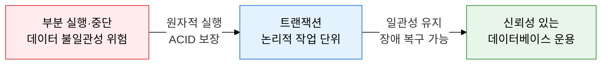
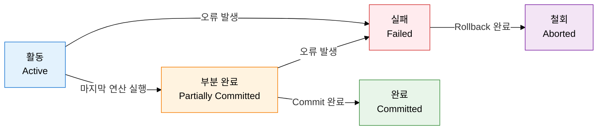
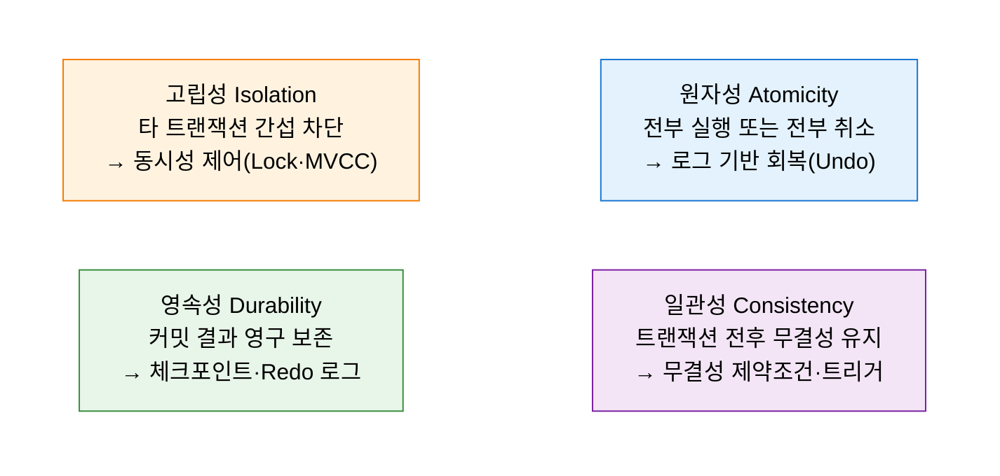

# 트랜잭션 (Transaction)
**데이터베이스의 논리적 작업 최소 단위**

## 1. 데이터 일관성의 최소 논리 단위, 트랜잭션의 개요

**정의**: 데이터베이스에서 하나의 논리적 기능을 수행하기 위한 작업의 기본 단위로, ACID 특성을 통해 데이터의 일관성과 무결성을 보장하는 연산 집합.
- 트랜잭션 내의 모든 연산은 전부 실행되거나(Commit) 전부 취소(Rollback)되어야 함
- 여러 SQL 문이 하나의 논리적 단위로 묶여 데이터베이스의 상태를 변환시키는 작업
- DBMS는 트랜잭션 단위로 회복, 동시성 제어, 무결성 보장 메커니즘을 적용함

**특징**:
- **원자성(Atomicity)**: 트랜잭션의 모든 연산은 완전히 수행되거나 전혀 수행되지 않아야 하며, 부분 실행 결과는 허용되지 않음
- **ACID 기반 신뢰성**: 원자성·일관성·고립성·영속성의 4가지 특성으로 다중 사용자 환경에서도 데이터 무결성을 보장
- **회복·동시성 제어의 기본 단위**: DBMS의 회복 관리자와 동시성 제어 관리자는 트랜잭션을 기본 단위로 동작하여 장애 대응 및 충돌 방지를 수행

---

## 2. 트랜잭션의 핵심 구성 체계

### 가. 트랜잭션 상태 전이도

| 상태 | 명칭 | 의미 | 전이 조건 |
|---|---|---|---|
| **활동(Active)** | 트랜잭션 시작 ~ 마지막 연산 실행 중 | SQL 문이 실행 중인 정상 진행 상태 | 트랜잭션 시작 시 진입 |
| **부분 완료(Partially Committed)** | 마지막 연산 직후, Commit 전 | 모든 연산 완료 후 버퍼에만 반영된 상태 | 마지막 SQL 실행 완료 후 |
| **완료(Committed)** | Commit 완료 후 영구 반영 | 변경 내용이 디스크에 영구 기록된 최종 상태 | Commit 명령 실행 성공 |
| **실패(Failed)** | 오류 발생으로 정상 진행 불가 | 하드웨어·소프트웨어·논리 오류로 중단된 상태 | 활동 또는 부분완료 중 오류 |
| **철회(Aborted)** | Rollback 완료 후 이전 상태 복구 | 트랜잭션 실행 전 상태로 데이터베이스가 되돌려진 상태 | Rollback 명령 실행 완료 |

---

### 나. ACID 특성 및 DBMS 보장 메커니즘

| ACID 특성 | 정의 | DBMS 보장 메커니즘 | 위반 시 문제 |
|---|---|---|---|
| **원자성(Atomicity)** | 트랜잭션의 모든 연산은 완전히 수행되거나 전혀 수행되지 않음 | Write-Ahead Log(WAL), Undo 로그 기반 롤백 | 부분 실행으로 데이터 불일관성 발생 |
| **일관성(Consistency)** | 트랜잭션 실행 전후 데이터베이스는 항상 일관된 상태 유지 | 무결성 제약조건(PK·FK·Check), 트리거, 연쇄 규칙 | 참조 무결성 파괴, 비즈니스 룰 위반 |
| **고립성(Isolation)** | 동시 실행되는 트랜잭션은 서로의 중간 결과에 접근 불가 | Lock(공유·독점), 2PL, MVCC, 타임스탬프 순서화 | Dirty Read, Lost Update, Phantom Read |
| **영속성(Durability)** | 성공적으로 Commit된 트랜잭션의 결과는 시스템 장애 후에도 유지 | WAL, Redo 로그, 체크포인트, 이중화·백업 | 장애 후 커밋된 데이터 소실 |

---

## 3. 트랜잭션 적용의 기대효과 및 활용 방안

| 구분 | 주요 기대효과 | 활용 및 실무 적용 방안 |
|---|---|---|
| **데이터 무결성** | ACID 보장으로 다중 사용자 환경에서도 데이터 일관성 유지 | 금융 이체·주문 처리 등 단일 비즈니스 로직을 하나의 트랜잭션으로 묶어 원자적 실행 보장 |
| **장애 복구** | 시스템 장애 시 Undo/Redo를 통해 일관된 상태로 자동 복구 | WAL(Write-Ahead Logging) 기반 로그를 활용하여 장애 유형별 자동 회복 절차 수립 |
| **동시성 제어** | 고립성 보장으로 다중 트랜잭션 동시 처리 시 충돌 방지 | 업무 특성에 맞는 고립 수준(Isolation Level) 선택으로 성능과 일관성의 최적 균형 달성 |
| **감사·추적성** | 트랜잭션 로그를 통한 데이터 변경 이력 완전 추적 가능 | 규제 준수(SOX·ISMS) 요건에서 변경 이력 보존을 트랜잭션 로그로 대응하여 감사 대응 강화 |
