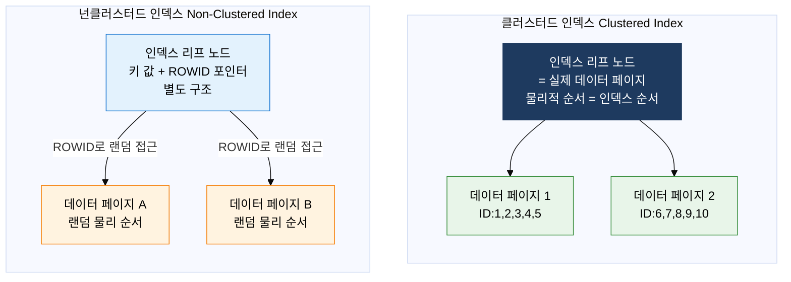

## 1. 풀스캔 없이 원하는 데이터를 즉시 탐색, 인덱스의 개요


**정의**: 테이블의 특정 컬럼 값과 해당 행의 물리적 위치(ROWID)를 매핑한 별도의 자료구조로, Full Table Scan을 회피하고 원하는 데이터에 최소 I/O로 직접 접근하는 성능 최적화 메커니즘.
- B+Tree, 비트맵, 해시 등 탐색 목적에 따라 다양한 구조를 선택하며, 잘못된 인덱스 설계는 오히려 DML 성능을 저하시킴
- 클러스터드 인덱스는 테이블 데이터 자체를 인덱스 키 순서로 물리 정렬하여 범위 탐색 성능을 극대화
- 인덱스 선택도(Selectivity)와 카디널리티(Cardinality)가 인덱스 효용의 핵심 판단 기준

**특징**:
- **구조적 탐색**: 트리 구조(O(log n)) 또는 해시(O(1)) 탐색으로 Full Scan 대비 수십~수천 배 I/O 절감
- **DML 오버헤드 트레이드오프**: INSERT·UPDATE·DELETE 시 인덱스도 함께 갱신되어 쓰기 성능 저하 가능 — 과도한 인덱스는 금물
- **선택도 의존성**: 카디널리티가 높은 컬럼(고유값 비율 높음)에서 효과 극대화, 성별처럼 값이 2~3개뿐인 컬럼에는 비트맵 인덱스가 적합

---

## 2. 인덱스의 핵심 구성 체계

### 가. 인덱스 구조 유형 비교

B+Tree는 기술사 시험 최빈출 구조로, 루트·브랜치·리프 3계층 구조와 리프 노드 간 연결 리스트를 반드시 이해해야 한다.

```mermaid
%%{init: { 'theme': 'base', 'themeVariables': { 'edgeLabelBackground': '#fff' }}}%%
flowchart TD
    ROOT["루트 노드 Root Node<br/>최상위 분기점<br/>키 범위로 브랜치 지시"]
    ROOT --> B1["브랜치 노드<br/>키 10~49"]
    ROOT --> B2["브랜치 노드<br/>키 50~99"]
    B1 --> L1["리프 노드<br/>키10 → ROWID<br/>키15 → ROWID<br/>키20 → ROWID"]
    B1 --> L2["리프 노드<br/>키25 → ROWID<br/>키30 → ROWID<br/>키40 → ROWID"]
    B2 --> L3["리프 노드<br/>키50 → ROWID<br/>키60 → ROWID<br/>키70 → ROWID"]
    B2 --> L4["리프 노드<br/>키80 → ROWID<br/>키90 → ROWID<br/>키99 → ROWID"]
    L1 -. "연결 리스트<br/>범위 스캔"-. -> L2
    L2 -. "연결 리스트<br/>범위 스캔"-. -> L3
    L3 -. "연결 리스트<br/>범위 스캔"-. -> L4
    style ROOT fill:#1E3A5F,stroke:#1E3A5F,color:#fff
    style B1 fill:#E3F2FD,stroke:#1976D2,color:#000
    style B2 fill:#E3F2FD,stroke:#1976D2,color:#000
    style L1 fill:#E8F5E9,stroke:#388E3C,color:#000
    style L2 fill:#E8F5E9,stroke:#388E3C,color:#000
    style L3 fill:#E8F5E9,stroke:#388E3C,color:#000
    style L4 fill:#E8F5E9,stroke:#388E3C,color:#000
```

**B+Tree 핵심 구조 포인트**:
- **내부 노드(루트·브랜치)**: 키 값과 자식 포인터만 저장, 실제 데이터 포인터 없음
- **리프 노드**: 키 값 + ROWID(물리 주소) 저장, 모든 검색은 반드시 리프 노드까지 도달
- **리프 노드 연결**: 인접 리프 노드가 양방향 연결 리스트로 연결 → 범위 검색(BETWEEN, >=) 시 연속 블록 스캔 가능
- **균형 유지**: 삽입·삭제 시 자동 리밸런싱으로 트리 높이 균일 유지 → 탐색 시간 O(log n) 보장

| 인덱스 유형 | 자료구조 | 탐색 복잡도 | 범위 검색 | 적합한 컬럼 | 주요 단점 |
|:---:|:---|:---:|:---:|:---|:---|
| **B-Tree** | 균형 이진 탐색 트리. 내부·리프 노드 모두 데이터 포인터 보유 | O(log n) | 가능 | 범용, 중간 카디널리티 | 리프 간 연결 없어 범위 스캔 시 역추적 필요 |
| **B+Tree** | B-Tree 개선판. 내부 노드는 키만, 리프에 데이터 포인터·연결 리스트 | O(log n) | 최적 | 범위 검색·정렬 컬럼, PK | 삽입·삭제 시 리밸런싱 오버헤드 |
| **비트맵 인덱스** | 각 컬럼 값별 비트 벡터. 비트 AND/OR 연산으로 다중 조건 결합 | O(1)~O(n/8) | 비효율 | 성별, 상태코드, 지역 등 저카디널리티 | 동시 DML 시 비트 락 경합 심각, OLTP 부적합 |
| **해시 인덱스** | 해시 함수로 버킷 주소 직접 계산, 버킷 내 체이닝 구조 | O(1) 평균 | 불가 | 동등 비교(=)만 사용하는 컬럼 | 범위·정렬 검색 전혀 지원 안 함, 해시 충돌 시 성능 저하 |
| **함수 기반 인덱스** | 컬럼 값에 함수 적용 결과를 인덱스화 | O(log n) | 가능 | UPPER, SUBSTR, 날짜 변환 등 | 함수 결과 변경 시 인덱스 무효화 |
| **복합 인덱스** | 두 개 이상 컬럼을 조합한 B+Tree | O(log n) | 선두 컬럼 기준 | 복합 조건 쿼리, 커버링 인덱스 | 선두 컬럼 없는 쿼리에는 미사용 |

---

### 나. 클러스터드 vs 넌클러스터드 인덱스 및 스캔 방식



| 구분 | 클러스터드 인덱스 | 넌클러스터드 인덱스 |
|:---:|:---|:---|
| **물리 정렬** | 테이블 데이터가 인덱스 키 순서대로 물리 정렬 | 데이터 물리 순서와 무관, 별도 인덱스 구조 |
| **테이블당 개수** | 1개만 생성 가능 (물리 정렬은 하나의 순서만 가능) | 여러 개 생성 가능 (Oracle 기준 약 1000개) |
| **리프 노드** | 리프 노드 자체가 실제 데이터 페이지 | 리프 노드에 키+ROWID 저장, 별도 데이터 페이지 참조 |
| **범위 검색** | 물리적 연속성으로 범위 스캔 매우 효율적 | 랜덤 I/O 발생 가능, 대량 범위 시 성능 저하 |
| **DML 오버헤드** | 삽입 시 물리 재정렬 발생, 페이지 분할 비용 큼 | 상대적으로 삽입·삭제 빠름 |
| **적합 컬럼** | PK, 범위 검색 빈번한 컬럼(날짜, ID 범위) | 다양한 검색 조건 컬럼, 커버링 인덱스 구성 |

**인덱스 스캔 방식 비교**

| 스캔 방식 | 동작 원리 | 사용 조건 | 성능 특성 |
|:---:|:---|:---|:---|
| **Index Unique Scan** | 인덱스에서 단 1건만 탐색 후 즉시 종료 | PK·Unique 제약 컬럼의 동등(=) 조건 | 최고 성능, 최소 I/O |
| **Index Range Scan** | 루트→브랜치→리프 탐색 후 리프 체인으로 범위 이동 | BETWEEN, >=, <=, LIKE 'A%' 등 범위 조건 | 범위 크기에 비례, 클러스터드 인덱스에서 특히 효율적 |
| **Index Full Scan** | 인덱스 전체 리프 노드를 처음부터 끝까지 스캔 | ORDER BY·GROUP BY 정렬 회피, 커버링 인덱스 | Full Table Scan보다 블록 수 적을 때 유리 |
| **Index Skip Scan** | 복합 인덱스에서 선두 컬럼 조건 없어도 탐색 | 선두 컬럼 카디널리티 낮고 후행 컬럼 조건 있을 때 | 선두 컬럼 값 구간마다 Range Scan 수행 — 오버헤드 존재 |
| **Index Fast Full Scan** | 멀티블록 I/O로 인덱스 전체 블록 읽기 | 인덱스 내 컬럼만으로 쿼리 완성(커버링) | Full Scan보다 빠르나 정렬 보장 없음 |

---

## 3. 인덱스 도입의 기대효과 및 활용 방안

| 구분 | 주요 기대효과 | 활용 및 실무 적용 방안 |
|:---:|:---|:---|
| **쿼리 성능** | Full Table Scan 제거로 수백만 행 테이블에서도 수 밀리초 내 응답, I/O 비용 수십~수천 배 절감 | 실행계획(EXPLAIN PLAN) 분석으로 Full Scan 구간 식별 후 선택도 높은 컬럼에 B+Tree 인덱스 추가 |
| **설계 최적화** | 복합 인덱스·커버링 인덱스 설계로 테이블 접근 없이 인덱스만으로 쿼리 완성(Zero Block Read) 가능 | 빈번한 SELECT 컬럼을 인덱스에 포함시켜 커버링 인덱스 구성, DML 오버헤드와 읽기 성능 간 균형 설계 |
| **OLAP 분석** | 비트맵 인덱스의 비트 AND/OR 연산으로 다차원 집계·필터링 성능 극대화 | DW/BI 환경에서 성별·지역·상태 등 저카디널리티 컬럼에 비트맵 인덱스 적용, 배치 로드 후 인덱스 리빌드 전략 수립 |
| **유지보수** | 인덱스 단편화(Fragmentation) 모니터링·주기적 리빌드로 성능 저하 방지 | 통계 정보 자동 갱신 스케줄 설정, 사용되지 않는 인덱스 제거(Unused Index Monitoring)로 DML 오버헤드 감소 |
