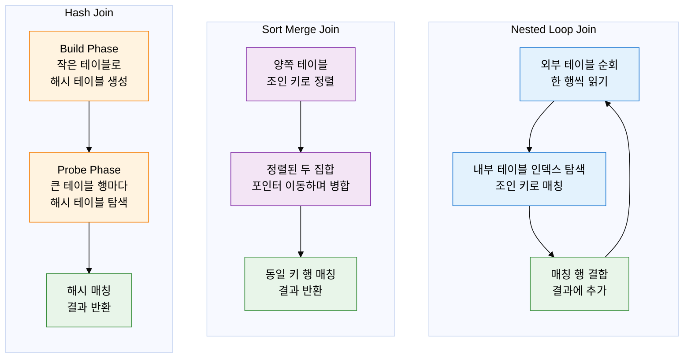
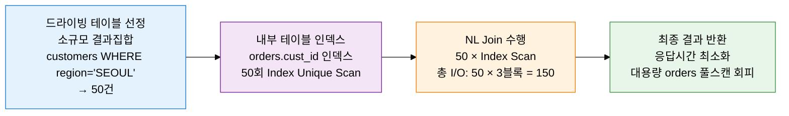

## 1. 두 테이블 결합의 최적 알고리즘 선택, 조인 메커니즘의 개요

**정의**: 두 개 이상의 테이블을 조인 조건(ON 절)에 따라 결합하여 단일 결과집합을 생성하는 DBMS 내부 알고리즘으로, 데이터 크기·인덱스 존재 여부·조인 유형에 따라 Nested Loop·Sort Merge·Hash Join 중 최적 방식을 선택.
- 조인 성능은 드라이빙 테이블의 결과집합 크기, 내부 테이블의 인덱스 존재 여부, 사용 가능한 메모리(PGA/Work_mem) 크기에 의해 결정
- 옵티마이저는 통계 정보를 기반으로 세 가지 알고리즘 중 최소 비용 방식을 자동 선택하며, 개발자는 힌트로 조인 방식과 순서를 강제할 수 있음
- 잘못된 드라이빙 테이블 선정은 조인 성능을 수십 배 저하시킬 수 있어, 소규모 결과집합이 항상 외부(드라이빙) 테이블이 되어야 함

**특징**:
- **알고리즘 다양성**: NL Join은 소규모 OLTP, Hash Join은 대용량 OLAP, Sort Merge Join은 이미 정렬된 데이터나 부등호 조인에 각각 최적화된 서로 다른 메커니즘
- **메모리 민감성**: Hash Join과 Sort Merge Join은 메모리(PGA/Sort Buffer)를 충분히 할당받아야 최고 성능 발휘, 메모리 부족 시 디스크 스필(Spill)로 성능 급락
- **드라이빙 테이블 결정적 역할**: NL Join에서 드라이빙 테이블의 결과집합 크기가 내부 루프 반복 횟수를 결정 — 드라이빙 테이블 선정 오류가 가장 흔한 성능 문제

---

## 2. 조인 메커니즘의 핵심 구성 체계

### 가. 3가지 조인 알고리즘 동작 원리 비교

| 조인 방식 | 동작 원리 | 시간 복잡도 | 적합한 상황 | 장점 | 단점 |
|:---:|:---|:---:|:---|:---|:---|
| **Nested Loop Join** | 외부 테이블을 행 단위로 순회하며 내부 테이블을 반복 탐색. 내부 테이블 조인 컬럼에 인덱스 필수 | O(n × log m) | 소규모 드라이빙 결과, 내부 테이블 인덱스 존재, OLTP 단건·소량 조회 | 첫 행 빠르게 반환(응답 시간 최소), 메모리 적게 사용, 인덱스 활용 극대화 | 드라이빙 집합 크면 내부 루프 폭발적 증가, 인덱스 없으면 사용 불가 |
| **Sort Merge Join** | 양쪽 테이블을 조인 키 기준으로 먼저 정렬한 후, 포인터를 이동하며 병합 | O(n log n + m log m) | 이미 정렬된 결과, 비동등 조인(부등호), 범위 조인, 대용량·인덱스 부재 | 정렬 후 선형 병합으로 예측 가능한 성능, 부등호 조인 지원 | 정렬 비용 높음, 메모리 부족 시 디스크 정렬로 성능 급락 |
| **Hash Join** | 작은 테이블로 메모리 해시 테이블 빌드 후, 큰 테이블 행마다 해시 탐색으로 매칭 | O(n + m) 평균 | 대용량 동등 조인, 인덱스 없는 테이블, OLAP·DW 집계 쿼리 | 인덱스 없어도 고성능, 대용량에서 NL 대비 압도적 성능 | 동등(=) 조인만 가능, 메모리 부족 시 디스크 해시(Grace Hash Join)로 전환 — 성능 저하 |

---

### 나. 조인 성능 최적화 기법

**드라이빙 테이블 선정 원칙**:
- NL Join에서 드라이빙 테이블의 결과집합 크기 = 내부 루프 반복 횟수
- 항상 WHERE 조건 적용 후 결과집합이 **가장 작은 테이블**이 드라이빙 테이블
- Hash Join에서는 Build 대상이 **더 작은 테이블** (메모리에 올라가는 쪽)

| 최적화 기법 | 적용 조건 | 효과 | 주의사항 |
|:---:|:---|:---|:---|
| **드라이빙 테이블 최소화** | NL Join 사용 시 항상 적용 — WHERE 조건이 가장 많은 테이블을 드라이빙으로 | 내부 루프 횟수 최소화로 전체 I/O 수십 배 절감 | 조건 선택도 오판 시 역효과. EXPLAIN으로 실제 Rows 확인 필수 |
| **조인 컬럼 인덱스 구성** | NL Join 내부 테이블, 모든 조인 유형의 조인 키 컬럼 | Index Range/Unique Scan으로 내부 루프 비용 최소화 | 복합 인덱스 구성 시 조인 키를 선두 컬럼에 배치 |
| **조인 순서 최적화** | 3개 이상 테이블 조인 시 — LEADING 힌트 활용 | 중간 결과집합 최소화로 후속 조인 비용 감소 | 조인 순서는 중간 결과집합 크기 기준으로 결정 |
| **서브쿼리를 조인으로 변환** | 상관 서브쿼리(Correlated Subquery) — 외부 쿼리 행마다 반복 실행되는 구조 | 조인으로 변환 시 한 번만 실행, 성능 수십 배 향상 | 의미 동일성 검증 필수. NOT EXISTS → LEFT JOIN + IS NULL 패턴 활용 |
| **해시 조인 메모리 튜닝** | Hash Join 사용 시 — 빌드 테이블이 메모리에 충분히 올라가야 함 | 디스크 스필 방지로 해시 조인 최고 성능 유지 | PGA_AGGREGATE_TARGET(Oracle), work_mem(PostgreSQL) 증가 시 전체 세션 영향 고려 |
| **배치 NL 조인** | 소규모 OLTP에서 대량 처리 필요 시 — 배치 키 액세스(BKA) | 내부 테이블 접근을 묶어서 처리, 랜덤 I/O를 순차 I/O로 전환 | MySQL 8.0 Hash Join 또는 BKA 힌트 활용 |

---

## 3. 조인 메커니즘 최적화의 기대효과 및 활용 방안

| 구분 | 주요 기대효과 | 활용 및 실무 적용 방안 |
|:---:|:---|:---|
| **OLTP 성능** | NL Join + 내부 테이블 인덱스로 수백만 행 테이블 조인도 수 밀리초 내 응답, 동시 사용자 처리 극대화 | 조인 쿼리 EXPLAIN 분석으로 드라이빙 테이블 확인, USE_NL 힌트와 조인 키 인덱스로 소규모 OLTP 튜닝 |
| **OLAP 분석** | Hash Join으로 인덱스 없는 수억 건 테이블 동등 조인을 메모리 기반으로 고속 처리 | DW 쿼리에서 Hash Join 강제(USE_HASH), work_mem/PGA 증가로 디스크 스필 방지, 파티션 프루닝과 병행 |
| **쿼리 구조 개선** | 상관 서브쿼리·인라인 뷰를 조인으로 재작성하여 반복 실행 구조 제거, 전체 실행 횟수 최소화 | 상관 서브쿼리를 LEFT JOIN + GROUP BY 또는 Window Function으로 변환, ORM 생성 N+1 쿼리 조인 변환 |
| **아키텍처 설계** | 조인 메커니즘 이해를 바탕으로 정규화·비정규화 균형, 파티셔닝 전략, 분산 DB 크로스 조인 비용 최소화 | 마이크로서비스에서 DB 분리 시 크로스 서비스 조인을 API 집계·이벤트 소싱으로 대체 설계 |
