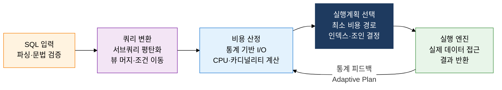
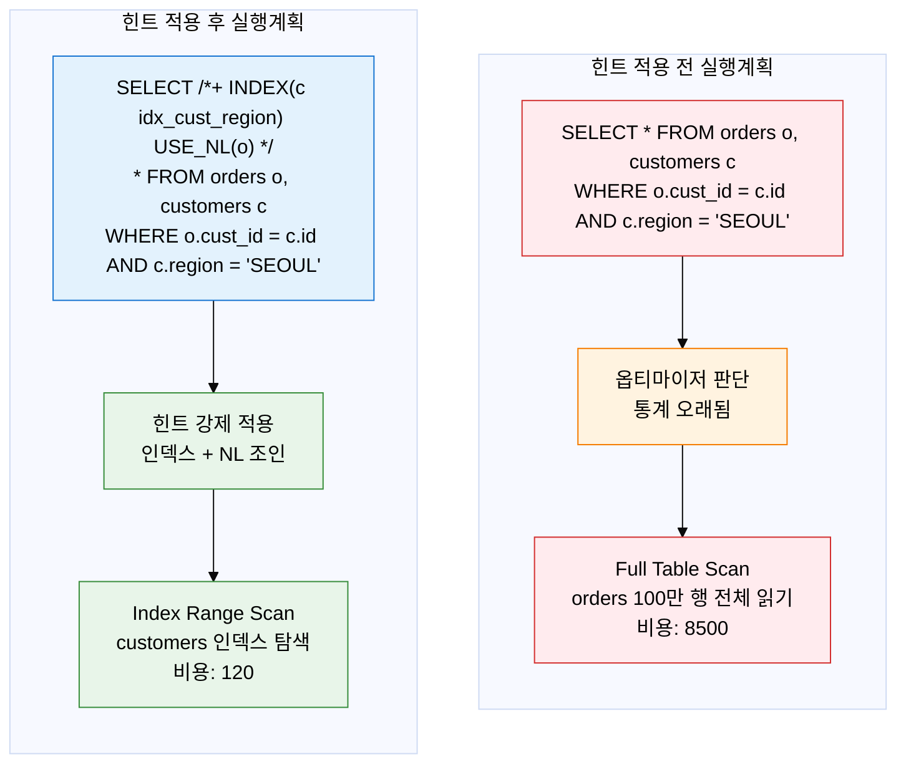

## 1. SQL을 최소 비용 실행 경로로 변환, 옵티마이저의 개요

**정의**: SQL 문장을 파싱하여 가능한 모든 실행 경로를 평가하고, 통계 정보 기반의 비용 모델로 최소 비용 실행계획을 자동 선택하는 DBMS 내부 쿼리 최적화 엔진.
- 규칙 기반(RBO)에서 비용 기반(CBO)으로 진화하였으며, 현대 DBMS(Oracle 10g 이후, PostgreSQL, MySQL 8.0 이상)는 CBO를 기본으로 사용
- 최적화 품질은 통계 정보(행 수, 카디널리티, 히스토그램, 블록 수)의 정확성에 크게 의존하며, 통계 미갱신은 잘못된 실행계획의 주요 원인
- 개발자는 힌트(Hint) 메커니즘으로 옵티마이저 판단에 개입하여 특정 인덱스 사용이나 조인 순서를 강제할 수 있음

**특징**:
- **비용 기반 최적화**: I/O 비용, CPU 비용, 네트워크 비용을 수치화하여 복수의 실행계획 후보를 비교·선택하는 과학적 결정 메커니즘
- **통계 의존성**: 테이블 행 수, 컬럼 카디널리티, 히스토그램, 인덱스 클러스터링 팩터 등 통계 정보의 정확도가 최적화 품질을 결정
- **힌트 오버라이드**: 옵티마이저가 잘못된 실행계획을 생성할 경우 SQL 힌트로 강제 제어 가능 — 단, 남용 시 통계 갱신 후 성능 역전 위험

---

## 2. 옵티마이저의 핵심 구성 체계

### 가. RBO vs CBO 비교 및 CBO 최적화 과정

**CBO 비용 산정 3요소**:
- **I/O Cost**: 디스크 블록 읽기 횟수 × 블록당 읽기 비용 — 전체 비용의 70~80% 차지
- **CPU Cost**: 행 처리당 연산 비용 × 예상 처리 행 수 — 해시·정렬 집약 연산에서 비중 증가
- **Network Cost**: 분산 DB·RAC 환경에서 노드 간 데이터 전송 비용

| 비교 항목 | RBO (Rule-Based Optimizer) | CBO (Cost-Based Optimizer) |
|:---:|:---|:---|
| **최적화 기준** | 사전 정의된 15개 규칙 우선순위 — 인덱스 있으면 무조건 사용 | 통계 기반 비용 수치 계산으로 최소 비용 경로 선택 |
| **통계 정보 활용** | 미사용. 테이블 크기·데이터 분포 무시 | 행 수, 카디널리티, 히스토그램, 블록 수 등 필수 |
| **적용 DBMS 버전** | Oracle 9i 이전 (현재 Oracle은 힌트로만 활성화 가능) | Oracle 10g 이후 기본값, PostgreSQL, MySQL 8.0+ |
| **예측 가능성** | 규칙 기반이므로 결과 예측 쉬움 | 통계 정확도에 따라 실행계획 변동 가능 |
| **데이터 편향 처리** | 처리 불가. 성별 컬럼이라도 인덱스 있으면 사용 | 히스토그램으로 데이터 분포 반영, 선택적 인덱스 사용 |
| **복잡 쿼리 성능** | 규칙 우선순위로 최적 경로 놓치는 경우 많음 | 조인 순서·인덱스 조합 탐색으로 최적 경로 선택 |
| **유지보수** | 통계 갱신 불필요, 단순 유지 | 통계 주기적 갱신 필수 (ANALYZE/DBMS_STATS) |

---

### 나. 힌트(Hint) 활용 및 실행계획 분석

**실행계획 분석 핵심 포인트**:
- `EXPLAIN PLAN FOR [SQL]` 또는 `EXPLAIN [SQL]`로 실행계획 확인
- **Rows(Cardinality)**: 옵티마이저가 예측한 행 수 — 실제 행 수와 크게 다르면 통계 미갱신 의심
- **Cost**: 상대적 비용 수치 — 루트 노드의 Total Cost가 전체 실행 비용
- **Access Type**: ALL(Full Scan) → range → ref → const 순으로 성능 향상 (MySQL 기준)

| 힌트 종류 | 문법 (Oracle 기준) | 적용 목적 | 사용 시 주의사항 |
|:---:|:---|:---|:---|
| **INDEX** | `/*+ INDEX(테이블 인덱스명) */` | 특정 인덱스 강제 사용, Full Scan 회피 | 데이터 증가로 인덱스 효율 변할 경우 힌트가 오히려 역효과 |
| **FULL** | `/*+ FULL(테이블) */` | 인덱스 무시하고 Full Scan 강제 — 소규모 테이블·DW 배치 | 대용량 OLTP에서 절대 사용 금지 |
| **USE_NL** | `/*+ USE_NL(테이블) */` | Nested Loop Join 강제 적용 | 내부 테이블 크기 클 경우 성능 역전 |
| **USE_HASH** | `/*+ USE_HASH(테이블) */` | Hash Join 강제 — 대용량 테이블 동등 조인 | PGA 메모리 부족 시 디스크 스필 발생 |
| **PARALLEL** | `/*+ PARALLEL(테이블 4) */` | N개 병렬 프로세스로 Full Scan 분산 처리 | 동시 사용자 많을 때 리소스 경합 심각 |
| **NO_INDEX** | `/*+ NO_INDEX(테이블 인덱스명) */` | 특정 인덱스 사용 억제 | 다른 인덱스 또는 Full Scan으로 전환 |
| **LEADING** | `/*+ LEADING(테이블1 테이블2) */` | 조인 순서 강제 지정 | 드라이빙 테이블 선정 오류 시 NL 조인 성능 대폭 저하 |

---

## 3. 옵티마이저 도입의 기대효과 및 활용 방안

| 구분 | 주요 기대효과 | 활용 및 실무 적용 방안 |
|:---:|:---|:---|
| **쿼리 성능** | CBO 비용 모델로 수천 개 실행계획 후보 중 최적 경로 자동 선택, 수동 튜닝 공수 80% 이상 절감 | 주기적 통계 갱신(DBMS_STATS, ANALYZE) 스케줄 설정, 히스토그램 수집으로 데이터 편향 컬럼 정확도 향상 |
| **안정성** | SQL Plan Baseline·Adaptive Plan으로 통계 변경 시에도 검증된 실행계획 유지 가능 | Oracle SPM(SQL Plan Management) 또는 pg_hint_plan 활용, 배포 전 EXPLAIN으로 실행계획 변경 여부 확인 |
| **문제 진단** | 실행계획의 Cardinality 오류·비용 과소평가 구간 식별로 튜닝 포인트 명확화 | AWR·ASH 보고서 또는 slow query log 분석으로 고비용 SQL 목록화, 힌트·인덱스·통계로 3단계 튜닝 적용 |
| **운영 자동화** | Adaptive Query Optimization(Oracle 12c+)으로 런타임 통계 피드백 기반 실시간 실행계획 재조정 | 개발·테스트 환경에서 EXPLAIN 자동 비교 CI 파이프라인 구축, 실행계획 회귀 탐지로 배포 품질 보장 |
