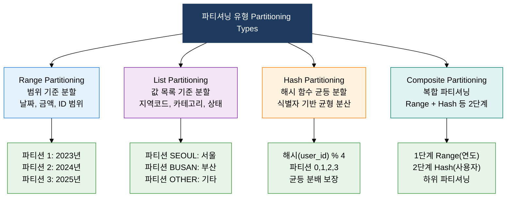
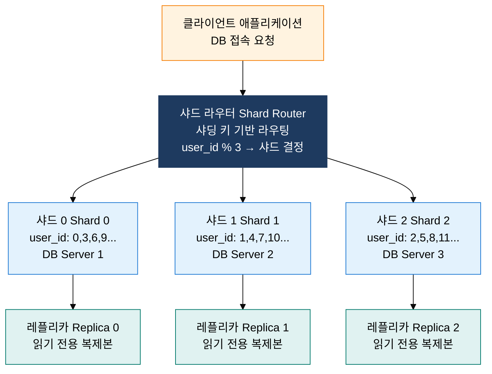

## 1. 대용량 데이터를 분할해 성능·관리 최적화, 파티셔닝 및 샤딩의 개요


**정의**: 대용량 테이블을 특정 기준(범위·목록·해시)에 따라 논리적 또는 물리적으로 분할하여 쿼리 범위를 제한하고, 병렬 처리·관리 효율성을 높이는 데이터 분산 설계 기법.
- 파티셔닝은 단일 DB 서버 내에서 테이블을 논리적으로 분할하며, 샤딩은 동일한 분할 개념을 여러 물리 서버로 확장한 수평 분산 아키텍처
- 파티션 프루닝(Partition Pruning)을 통해 쿼리가 관련 파티션만 스캔하여 불필요한 I/O를 원천 차단
- 샤딩 키(Shard Key) 선정은 데이터 균등 분산과 크로스 샤드 조인 최소화라는 상충 요건을 균형 있게 고려해야 함

**특징**:
- **파티션 프루닝**: WHERE 조건에 파티션 키가 포함되면 해당 파티션만 스캔하여 I/O를 파티션 수만큼 비례 절감
- **관리 단위 분리**: 개별 파티션 단위로 백업·복원·삭제(DROP PARTITION)·압축이 가능하여 운영 유연성 극대화 및 잠금 범위 최소화
- **스케일 아웃 기반**: 샤딩은 단일 서버의 물리적 한계를 초월하여 수평 확장(Scale-Out)을 실현하나, 크로스 샤드 조인·재샤딩 비용이라는 운영 복잡도를 수반

---

## 2. 파티셔닝 및 샤딩의 핵심 구성 체계

### 가. 파티셔닝 유형 4가지 비교



| 유형 | 분할 기준 | 장점 | 단점 | 적합 케이스 |
|:---:|:---|:---|:---|:---|
| **Range Partitioning** | 컬럼 값의 연속적 범위 — `PARTITION BY RANGE (reg_date)` | 날짜 범위 쿼리 시 파티션 프루닝 완벽 적용, 오래된 파티션 단번에 DROP 가능 | 최신 파티션에 INSERT 집중되는 핫스팟 현상, 빈 파티션 사전 정의 필요 | 이력 데이터·로그 테이블(일별/월별), 아카이빙 전략 |
| **List Partitioning** | 미리 정의한 값 목록 — `PARTITION BY LIST (region_cd)` | 특정 값 기준 데이터 완전 분리, 지역별·카테고리별 관리 독립성 | 새로운 값 등장 시 파티션 추가 필요, 값 분포 불균형 시 파티션 크기 편차 | 지역 코드, 부서 코드, 상태값 등 열거형 컬럼 |
| **Hash Partitioning** | 해시 함수 적용 결과 — `PARTITION BY HASH (user_id) PARTITIONS 8` | 데이터 균등 분산 보장, 핫스팟 없음, 파티션 크기 예측 가능 | 범위 쿼리 시 프루닝 불가 — 모든 파티션 스캔, 파티션 수 변경 시 재분배 비용 | 균등 분산이 중요한 사용자 ID, 트랜잭션 ID |
| **Composite Partitioning** | 두 가지 기준 결합 — Range-Hash, Range-List 등 2계층 | Range 프루닝 + Hash 균등 분산의 장점 결합, 세밀한 파티션 관리 | 파티션 수 급격히 증가, 관리 복잡도 상승 | 대용량 이력 테이블 + 균등 분산 동시 요구 환경 |

**파티션 프루닝 예시**:

```sql
-- Range 파티션 프루닝: 2024년 파티션만 스캔
SELECT * FROM orders WHERE order_date BETWEEN '2024-01-01' AND '2024-12-31';

-- List 파티션 프루닝: SEOUL 파티션만 스캔
SELECT * FROM customers WHERE region_cd = 'SEOUL';

-- Hash 파티션: 프루닝 불가 — 8개 파티션 모두 스캔
SELECT * FROM users WHERE user_id BETWEEN 100 AND 200;
```

---

### 나. 샤딩(Sharding) 아키텍처 및 운영 전략



**파티셔닝 vs 샤딩 핵심 차이**:

| 비교 항목 | 파티셔닝 | 샤딩 |
|:---:|:---|:---|
| **분산 범위** | 단일 DB 서버 내 논리적 분할 | 다수의 물리 서버로 수평 분산 |
| **스케일** | 서버 자원(CPU·메모리·디스크) 한계 내 | 서버 추가로 이론상 무제한 확장 |
| **SQL 투명성** | 애플리케이션 변경 없이 DBMS가 투명 처리 | 애플리케이션·미들웨어 레벨 라우팅 필요 |
| **크로스 조인** | 동일 서버 내이므로 조인 비용 낮음 | 크로스 샤드 조인 = 네트워크 전송·분산 집계로 매우 고비용 |
| **트랜잭션** | 단일 서버 ACID 완전 보장 | 크로스 샤드 트랜잭션 = 2PC(Two-Phase Commit) 필요 |
| **운영 복잡도** | DBMS 기본 기능으로 비교적 단순 | 샤드 키 설계·재샤딩·글로벌 시퀀스 등 복잡도 높음 |

**샤딩 방식별 특징 비교**:

| 샤딩 방식 | 라우팅 메커니즘 | 장점 | 단점 | 적용 사례 |
|:---:|:---|:---|:---|:---|
| **모듈러 샤딩** | shard_id = key % shard_count. 키 값을 샤드 수로 나눈 나머지 | 단순 구현, 균등 분산 보장, 라우팅 O(1) | 샤드 추가 시 대부분 데이터 재배치 필요 — 재샤딩 비용 막대 | 샤드 수 고정 가능한 초기 설계 |
| **범위 기반 샤딩** | shard_id = range_table(key). 키 범위별 샤드 매핑 테이블 | 범위 쿼리 시 특정 샤드만 접근, 순차 데이터 지역성 활용 | 핫스팟: 최신/인기 데이터에 특정 샤드 과부하 집중 | 시계열 데이터, 게임 캐릭터 ID 범위 |
| **디렉토리 기반 샤딩** | 별도 룩업 테이블로 key → shard 매핑 관리 | 유연한 샤드 이동, 재샤딩 시 룩업 테이블만 수정 | 룩업 테이블이 단일 장애점(SPOF), 조회마다 추가 쿼리 발생 | 복잡한 샤드 이동이 빈번한 멀티테넌트 |
| **일관된 해싱** | 해시 링(Consistent Hash Ring)에 샤드 배치, 키를 링에 매핑 | 샤드 추가·제거 시 최소 데이터만 재배치(1/n만 이동) | 구현 복잡, 가상 노드(Vnodes) 없으면 불균등 분산 | Cassandra, DynamoDB, Redis Cluster |

**샤딩 핵심 이슈 및 대응**:
- **크로스 샤드 조인**: 비정규화·중복 저장으로 조인 회피, 애플리케이션 레벨 집계, 또는 OLAP용 별도 데이터 레이크 구성
- **글로벌 시퀀스**: UUID v4(랜덤)·Snowflake ID(시계열+서버ID 조합)·Twitter Snowflake 방식으로 전역 고유 ID 생성
- **재샤딩(Resharding)**: 일관된 해싱으로 재배치 데이터 최소화, 점진적 이중 쓰기(Dual Write) 후 컷오버

---

## 3. 파티셔닝 및 샤딩 도입의 기대효과 및 활용 방안

| 구분 | 주요 기대효과 | 활용 및 실무 적용 방안 |
|:---:|:---|:---|
| **쿼리 성능** | 파티션 프루닝으로 수십억 건 테이블에서 관련 파티션만 스캔, I/O를 파티션 수에 비례하여 절감 | Range 파티셔닝 + 파티션 키 포함 WHERE 조건 강제, 파티션 프루닝 여부를 실행계획으로 확인(partition pruning: yes) |
| **운영 효율** | 오래된 파티션 DROP으로 수십억 건 DELETE 없이 순간적 데이터 정리, 백업·통계 갱신을 파티션 단위로 분할 실행 | 월별/일별 파티션 생성 자동화 스크립트 운영, 보존 기간 초과 파티션 DROP 스케줄링, 파티션 단위 압축 전략 적용 |
| **수평 확장** | 샤딩으로 단일 서버 한계 초월, 트래픽·데이터 증가에 따라 샤드 추가만으로 선형 확장 가능 | 일관된 해싱(Consistent Hashing) 기반 샤딩으로 재샤딩 비용 최소화, 샤드별 독립 레플리카로 읽기 확장 |
| **아키텍처 설계** | 파티셔닝·샤딩 전략을 초기 설계에 반영하여 후속 마이그레이션 비용 제거, 멀티테넌트·글로벌 서비스 설계 기반 확보 | 마이크로서비스 DB 설계 시 서비스별 독립 DB(샤드) 원칙 적용, Snowflake ID로 분산 환경 전역 고유 키 생성 체계 구축 |
