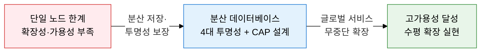
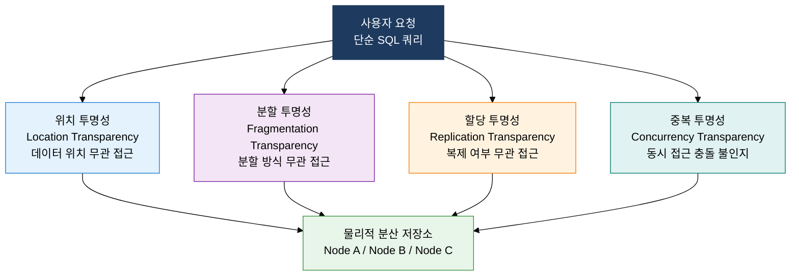
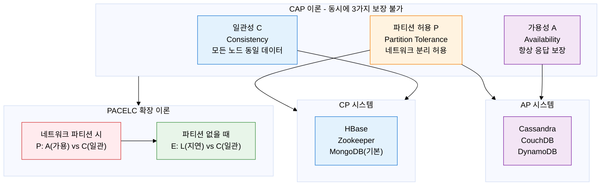

## 1. 지리적으로 분산된 단일 논리 DB 시스템, 분산 데이터베이스의 개요

**정의**: 네트워크로 연결된 여러 물리적 노드에 데이터를 분산 저장하면서도 사용자에게 단일 논리 데이터베이스처럼 보이는 투명성을 제공하는 DB 시스템.
- 각 노드는 독립적으로 운영되며, 로컬 트랜잭션과 분산 트랜잭션을 모두 처리할 수 있다.
- 2PC(Two-Phase Commit) 또는 Saga 패턴 등의 분산 트랜잭션 프로토콜을 통해 일관성을 유지한다.
- CAP 이론에 따라 일관성(C), 가용성(A), 파티션 허용성(P) 중 두 가지만 동시에 보장할 수 있다.

**특징**:
- **투명성(Transparency)**: 데이터의 물리적 위치, 분할 방식, 복제 여부를 사용자가 몰라도 접근할 수 있는 논리적 단일성 제공
- **자율성(Autonomy)**: 각 노드가 로컬 데이터에 대한 관리 권한을 가지면서도 전체 시스템 차원의 협력이 가능한 분산 제어 구조
- **수평 확장성(Horizontal Scalability)**: 노드 추가만으로 처리 용량을 선형적으로 확장할 수 있어 단일 서버의 물리적 한계를 극복

---

## 2. 분산 데이터베이스의 핵심 구성 체계

### 가. 분산 DB 4대 투명성

| 투명성 유형 | 정의 | 구현 메커니즘 | 효과 |
|---|---|---|---|
| **위치 투명성** | 데이터가 어느 노드에 저장되어 있는지 몰라도 접근 가능 | 글로벌 카탈로그, 분산 디렉토리 서비스 | 물리적 DB 재배치 시 애플리케이션 무변경 |
| **분할 투명성** | 데이터가 수평·수직 분할되어 있어도 전체 데이터로 인식 | 쿼리 분해기(Query Decomposer), Union 재조합 | 분할 전략 변경 시 애플리케이션 무변경 |
| **할당 투명성** | 데이터가 여러 노드에 복제되어 있어도 단일 사본으로 인식 | 복제 관리자(Replication Manager), 버전 벡터 | 복제 수 조정 시 애플리케이션 무변경 |
| **중복 투명성** | 다수 사용자의 동시 접근에서 충돌을 인식하지 못함 | 분산 잠금(Distributed Lock), MVCC | 동시성 제어 로직을 DB 계층에서 자동 처리 |
| **장애 투명성** | 일부 노드 장애 시에도 전체 시스템이 정상 작동하는 것처럼 인식 | Failover 자동 전환, 재시도 메커니즘 | 부분 장애의 사용자 노출 방지 |

---

### 나. CAP 이론 + PACELC 이론

| CAP 조합 | 포기 요소 | 특성 | 대표 시스템 | 적합 사용 케이스 |
|---|---|---|---|---|
| **CP 시스템** | 가용성(A) | 파티션 시 일부 요청 거부, 강한 일관성 보장 | HBase, Zookeeper, MongoDB(기본) | 금융 거래, 재고 관리, 분산 코디네이션 |
| **AP 시스템** | 일관성(C) | 파티션 시 오래된 데이터 반환 가능, 항상 응답 | Cassandra, CouchDB, DynamoDB | SNS 피드, 쇼핑 카트, DNS 시스템 |
| **CA 시스템** | 파티션 허용(P) | 단일 노드 또는 동일 네트워크, 파티션 불허 | 전통적 RDBMS(MySQL, PostgreSQL) | 단일 데이터센터 OLTP 시스템 |
| **PACELC: PC/EL** | 가용성, 지연 | 파티션·평상시 모두 일관성 우선 | HBase, VoltDB | 금융·의료 등 강한 일관성 필수 환경 |
| **PACELC: PA/EL** | 일관성(양쪽) | 파티션 시 가용, 평상시 지연 최소 | Cassandra, DynamoDB | 대규모 글로벌 서비스, 최종 일관성 허용 |
| **PACELC: PA/EC** | 일관성, 지연(혼합) | 파티션 시 가용, 평상시 일관성 | PNUTS, Megastore | 멀티 리전 읽기 집약적 서비스 |

---

## 3. 분산 데이터베이스 도입의 기대효과 및 활용 방안

| 구분 | 주요 기대효과 | 활용 및 실무 적용 방안 |
|---|---|---|
| **확장성** | 수평 확장을 통해 데이터 폭증에도 선형적 성능 유지 가능 | 트래픽 급증 서비스(커머스, 게임)에서 노드 동적 추가로 피크 대응 |
| **가용성** | 단일 장애점(SPOF) 제거로 일부 노드 장애 시에도 서비스 연속성 보장 | Active-Active 구성으로 무중단 서비스 실현, RPO 0 달성 |
| **성능** | 지역 기반 데이터 배치로 네트워크 지연 최소화 및 읽기 분산 | CDN 패턴 결합으로 글로벌 사용자에게 최저 지연 데이터 서비스 제공 |
| **설계 최적화** | CAP/PACELC 이론 기반으로 서비스 특성에 맞는 DB 선택 가능 | 금융은 CP 시스템(HBase), SNS·로그는 AP 시스템(Cassandra) 선택 기준 적용 |
