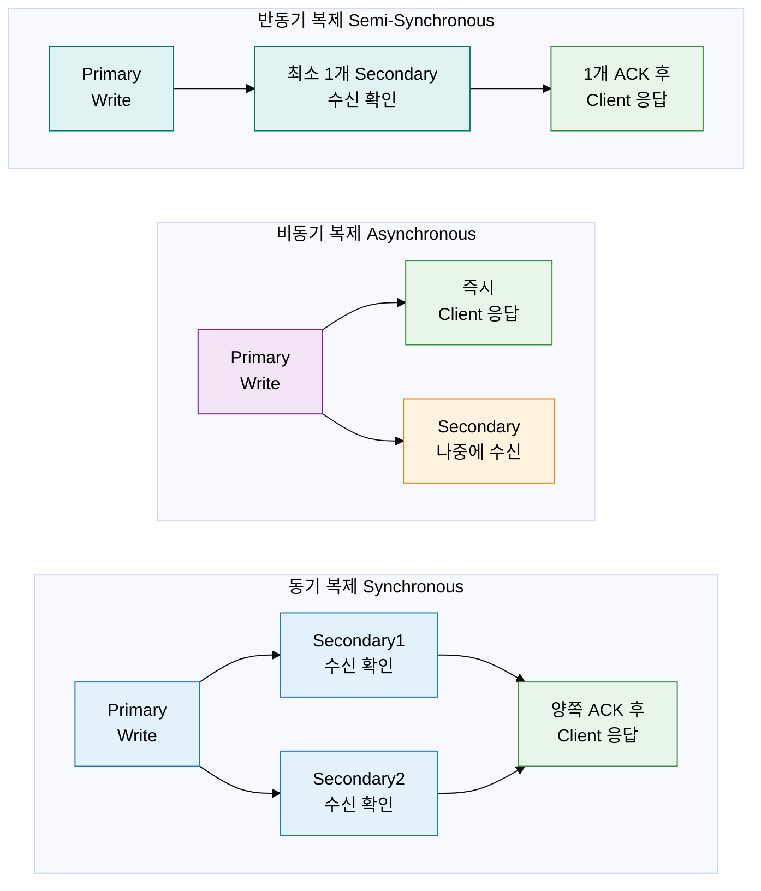
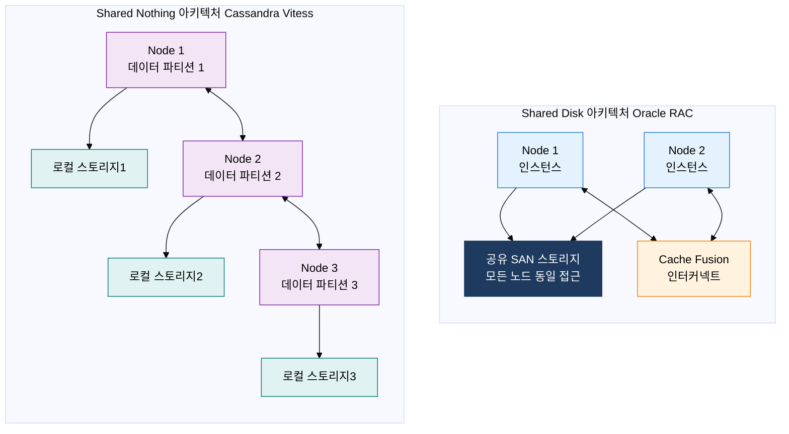

# 고가용성 아키텍처 (High Availability)

## 1. 장애 시에도 서비스 중단 없는 DB 설계, 고가용성 아키텍처의 개요

**정의**: 하드웨어·소프트웨어·네트워크 장애 발생 시에도 사전 정의된 복구 목표(RTO/RPO) 내에 서비스 연속성을 보장하도록 설계된 DB 이중화 아키텍처.
- RTO(Recovery Time Objective): 장애 발생 후 서비스가 복구되어야 하는 최대 허용 시간
- RPO(Recovery Point Objective): 장애 발생 시 허용 가능한 데이터 손실의 최대 시점(얼마나 최근까지 복구 가능한가)
- 가용성은 (가동 시간 / 전체 시간 × 100%)로 표현하며, 99.999%(파이브 나인)는 연간 약 5분 26초의 다운타임만 허용

**특징**:
- **자동 페일오버(Auto Failover)**: Primary 장애 감지 시 자동으로 Secondary를 승격시켜 수동 개입 없이 서비스 재개
- **데이터 복제(Data Replication)**: Primary의 변경 사항을 실시간 또는 비동기로 Secondary에 전달하여 데이터 이중화 유지
- **헬스 체크(Health Check)**: 주기적 상태 모니터링으로 장애를 선제적으로 감지하고 자동 복구 프로세스 트리거

---

## 2. 고가용성 아키텍처의 핵심 구성 체계

### 가. 데이터 복제 방식 비교

| 복제 방식 | 데이터 안전성 | 성능 영향 | RTO | RPO | 적합 케이스 |
|---|---|---|---|---|---|
| **동기 복제** | 최고 (데이터 무손실 보장) | 높음 (Secondary 응답 대기) | 수초 이내 | 0 (무손실) | 금융 거래, 의료 정보, 법적 데이터 |
| **비동기 복제** | 낮음 (일부 데이터 손실 가능) | 최소 (Primary만 커밋) | 수십 초 | 수초~수분 | 대용량 로그, 분석 데이터, 지리적 원거리 복제 |
| **반동기 복제** | 중간 (최소 1 Secondary 보장) | 중간 (1개 응답만 대기) | 수초~수십 초 | 최소화 | 전자상거래, 일반 업무 시스템, MySQL 기본 HA |
| **그룹 복제** | 높음 (과반수 노드 합의) | 중상 (합의 프로토콜 오버헤드) | 자동 즉시 | 0~수초 | 멀티 마스터 환경, MySQL InnoDB Cluster |
| **지연 복제** | 낮음 (의도적 지연 설정) | 최소 | 수분~수시간 | 수분~수시간 | 논리적 오류 복구, 실수 삭제 방어 |

---

### 나. DB 클러스터링 아키텍처 비교

| 아키텍처 유형 | 구성 방식 | 장점 | 단점 | 대표 제품 |
|---|---|---|---|---|
| **Shared Disk** | 모든 노드가 동일한 공유 스토리지(SAN)에 접근, Cache Fusion으로 버퍼 캐시 공유 | 데이터 일관성 높음, 단순한 데이터 관리, 노드 추가 용이 | 스토리지가 SPOF, 스토리지 비용 높음, 수평 확장 한계 | Oracle RAC, IBM DB2 pureScale |
| **Shared Nothing** | 각 노드가 독립적 스토리지 보유, 데이터를 파티셔닝하여 분산 | 완전한 수평 확장, 스토리지 SPOF 없음, 비용 효율 | 파티셔닝 복잡도, 교차 파티션 쿼리 비용 | Cassandra, Vitess, CockroachDB |
| **Active-Active** | 모든 노드가 읽기·쓰기를 동시에 처리 | 부하 분산 최대화, 노드 장애 시 무중단 | 충돌 해소 복잡, 쓰기 일관성 도전 | Oracle RAC, Galera Cluster, CockroachDB |
| **Active-Standby** | 하나의 Active 노드만 쓰기, Standby는 복제 수신 대기 | 구성 단순, 일관성 보장 용이 | Standby 자원 낭비, 페일오버 시 RTO 존재 | MySQL MHA, PostgreSQL Patroni, AWS RDS |
| **Active-Active (비동기)** | Active-Active지만 복제는 비동기 수행 | 성능 최우선, 지리적 분산 가능 | RPO 존재, 충돌 시 수동 해소 필요 | MySQL Group Replication(비동기 모드) |

---

## 3. 고가용성 아키텍처 도입의 기대효과 및 활용 방안

| 구분 | 주요 기대효과 | 활용 및 실무 적용 방안 |
|---|---|---|
| **연속성** | RTO 수초·RPO 0 수준의 무중단 서비스로 SLA 99.999% 달성 | 금융·의료·전자상거래 시스템에 동기 복제 + Active-Standby 구성으로 법적 요건 충족 |
| **성능** | Active-Active 구성으로 읽기 부하를 Secondary에 분산하여 처리량 증가 | 읽기 집약적 시스템에서 Read Replica를 다수 배치하여 Primary 부하 70~80% 절감 |
| **데이터 보호** | 지리적 분산 복제로 재해(화재·침수) 발생 시에도 데이터 보존 | DR(Disaster Recovery) 사이트에 비동기 복제 + 정기 스냅샷 결합으로 RPO 최소화 |
| **운영 효율** | 자동 페일오버와 헬스체크로 야간·주말 장애 시 무인 복구 가능 | Patroni(PostgreSQL) 또는 MHA(MySQL) 등 오케스트레이터를 통해 페일오버 자동화 구현 |
