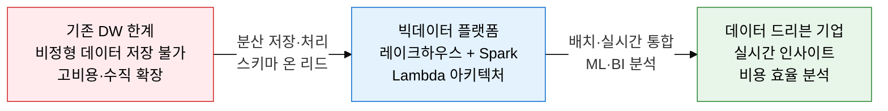
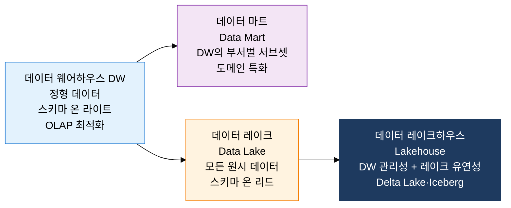
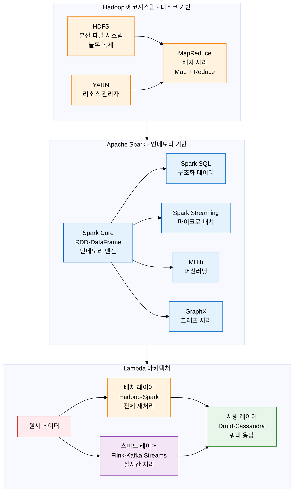

## 1. 수집→저장→분석 일괄 처리하는 빅데이터 생태계, 빅데이터 아키텍처의 개요

**정의**: 정형·반정형·비정형 대용량 데이터를 수집·저장·처리·분석하는 분산 컴퓨팅 기반의 데이터 플랫폼 아키텍처로, Volume·Velocity·Variety·Veracity 4V 특성의 데이터를 다룬다.
- 데이터 저장소는 스키마 온 라이트(DW)에서 스키마 온 리드(Data Lake)로, 그리고 두 장점을 통합한 레이크하우스로 진화하고 있다.
- 처리 프레임워크는 Hadoop MapReduce 기반 배치에서 Spark 인메모리 처리, 그리고 Flink 실시간 스트림 처리로 발전하였다.
- Lambda 아키텍처와 Kappa 아키텍처가 배치·실시간 데이터를 통합 처리하는 대표적 설계 패턴이다.

**특징**:
- **다중 데이터 형태 처리**: 정형(CSV·DB), 반정형(JSON·XML·로그), 비정형(이미지·동영상·텍스트) 데이터를 단일 플랫폼에서 통합 관리
- **선형 확장 분산 처리**: 수백~수천 노드의 상용 서버로 페타바이트 규모 데이터를 병렬 처리하는 수평 확장 아키텍처
- **비용 효율 저장**: 고가 SAN 대신 저렴한 상용 디스크와 오브젝트 스토리지(S3)를 활용하여 TB당 저장 비용을 1/10 수준으로 절감

---

## 2. 빅데이터 아키텍처의 핵심 구성 체계

### 가. 데이터 저장소 아키텍처 진화

**데이터 웨어하우스(DW) 다차원 모델링**:
- **MOLAP(Multidimensional OLAP)**: 데이터를 하이퍼큐브 형태로 사전 집계 저장, 조회 속도 최고, 저장 공간 비효율
- **ROLAP(Relational OLAP)**: 관계형 DB에 스타·스노우플레이크 스키마로 저장, 유연하지만 집계 속도 느림
- **HOLAP(Hybrid OLAP)**: MOLAP + ROLAP 혼합, 요약 데이터는 큐브·상세 데이터는 관계형으로 저장

| 스토리지 유형 | 데이터 형태 | 스키마 방식 | 강점 | 약점 |
|---|---|---|---|---|
| **데이터 웨어하우스** | 정형 데이터, ETL 전처리 완료 | 스키마 온 라이트 (사전 정의) | 고성능 OLAP 쿼리, 데이터 품질 보장 | 비정형 처리 불가, 스키마 변경 비용 |
| **데이터 마트** | DW 서브셋, 부서별 특화 | 스키마 온 라이트 | 빠른 도메인 분석, 사용자 이해 쉬움 | DW 의존, 중복 데이터 관리 부담 |
| **데이터 레이크** | 정형·반정형·비정형 원시 데이터 | 스키마 온 리드 (사용 시 정의) | 모든 데이터 저장, 저비용 오브젝트 스토리지 | 거버넌스 부재 시 데이터 늪(Data Swamp) |
| **데이터 레이크하우스** | 정형·비정형 통합, ACID 지원 | 메타데이터 관리 + 스키마 진화 | DW 성능 + 레이크 유연성, 통합 거버넌스 | 신기술 도입 복잡도, 성숙도 발전 중 |
| **데이터 메시(Data Mesh)** | 도메인별 분산 관리 | 도메인 오너십 기반 | 조직 자율성, 확장성 | 거버넌스 표준화 도전 |

---

### 나. 대용량 처리 프레임워크

| 프레임워크 | 처리 방식 | 강점 | 약점 | 적합 케이스 |
|---|---|---|---|---|
| **Hadoop MapReduce** | 디스크 기반 배치 처리, Map→Shuffle→Reduce | 안정성 검증, 페타바이트 처리, 오픈소스 생태계 | 디스크 I/O 병목으로 느린 처리, 반복 처리 비효율 | 로그 분석, 대용량 ETL, 야간 배치 처리 |
| **Apache Spark** | 인메모리 RDD·DataFrame, DAG 최적화 실행 | MapReduce 대비 배치 10배·인메모리 100배 빠름 | 메모리 비용, OOM 위험, 소용량 데이터 비효율 | 머신러닝, 대화형 분석, 스트리밍, SQL 쿼리 |
| **Apache Flink** | 진정한 이벤트 기반 스트림 처리, Stateful 연산 | 실시간 처리 최저 지연, 정확한 Once 처리 보장 | 학습 곡선, 배치 처리 최적화 미흡 | 실시간 사기 탐지, 이벤트 드리븐 처리 |
| **Kafka Streams** | Kafka 토픽 기반 스트림 처리, 경량 라이브러리 | 별도 클러스터 불필요, Kafka 생태계 통합 | 처리 복잡도 한계, 배치 미지원 | 실시간 데이터 변환, 이벤트 집계 |
| **Delta Lake / Iceberg** | 레이크하우스 테이블 포맷, ACID 트랜잭션 지원 | 스키마 진화, 타임 트래블, 통계 기반 최적화 | 추가 메타데이터 관리, 소파일 문제 | Lakehouse 기반 ACID 보장 분석 워크로드 |

---

## 3. 빅데이터 아키텍처 도입의 기대효과 및 활용 방안

| 구분 | 주요 기대효과 | 활용 및 실무 적용 방안 |
|---|---|---|
| **비용 절감** | 고가 DW 대신 오브젝트 스토리지(S3) + Spark 조합으로 TB당 비용 1/10 수준 달성 | AWS S3 기반 레이크하우스(Delta Lake)로 기존 Teradata·Oracle DW 마이그레이션 |
| **처리 속도** | Spark 인메모리 처리로 일 단위 배치를 시간·분 단위로 단축하여 의사결정 지연 최소화 | 야간 배치 ETL 파이프라인을 Spark로 전환하여 D+1 리포트를 실시간 대시보드로 전환 |
| **데이터 통합** | 정형·비정형 데이터를 단일 레이크에 통합하여 데이터 사일로 해소 및 통합 분석 가능 | 고객 구매 이력(DB) + 소셜 미디어 텍스트 + 앱 로그를 통합하여 360도 고객 뷰 구축 |
| **AI/ML 연계** | MLlib·TensorFlow on Spark 등을 활용하여 대용량 데이터 기반 머신러닝 파이프라인 구현 | 피처 엔지니어링부터 모델 학습·서빙까지 Spark 기반 ML 파이프라인 자동화 구축 |
