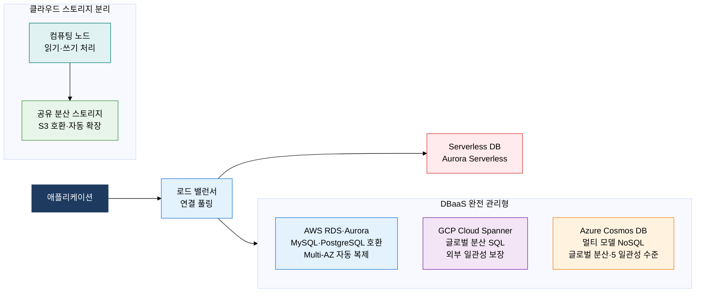

# 클라우드 데이터베이스 (Cloud Database)

## 1. 탄력적 확장과 완전 관리형 DB 인프라, 클라우드 데이터베이스의 개요

**정의**: 클라우드 인프라 위에서 운영되며 자동 백업·패치·스케일링·고가용성이 내장된 완전 관리형(Fully Managed) 데이터베이스 서비스로, 사용량 기반 과금 모델을 적용한다.
- DBaaS(Database as a Service) 형태로 제공되어 DBA가 인프라 관리보다 데이터 설계·최적화에 집중할 수 있게 한다.
- 시계열 DB·벡터 DB 등 특수 목적 DB가 클라우드 네이티브 형태로 제공되어 IoT·AI/LLM 워크로드를 지원한다.
- Serverless DB는 사용이 없을 때 자동으로 중단되어 개발·테스트 환경에서 비용을 최소화한다.

**특징**:
- **완전 관리형(Fully Managed)**: 하드웨어 프로비저닝·OS 패치·DB 업그레이드·자동 백업을 클라우드 공급자가 처리하여 운영 오버헤드 제거
- **탄력적 확장(Elastic Scaling)**: 트래픽 패턴에 따라 자동으로 컴퓨팅·스토리지를 증감하여 과잉 프로비저닝 없이 비용 최적화
- **멀티 AZ 고가용성**: 여러 가용 영역(Availability Zone)에 자동 복제하여 단일 데이터센터 장애에도 서비스 연속성 보장

---

## 2. 클라우드 데이터베이스의 핵심 구성 체계

### 가. Cloud-Native DBMS 특징 및 유형

| 클라우드 DB 유형 | 특징 | 대표 서비스 | 적합 케이스 |
|---|---|---|---|
| **관계형 DBaaS** | MySQL·PostgreSQL 호환, Multi-AZ 자동 HA, 자동 백업 | AWS RDS, Azure Database, GCP Cloud SQL | 마이그레이션 용이, 기존 RDBMS 워크로드 |
| **클라우드 네이티브 SQL** | 스토리지-컴퓨팅 분리, 자동 스케일링, 고성능 | AWS Aurora, Google AlloyDB | 고성능 OLTP, 읽기 집약적 워크로드 |
| **글로벌 분산 SQL** | 외부 일관성, 멀티 리전 ACID, TrueTime API | GCP Cloud Spanner, CockroachDB | 글로벌 금융·재고 시스템 |
| **멀티 모델 NoSQL** | 다중 API(SQL·Graph·Document), 글로벌 분산 | Azure Cosmos DB, Amazon DynamoDB | 멀티 모델 단일 플랫폼 필요 환경 |
| **Serverless DB** | 사용 시 자동 기동·정지, ACU 기반 과금 | Aurora Serverless, Neon | 개발·테스트, 간헐적 트래픽 서비스 |

---

### 나. 특수 목적 데이터베이스

```mermaid
%%{init: { 'theme': 'base', 'themeVariables': { 'edgeLabelBackground': '#fff' }}}%%
flowchart TD
    subgraph TSDB["시계열 DB Time-Series DB"]
        direction LR
        IOT["IoT 센서<br/>타임스탬프 데이터"] --> TSSTORE["InfluxDB·TimescaleDB<br/>시간 기반 압축 저장<br/>다운샘플링·집계"]
        TSSTORE --> TSQUERY["범위 조회<br/>집계 함수<br/>이상 감지"]
        style IOT fill:#FFF3E0,stroke:#F57C00,color:#000
        style TSSTORE fill:#E3F2FD,stroke:#1976D2,color:#000
        style TSQUERY fill:#E8F5E9,stroke:#388E3C,color:#000
    end

    subgraph RAG["RAG 파이프라인 벡터 DB 활용"]
        direction LR
        QDOC["사용자 질문<br/>문서 업로드"] --> EMB["임베딩 모델<br/>OpenAI·HuggingFace<br/>텍스트→벡터 변환"]
        EMB --> VDB["벡터 DB<br/>Pinecone·Weaviate<br/>pgvector<br/>HNSW·IVF 인덱스"]
        VDB --> SEARCH["유사도 검색<br/>ANN 알고리즘<br/>Top-K 결과 반환"]
        SEARCH --> LLM["LLM 생성<br/>GPT·Claude<br/>컨텍스트 주입 응답"]
        style QDOC fill:#FFEBEE,stroke:#D32F2F,color:#000
        style EMB fill:#F3E5F5,stroke:#7B1FA2,color:#000
        style VDB fill:#1E3A5F,stroke:#1E3A5F,color:#fff
        style SEARCH fill:#E3F2FD,stroke:#1976D2,color:#000
        style LLM fill:#E8F5E9,stroke:#388E3C,color:#000
    end
```

**벡터 DB ANN 검색 알고리즘**:
- **HNSW(Hierarchical Navigable Small World)**: 계층형 그래프 구조로 고차원 벡터 공간을 탐색, 검색 속도와 정확도 균형 우수
- **IVF(Inverted File Index)**: 벡터 공간을 클러스터로 분할하고 해당 클러스터만 검색하여 대용량 처리 적합
- **PQ(Product Quantization)**: 벡터를 압축하여 메모리 사용량 절감, 속도와 메모리 트레이드오프

| 특수 DB 유형 | 저장 구조 | 검색 방식 | 대표 제품 | 활용 시나리오 |
|---|---|---|---|---|
| **시계열 DB** | 타임스탬프 기반 컬럼 압축, 자동 다운샘플링 | 시간 범위 쿼리, 집계 함수(평균·최대·최소) | InfluxDB, TimescaleDB, Prometheus | IoT 센서 데이터, 서버 메트릭, 금융 틱 데이터 |
| **벡터 DB** | 고차원 실수 벡터 배열, HNSW·IVF 인덱스 | ANN(근사 최근접 이웃) 유사도 검색 | Pinecone, Weaviate, Qdrant, pgvector | LLM/RAG 파이프라인, 이미지 유사도, 추천 엔진 |
| **검색 엔진 DB** | 역인덱스(Inverted Index), 형태소 분석 | 전문 검색(Full-Text Search), BM25 스코어링 | Elasticsearch, OpenSearch, Solr | 통합 검색, 로그 분석, 상품 검색 |
| **공간 DB** | R-Tree·GiST 공간 인덱스, 좌표 데이터 | 반경 검색, 지리적 집계, 경로 분석 | PostGIS, MongoDB Atlas Search | 위치 기반 서비스, GIS, 지오펜싱 |
| **인메모리 DB** | DRAM 기반 저장, AOF·RDB 영속성 | 해시·리스트·셋·정렬셋 자료구조 | Redis, Memcached, VoltDB | 세션 캐시, 실시간 순위, 분산 잠금 |

---

## 3. 클라우드 데이터베이스 도입의 기대효과 및 활용 방안

| 구분 | 주요 기대효과 | 활용 및 실무 적용 방안 |
|---|---|---|
| **운영 효율** | 패치·백업·HA 자동화로 DBA 운영 공수를 70% 이상 절감하여 설계·최적화 집중 | AWS RDS Multi-AZ 전환으로 야간 장애 대응 인력을 제거하고 자동 페일오버 적용 |
| **비용 최적화** | Serverless DB로 개발·테스트 환경의 DB 비용을 사용 시간 기반 과금으로 90% 절감 | Aurora Serverless v2를 개발·스테이징 환경에 적용하여 월 DB 비용 대폭 절감 |
| **AI/LLM 연계** | 벡터 DB + RAG 파이프라인으로 기업 내부 문서 기반 AI 챗봇 구현 가능 | pgvector(PostgreSQL 확장)으로 기존 RDB에 벡터 검색을 추가하여 기업 지식 검색 시스템 구축 |
| **글로벌 확장** | 멀티 리전 복제·글로벌 분산 SQL로 전 세계 사용자에게 저지연 DB 서비스 제공 | GCP Cloud Spanner로 글로벌 금융 플랫폼의 멀티 리전 ACID 트랜잭션 처리 구현 |
