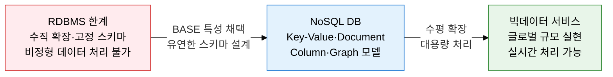
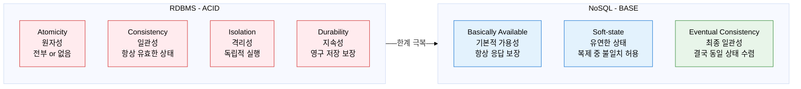
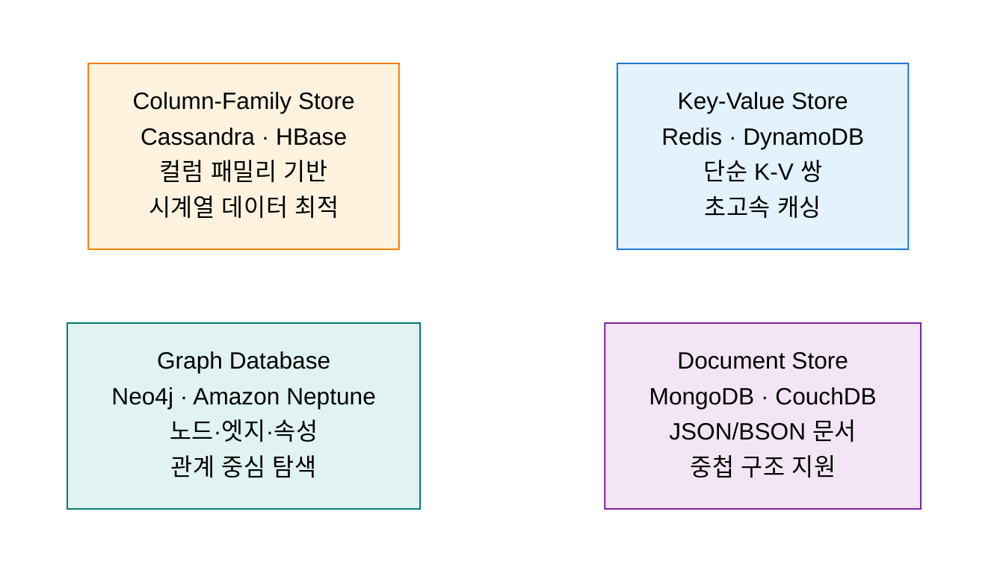

## 1. ACID 대신 BASE로 대규모 분산 처리, NoSQL의 개요

**정의**: 관계형 모델과 SQL의 제약을 탈피하여 유연한 스키마와 수평 확장성을 통해 대용량 비정형 데이터를 분산 처리하는 비관계형 데이터베이스의 총칭.
- 빅데이터·소셜 미디어·IoT 환경에서 초당 수백만 건의 읽기·쓰기를 처리하기 위해 등장하였다.
- ACID 대신 BASE(Basically Available, Soft-state, Eventual Consistency)를 채택하여 일관성보다 가용성과 확장성을 우선한다.
- 데이터 모델에 따라 Key-Value, Document, Column-Family, Graph Store 4가지 유형으로 분류된다.

**특징**:
- **수평 확장성(Horizontal Scalability)**: 상용 서버를 추가하는 방식으로 선형적 확장이 가능하여 RDBMS의 수직 확장 비용 문제를 해결
- **유연한 스키마(Schema-Free)**: 스키마를 사전에 정의하지 않아도 되므로 빠른 개발 속도와 데이터 구조 변경 유연성 제공
- **최종 일관성(Eventual Consistency)**: 일시적 불일치를 허용하되 결국 모든 복제본이 동일한 상태로 수렴하여 가용성과 성능을 확보

---

## 2. NoSQL의 핵심 구성 체계

### 가. NoSQL 등장 배경 + BASE vs ACID 특성 비교

| 비교 항목 | ACID (RDBMS) | BASE (NoSQL) |
|---|---|---|
| **일관성** | 강한 일관성 (Strong Consistency) | 최종 일관성 (Eventual Consistency) |
| **가용성** | 일관성 우선으로 가용성 저하 가능 | 항상 응답(Basically Available) 보장 |
| **확장 방식** | 수직 확장(Scale-Up) 위주 | 수평 확장(Scale-Out) 용이 |
| **스키마** | 사전 정의 필수 (Schema-on-Write) | 스키마 자유 (Schema-on-Read) |
| **트랜잭션** | 복잡한 다중 테이블 트랜잭션 지원 | 단순 단일 엔티티 트랜잭션 위주 |
| **적합 환경** | 금융·ERP 등 정확성이 최우선 환경 | SNS·IoT·게임 등 대용량·고속 처리 환경 |

---

### 나. NoSQL 데이터 모델 4가지 유형

| 유형 | 저장 구조 | 대표 제품 | 장점 | 적합 사용 케이스 |
|---|---|---|---|---|
| **Key-Value Store** | 유일한 키에 값(문자열·바이너리·객체) 매핑, 해시 테이블 기반 | Redis, DynamoDB, Memcached | 초저지연(마이크로초) 조회, 구조 단순, 메모리 기반 운용 | 세션 관리, 캐시, 실시간 순위표, 분산 잠금 |
| **Document Store** | JSON/BSON 형태의 문서를 컬렉션에 저장, 중첩·배열 구조 지원 | MongoDB, CouchDB, Firestore | 유연한 스키마, 직관적 객체 매핑, 풍부한 쿼리 | 상품 카탈로그, CMS, 사용자 프로필, 이벤트 로그 |
| **Column-Family Store** | 로우 키 + 컬럼 패밀리 + 컬럼으로 구성, 희소 컬럼 효율 저장 | Cassandra, HBase, ScyllaDB | 쓰기 집약 고성능, 시계열 데이터 최적, 선형 확장 | 시계열 데이터, IoT 센서, 메시지 로그, 추천 기록 |
| **Graph Database** | 노드(개체)와 엣지(관계), 속성으로 구성된 그래프 구조 | Neo4j, Amazon Neptune, JanusGraph | 복잡한 다단계 관계 탐색 고성능, 직관적 관계 모델링 | SNS 친구 관계, 추천 엔진, 사기 탐지, 지식 그래프 |
| **Wide-Column** | 컬럼이 로우마다 다를 수 있는 동적 컬럼 구조 | Bigtable, HBase | 페타바이트 규모 처리, 구글 규모 확장성 | 웹 인덱싱, 대규모 분석, 금융 이력 데이터 |

---

## 3. NoSQL 도입의 기대효과 및 활용 방안

| 구분 | 주요 기대효과 | 활용 및 실무 적용 방안 |
|---|---|---|
| **성능** | 메모리 기반 Key-Value Store로 RDBMS 대비 10~100배 빠른 조회 응답 | Redis를 RDBMS 앞단 캐시 레이어로 배치하여 DB 부하 80% 이상 절감 |
| **확장성** | 수평 확장 아키텍처로 트래픽 급증에도 선형적 성능 유지 | Cassandra 링 구조를 활용하여 서비스 중단 없이 노드 추가·제거 가능 |
| **개발 생산성** | 스키마 자유 문서 모델로 애플리케이션 객체와 DB 구조 직접 매핑 | MongoDB를 사용하여 스키마 마이그레이션 없이 필드 추가·변경 대응 |
| **분석 최적화** | 데이터 모델 특성에 맞는 NoSQL 선택으로 관계 탐색·시계열 분석 특화 | SNS 관계 분석은 Neo4j, 실시간 IoT 집계는 Cassandra, 검색은 Elasticsearch 활용 |
