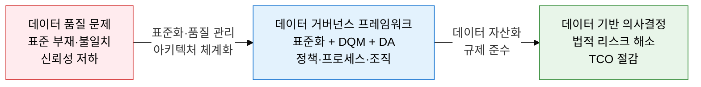
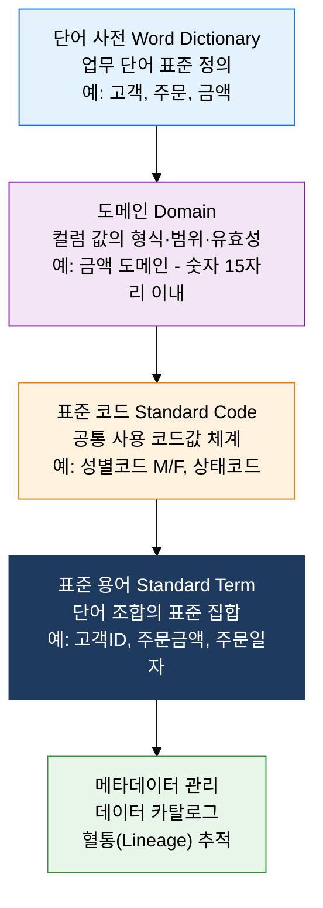
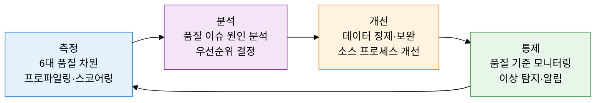

## 1. 데이터를 기업 전략 자산으로 체계 관리, 데이터 거버넌스의 개요

**정의**: 전사 데이터의 표준화·품질 관리·보안·아키텍처를 위한 정책·프로세스·조직·기술을 통합 관리하여 데이터를 신뢰할 수 있는 전략 자산으로 유지하는 관리 체계.
- 데이터 오너십(Data Ownership): 데이터 생산·관리에 대한 책임을 명확히 정의하여 품질 책임을 부여한다.
- 데이터 스튜어드십(Data Stewardship): 업무 도메인별 데이터 관리 담당자가 데이터 품질을 지속적으로 모니터링·개선한다.
- 공공 부문에서는 행정안전부의 공공데이터 관리 지침, 금융 부문에서는 BCBS 239(금융 데이터 집계 원칙)를 기준으로 적용한다.

**특징**:
- **전사 데이터 표준화**: 단어·도메인·표준코드·표준용어의 4요소를 통해 전 부서가 동일한 의미로 데이터를 생산·소비하도록 일관성 확보
- **데이터 품질 지속 관리**: 완전성·유일성·유효성·일관성·정확성·적시성 6대 차원으로 데이터 품질을 측정하고 지속적으로 개선하는 PDCA 사이클 운영
- **데이터 라이프사이클 관리**: 데이터 생성·저장·사용·보관·폐기의 전 생애에 걸쳐 정책과 절차를 적용하여 법적 요건 충족 및 데이터 신뢰성 유지

---

## 2. 데이터 거버넌스의 핵심 구성 체계

### 가. 데이터 표준화 체계

| 표준화 요소 | 정의 | 관리 방법 | 산출물 |
|---|---|---|---|
| **단어 사전** | 업무에서 사용하는 기본 단어에 대한 표준 한글명·영문명·정의를 관리하는 사전 | 용어 심의위원회 운영, 유의어·금칙어 목록 관리 | 표준 단어 목록, 유의어·금칙어 목록 |
| **도메인** | 컬럼(속성)이 가질 수 있는 데이터 유형·길이·형식·허용 값 범위를 정의 | 도메인 그룹 분류(금액·코드·날짜·ID 등), 물리 데이터 타입 매핑 | 도메인 목록, 물리 타입 매핑 표 |
| **표준 코드** | 여러 시스템에서 공통으로 사용하는 코드값과 코드명을 표준화하여 중앙 관리 | 코드 관리 시스템 구축, 코드 신청·심의·등록 프로세스 운영 | 표준 코드 목록, 코드 매핑 테이블 |
| **표준 용어** | 표준 단어를 조합하여 구성하는 컬럼명·테이블명의 표준 집합 | 용어 = 수식어 + 단어의 조합 규칙 적용, 약어 사용 지침 | 표준 용어 목록, 용어 조합 규칙 |
| **데이터 카탈로그** | 전사 데이터 자산의 위치·구조·품질·혈통 정보를 통합 관리하는 메타데이터 저장소 | 자동 수집(Crawler) + 수동 보강, 혈통 자동 추적 | 데이터 카탈로그 시스템, 혈통 맵 |

---

### 나. 데이터 품질 관리(DQM) + 데이터 아키텍처(DA) 역할

**데이터 아키텍처(DA) 역할**:
- 엔터프라이즈 전체의 데이터 구조·흐름·저장소를 설계하고 표준을 수립하는 역할
- EA(Enterprise Architecture)의 데이터 아키텍처 도메인으로, 비즈니스 아키텍처와 기술 아키텍처의 연결 고리
- 공공데이터 품질관리 가이드라인(행안부): 공공기관 데이터 개방 시 완전성·일관성·유효성 기준 충족 필수

| 품질 차원 | 정의 | 측정 방법 | 관리 기준 |
|---|---|---|---|
| **완전성(Completeness)** | 필수 데이터 항목에 결측값(NULL·공백)이 없는 정도 | NULL 비율, 필수 항목 누락 건수 | 필수 항목 NULL률 0% 이하 |
| **유일성(Uniqueness)** | 중복 레코드가 없이 고유하게 식별되는 정도 | PK 중복 건수, 유사 중복 탐지율 | PK 중복 0건, 유사 중복 허용 기준 정의 |
| **유효성(Validity)** | 정의된 비즈니스 규칙·형식·도메인에 부합하는 정도 | 형식 오류 건수, 값 범위 위반율 | 유효성 오류율 0.1% 이하 |
| **일관성(Consistency)** | 동일 데이터가 여러 시스템에서 동일한 값을 가지는 정도 | 시스템 간 불일치 건수, 참조 무결성 위반 | 시스템 간 불일치율 0.5% 이하 |
| **정확성(Accuracy)** | 실제 세계를 정확히 반영하는 정도 | 마스터 데이터와의 일치율, 외부 기준 비교 | 기준 데이터 대비 정확도 99% 이상 |
| **적시성(Timeliness)** | 필요한 시점에 최신 데이터가 제공되는 정도 | 갱신 주기 준수율, 배치 지연 시간 | 정의된 SLA 기준 내 갱신 |

---

## 3. 데이터 거버넌스 도입의 기대효과 및 활용 방안

| 구분 | 주요 기대효과 | 활용 및 실무 적용 방안 |
|---|---|---|
| **데이터 신뢰성** | 6대 품질 차원 관리로 데이터 오류 50% 이상 감소, 의사결정 신뢰도 향상 | 데이터 품질 대시보드 구축으로 품질 지표를 임원진이 실시간 모니터링 가능 |
| **규제 준수** | 개인정보보호법·GDPR 대응을 위한 데이터 라이프사이클 및 혈통 추적 체계 마련 | 데이터 카탈로그에 개인정보 태깅·접근 이력 관리로 감사 대응 자동화 |
| **운영 효율** | 데이터 표준화로 시스템 간 인터페이스 설계·개발 공수 30% 이상 절감 | 표준 코드·도메인 중앙 관리로 신규 시스템 개발 시 재사용률 극대화 |
| **데이터 자산화** | 메타데이터·혈통 관리로 데이터 발견 시간 단축 및 내부 데이터 마켓플레이스 구현 | 전사 데이터 카탈로그로 분석가의 데이터 탐색 시간을 일 단위에서 분 단위로 단축 |
