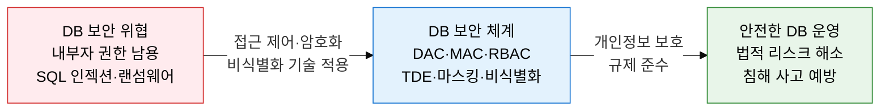
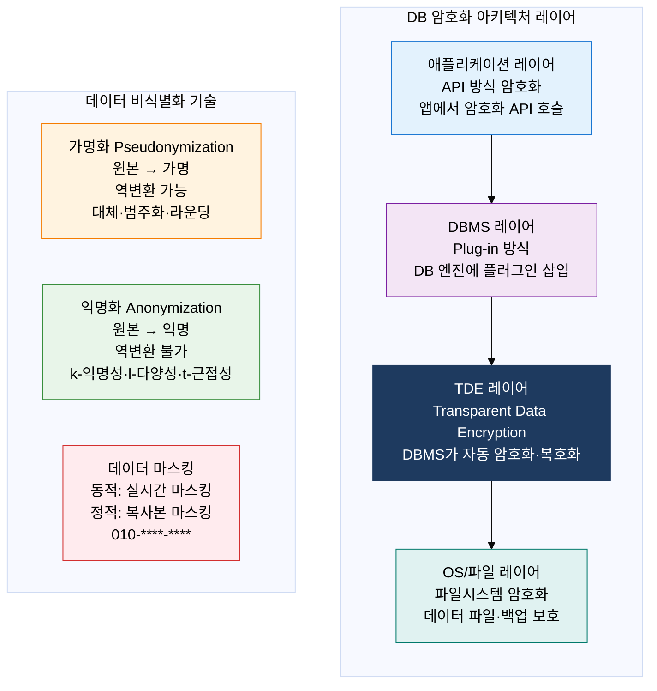

# 데이터베이스 보안 (Database Security)

## 1. 접근 제어·암호화·비식별화로 DB 자산 보호, 데이터베이스 보안의 개요

**정의**: 데이터베이스에 저장된 데이터와 DB 시스템 자체를 무단 접근·변조·유출·파괴로부터 보호하기 위해 접근 제어·암호화·비식별화·감사 로그를 체계적으로 적용하는 보안 관리 체계.
- 접근 제어(Access Control): 인증된 사용자가 권한 범위 내의 데이터에만 접근하도록 제한하는 첫 번째 방어선
- 암호화(Encryption): 데이터가 유출되더라도 평문을 알 수 없도록 보호하는 두 번째 방어선
- 비식별화(De-identification): 개인을 특정할 수 없도록 처리하여 개인정보 규제 요건을 충족하는 세 번째 방어선

**특징**:
- **다층 방어(Defense in Depth)**: 네트워크·OS·DB·애플리케이션·데이터 각 레이어에 독립적 보안 통제를 적용하여 단일 통제 우회 시에도 보호
- **최소 권한 원칙(Least Privilege)**: 사용자·역할에 업무 수행에 필요한 최소한의 권한만 부여하여 내부자 위협과 권한 오남용 위험 최소화
- **감사 추적(Audit Trail)**: DB 접근 및 변경 이력을 불변 로그로 기록하여 침해 사고 발생 시 포렌식 분석과 규제 감사 대응 가능

---

## 2. 데이터베이스 보안의 핵심 구성 체계

### 가. 접근 제어 (Access Control) 3가지 모델

```mermaid
%%{init: { 'theme': 'base', 'themeVariables': { 'edgeLabelBackground': '#fff' }}}%%
flowchart TD
    subgraph DAC["DAC - 자율적 접근 제어"]
        direction LR
        OWNER["데이터 소유자<br/>권한 부여 주체"] --> DACUSER["사용자A<br/>사용자B<br/>개별 권한 설정"]
        style OWNER fill:#FFEBEE,stroke:#D32F2F,color:#000
        style DACUSER fill:#E3F2FD,stroke:#1976D2,color:#000
    end

    subgraph MAC["MAC - 강제적 접근 제어"]
        direction LR
        POLICY["보안 정책<br/>관리자 설정"] --> LABEL["보안 등급 레이블<br/>기밀·비밀·대외비·일반"]
        LABEL --> MACUSER["사용자 등급<br/>레이블 일치 시만 접근"]
        style POLICY fill:#F3E5F5,stroke:#7B1FA2,color:#000
        style LABEL fill:#F3E5F5,stroke:#7B1FA2,color:#000
        style MACUSER fill:#E3F2FD,stroke:#1976D2,color:#000
    end

    subgraph RBAC["RBAC - 역할 기반 접근 제어"]
        direction LR
        ROLE["역할 Role<br/>관리자·일반사용자·감사자"] --> PERM["권한 Permission<br/>SELECT·INSERT·UPDATE"]
        PERM --> RBACUSER["사용자가 역할 할당받아<br/>권한 상속"]
        style ROLE fill:#FFF3E0,stroke:#F57C00,color:#000
        style PERM fill:#FFF3E0,stroke:#F57C00,color:#000
        style RBACUSER fill:#E3F2FD,stroke:#1976D2,color:#000
    end

    subgraph ABAC["ABAC - 속성 기반 접근 제어 (최신)"]
        direction LR
        ATTR["속성 Attribute<br/>사용자·리소스·환경 속성"] --> ABACPOL["정책 Policy<br/>속성 조합으로 접근 결정"]
        style ATTR fill:#E0F2F1,stroke:#00796B,color:#000
        style ABACPOL fill:#E8F5E9,stroke:#388E3C,color:#000
    end
```

| 모델 | 권한 결정 주체 | 특징 | 장점 | 단점 | 적합 환경 |
|---|---|---|---|---|---|
| **DAC** | 데이터 소유자 | 소유자가 타 사용자에게 자율적으로 권한 부여·회수 | 유연성 높음, 구현 단순 | 권한 분산으로 관리 어려움, 트로이목마 위험 | 소규모·협업 중심 환경 |
| **MAC** | 시스템(보안 정책) | 보안 등급 레이블 기반 접근 결정, 소유자도 변경 불가 | 강력한 기밀성 보장 | 유연성 낮음, 구현 복잡 | 정부·국방·기밀 데이터 환경 |
| **RBAC** | 역할 관리자 | 역할(Role)에 권한 할당, 사용자는 역할을 부여받아 권한 상속 | 권한 관리 단순화, 역할 재사용 | 역할 폭발(Role Explosion) 가능 | 기업 내부 시스템, DBMS 권한 관리 |
| **ABAC** | 정책 엔진 | 사용자·리소스·환경의 다양한 속성을 조합하여 동적 접근 결정 | 세밀한 접근 제어, 컨텍스트 인식 | 정책 복잡도 높음, 성능 오버헤드 | 제로트러스트, 클라우드 IAM, 마이크로서비스 |
| **IBAC** | 신원 관리자 | 개인 신원(Identity) 기반 접근 제어, OAuth·SAML 연계 | SSO 연동 용이 | 세분화 어려움 | 페더레이션 인증 환경 |

---

### 나. DB 암호화 방식 + 데이터 마스킹·비식별화

**비식별화 핵심 기법**:
- **k-익명성(k-Anonymity)**: 특정 준식별자 조합에 대해 최소 k개 레코드가 동일하게 존재하도록 처리 (k=2: 적어도 2명이 동일 조합)
- **l-다양성(l-Diversity)**: k-익명성의 한계(동일 그룹 내 민감 속성 동일) 보완 → 각 그룹 내 민감 속성이 최소 l가지 다양하게 존재
- **t-근접성(t-Closeness)**: l-다양성의 편향 문제 보완 → 각 그룹의 민감 속성 분포가 전체 분포와 t 이내로 유사하게 유지

| 암호화 방식 | 구현 위치 | 성능 영향 | 보호 범위 | 적합 환경 |
|---|---|---|---|---|
| **API 방식** | 애플리케이션 코드 내 암호화 함수 호출 | 최소 (앱 서버에서 처리) | 지정 컬럼 단위 선택적 보호 | 특정 민감 컬럼 보호, 세밀한 암호화 제어 |
| **Plug-in 방식** | DBMS 내부에 암호화 플러그인 삽입 | 중간 (DB 서버에서 처리) | DB 저장 데이터 전반 | 앱 코드 변경 최소화 필요 환경 |
| **Hybrid 방식** | API + Plug-in 혼합 적용 | 중간 | 컬럼별 차등 보호 수준 | 보안 요건이 다양한 복합 환경 |
| **TDE** | DBMS 스토리지 엔진 계층 | 낮음 (하드웨어 가속 활용) | 데이터 파일·백업·로그 전체 | 디스크 도난·백업 유출 방어 주목적 |
| **파일시스템 암호화** | OS 계층 (BitLocker, dm-crypt) | 낮음 | 파일 저장 전체 | 파일 수준 보호, DB 계층 암호화 보완 |
| **동적 마스킹** | DB 프록시·DBMS 정책 레이어 | 중간 (실시간 변환) | 조회 결과 실시간 마스킹 | 개발자·DBA에게 민감 데이터 노출 방지 |

---

## 3. 데이터베이스 보안 도입의 기대효과 및 활용 방안

| 구분 | 주요 기대효과 | 활용 및 실무 적용 방안 |
|---|---|---|
| **규제 준수** | 개인정보보호법·GDPR·의료법 등 데이터 보호 규제 요건 충족으로 법적 제재 위험 제거 | 개인정보 컬럼에 TDE + 동적 마스킹 적용, DBA 접근 시에도 평문 노출 방지 |
| **내부 위협 차단** | RBAC 최소 권한 원칙으로 내부자의 권한 오남용 및 데이터 탈취 위험 90% 이상 감소 | DB 접근 감사 로그 + SIEM 연동으로 비정상 쿼리 패턴 실시간 탐지·알림 |
| **침해 피해 최소화** | TDE·컬럼 암호화로 랜섬웨어·백업 유출 시 복호화 키 없이는 데이터 활용 불가 | 암호화 키를 HSM(Hardware Security Module)에 분리 보관하여 키 도난 시에도 데이터 보호 |
| **데이터 활용성** | 비식별화·마스킹으로 규제 준수와 데이터 활용성을 동시에 달성하는 균형점 확보 | 개발·테스트 환경에 정적 마스킹된 복제 데이터 제공으로 실 데이터 유출 없이 개발 진행 |
