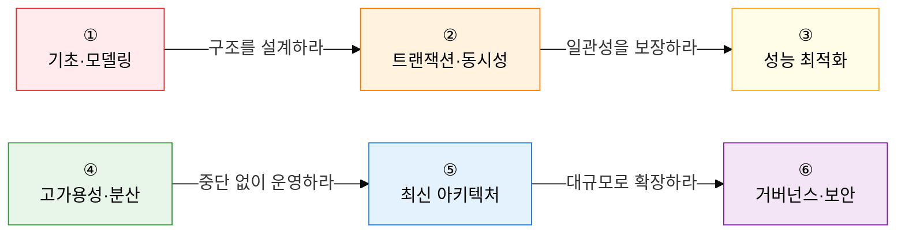

데이터베이스는 **"어떻게 하면 데이터를 안전하게 저장하고, 빠르게 조회하며, 일관성 있게 관리할 수 있는가"** 라는 질문에 대한 체계적 답변입니다.  
관계형 모델의 수학적 기반부터 분산·클라우드 환경의 최신 아키텍처까지, 데이터 전 생명주기를 다룹니다.

## 학습 로드맵 — 6단계 흐름

---

## ① 데이터베이스 기초 및 데이터 모델링

> **"데이터를 어떻게 구조화하고 추상화할 것인가"** 를 이해하는 단계입니다.  
> DBMS의 존재 이유부터 ANSI-SPARC 3단계 구조, E-R 다이어그램, 관계형 모델, 정규화까지 이어지는 설계 흐름을 파악하세요.

| 순서 | 토픽 | 핵심 키워드 | 중요도 |
|:---:|---|---|:---:|
| 1 | [데이터베이스 시스템 개요](01-fundamentals/db-system-overview) | 파일 시스템 vs DBMS, ANSI-SPARC, 외부/개념/내부 스키마, 데이터 독립성 | ★★★ |
| 2 | [데이터 모델링](01-fundamentals/data-modeling) | 개념적→논리적→물리적, E-R 다이어그램, Structure/Operation/Constraint | ★★★ |
| 3 | [관계형 데이터 모델](01-fundamentals/relational-data-model) | 튜플·애트리뷰트·도메인·차수·카디널리티, 개체/참조/도메인 무결성, 관계대수 | ★★★ |
| 4 | [정규화](01-fundamentals/normalization) | 이상 현상(삽입·삭제·갱신), 함수적 종속성, 1NF→BCNF→5NF 단계별 분해 | ★★★ |
| 5 | [반정규화](01-fundamentals/denormalization) | 성능 vs 무결성 트레이드오프, 테이블 병합/분할/추가, 컬럼·관계 중복 | ★★☆ |

**→ 핵심 학습법**: 정규화는 각 단계의 **전제조건과 위반 사례**를 예시 릴레이션으로 직접 분해해 보세요.

---

## ② 트랜잭션 및 동시성 제어

> **"다수의 사용자가 동시에 접근해도 데이터는 일관성을 유지해야 한다"** 는 원칙을 구현합니다.  
> ACID 4특성과 이를 보장하는 DBMS 메커니즘, 고립 수준별 이상 현상 표는 서술형 단골 출제 영역입니다.

| 순서 | 토픽 | 핵심 키워드 | 중요도 |
|:---:|---|---|:---:|
| 6 | [트랜잭션](02-transaction/transaction) | ACID(원자성·일관성·고립성·영속성), 5가지 상태 전이도, DBMS 보장 메커니즘 | ★★★ |
| 7 | [동시성 제어](02-transaction/concurrency-control) | Lost Update·Dirty Read·모순성·연쇄복구, S/X Lock, 2PL, 교착상태, MVCC | ★★★ |
| 8 | [트랜잭션 고립 수준](02-transaction/isolation-level) | Read Uncommitted→Serializable, Dirty/Non-Repeatable/Phantom Read 매트릭스 | ★★★ |
| 9 | [회복 기법](02-transaction/recovery) | 즉시/지연 갱신, REDO·UNDO, 검사점 4케이스, 그림자 페이지 | ★★★ |

**→ 핵심 학습법**: 고립 수준 × 이상 현상 **허용 매트릭스**를 눈 감고 그릴 수 있어야 합니다. 2PL의 Growing/Shrinking Phase 그래프도 필수입니다.

---

## ③ 데이터베이스 성능 최적화

> **"어떻게 하면 더 빠르게 데이터를 찾고 처리할 수 있는가"** 를 다루는 실무 핵심 영역입니다.  
> 아키텍처적 관점에서 인덱스 구조, 옵티마이저 동작, 조인 알고리즘을 이해하세요.

| 순서 | 토픽 | 핵심 키워드 | 중요도 |
|:---:|---|---|:---:|
| 10 | [인덱스](03-performance/index-structure) | B+Tree·비트맵·해시, Clustered vs Non-Clustered, Range/Full/Unique/Skip Scan | ★★★ |
| 11 | [옵티마이저 및 실행계획](03-performance/optimizer) | RBO vs CBO, 비용 산정(통계 정보), 힌트(Hint), EXPLAIN PLAN | ★★☆ |
| 12 | [조인 메커니즘](03-performance/join-mechanism) | Nested Loop·Sort Merge·Hash Join 적용 조건·장단점·드라이빙 테이블 | ★★★ |
| 13 | [파티셔닝 및 샤딩](03-performance/partitioning-sharding) | Range/List/Hash/Composite 파티셔닝, 샤딩 키, 라우팅, Resharding | ★★☆ |

**→ 핵심 학습법**: 조인 3가지의 **시간복잡도와 적합 상황**을 비교 표로 정리하고, B+Tree의 리프 노드 연결 구조를 직접 그려보세요.

---

## ④ 고가용성 및 분산 데이터베이스

> **"단일 서버의 한계를 넘어 여러 노드에서 중단 없이 서비스하는 구조"** 를 설계합니다.  
> CAP 이론은 분산 시스템 설계의 불변 원칙으로, NoSQL 선택 기준과 직결됩니다.

| 순서 | 토픽 | 핵심 키워드 | 중요도 |
|:---:|---|---|:---:|
| 14 | [분산 데이터베이스](04-ha-distributed/distributed-db) | 4대 투명성(위치·분할·할당·중복), CAP 이론, PACELC 이론 | ★★★ |
| 15 | [고가용성 아키텍처](04-ha-distributed/ha-architecture) | 동기/비동기/반동기 복제, RTO·RPO, Shared Disk vs Shared Nothing, Oracle RAC | ★★☆ |

**→ 핵심 학습법**: CAP 이론의 CP/AP 선택 기준과 대표 시스템(HBase vs Cassandra)을 연결하여 암기하세요.

---

## ⑤ 최신 데이터 아키텍처

> **"전통적 RDB를 넘어 대규모·비정형·실시간 데이터를 처리하는 현대 기술"** 을 다룹니다.  
> NoSQL의 BASE 특성, 데이터 레이크하우스, 벡터 DB의 RAG 연계는 최신 출제 트렌드입니다.

| 순서 | 토픽 | 핵심 키워드 | 중요도 |
|:---:|---|---|:---:|
| 16 | [NoSQL](05-modern-architecture/nosql) | BASE vs ACID, Key-Value(Redis)·Document(MongoDB)·Column(Cassandra)·Graph(Neo4j) | ★★★ |
| 17 | [빅데이터 아키텍처](05-modern-architecture/big-data-architecture) | DW·Data Lake·Lakehouse, MOLAP/ROLAP/HOLAP, Hadoop HDFS, Spark 인메모리 | ★★☆ |
| 18 | [클라우드 데이터베이스](05-modern-architecture/cloud-db) | DBaaS, Serverless DB, 시계열 DB(InfluxDB), 벡터 DB(Pinecone), RAG 파이프라인 | ★★☆ |

**→ 핵심 학습법**: NoSQL 4가지 모델의 **구조·대표 제품·적합 케이스**를 2×2 그리드로 외우고, 벡터 DB의 RAG 연계 흐름을 한 문장으로 설명하는 연습을 하세요.

---

## ⑥ 데이터 거버넌스 및 보안

> **"데이터를 기업의 전략 자산으로 관리하고 보호하는 프레임워크"** 입니다.  
> 접근 제어 3모델(DAC/MAC/RBAC)과 TDE, 비식별화 기법은 보안 영역 필수 출제입니다.

| 순서 | 토픽 | 핵심 키워드 | 중요도 |
|:---:|---|---|:---:|
| 19 | [데이터 거버넌스](06-governance-security/data-governance) | 단어사전·도메인·표준코드·표준용어, DQM 6대 품질 차원, 데이터 아키텍처(DA) | ★★☆ |
| 20 | [데이터베이스 보안](06-governance-security/db-security) | DAC·MAC·RBAC, API/Plug-in/TDE 암호화, 데이터 마스킹, k-익명성·l-다양성 | ★★★ |

**→ 핵심 학습법**: DAC/MAC/RBAC의 **권한 결정 주체와 적합 환경**을 비교 표로 정리하고, TDE의 암호화 위치(DBMS 레이어)를 다른 방식과 구분하세요.

---

## 기술사 시험 전략

| 출제 패턴 | 핵심 대응 전략 |
|---|---|
| **아키텍처 다이어그램** | ANSI-SPARC 3계층, 2PL 두 단계 그래프, B+Tree 구조, CAP 삼각형은 화이트보드에 그릴 수 있도록 준비 |
| **비교 문제** | 파일 시스템 vs DBMS, ACID vs BASE, Clustered vs Non-Clustered, RBO vs CBO, 조인 3가지 비교 표 암기 |
| **매트릭스 서술** | 고립 수준 × 이상 현상 허용 매트릭스, 락 호환성(S/X) 매트릭스, 정규화 단계별 위반 조건 표 |
| **정의 + 특징** | 각 토픽의 정의(한 문장) + 특징 3개를 **키워드** 볼드 형식으로 서술하는 연습 |
| **최신 트렌드** | NoSQL 4유형·벡터 DB·RAG 파이프라인·데이터 레이크하우스·PACELC 이론 적용 사례 |
