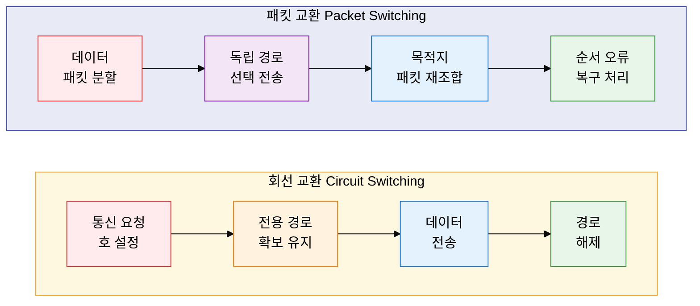

## 1. 데이터 전달 방식과 연결 구조의 설계 기반, 네트워크 아키텍처 기초의 개요

**정의**: 데이터 전달 방식(회선 교환·패킷 교환)과 물리적 연결 구조(토폴로지)를 체계적으로 설계하여 신뢰성 있는 통신 인프라를 구축하는 네트워크 설계 기반 기술.
- 회선 교환은 전용 경로를 사전에 확보하고, 패킷 교환은 데이터를 독립 패킷으로 분할해 공유 경로로 전송
- 네트워크 토폴로지는 노드 간 물리적·논리적 연결 형태를 정의하며 가용성·비용·확장성에 직접 영향
- 대규모 기업 네트워크 설계 시 교환 방식 선택과 토폴로지 구성이 성능·비용 최적화의 핵심 결정 요소

**특징**:
- **교환 방식 이원화**: 회선 교환(고정 대역폭 보장)과 패킷 교환(자원 공유 효율화)으로 서비스 특성에 따른 선택적 적용
- **토폴로지 다양성**: Mesh·Star·Bus·Ring·Tree 5가지 구조를 통해 가용성·비용·관리 복잡도 간 트레이드오프 최적화
- **계층적 확장성**: Tree 기반 계층 구조를 통해 소규모 LAN에서 대규모 WAN까지 동일 설계 원칙으로 확장 가능

---

## 2. 네트워크 아키텍처 기초의 핵심 구성 체계

### 가. 회선 교환 vs 패킷 교환

| 비교 항목 | 회선 교환 (Circuit Switching) | 패킷 교환 - 가상회선 | 패킷 교환 - 데이터그램 |
|---|---|---|---|
| **경로 설정** | 통신 전 전용 경로 사전 확보 | 논리적 경로 사전 설정 | 패킷별 독립 경로 결정 |
| **대역폭 보장** | 고정 대역폭 전용 보장 | 논리적 대역폭 보장 | 보장 없음, 최선 전달 |
| **전송 지연** | 예측 가능한 일정 지연 | 상대적으로 낮은 지연 | 가변적 지연(Jitter) 발생 |
| **장애 대응** | 경로 장애 시 재설정 필요 | 경로 장애 시 재설정 | 자동 우회 경로 선택 |
| **자원 효율** | 유휴 시에도 자원 점유 낭비 | 중간 수준 자원 효율 | 최대 자원 공유 효율 |
| **적합 서비스** | 음성 전화망(PSTN), 전용선 | ATM, Frame Relay, MPLS | IP 네트워크, 인터넷 |

---

### 나. 네트워크 토폴로지 5가지

```mermaid
%%{init: { 'theme': 'base', 'themeVariables': { 'edgeLabelBackground': '#fff' }}}%%
flowchart TD
    subgraph MESH["Mesh 완전 연결형"]
        M1["노드A"] --- M2["노드B"]
        M1 --- M3["노드C"]
        M2 --- M3
        style M1 fill:#1E3A5F,stroke:#1E3A5F,color:#fff
        style M2 fill:#1E3A5F,stroke:#1E3A5F,color:#fff
        style M3 fill:#1E3A5F,stroke:#1E3A5F,color:#fff
    end
    subgraph STAR["Star 성형"]
        SH["허브/스위치"]
        SA["노드A"] --- SH
        SB["노드B"] --- SH
        SC["노드C"] --- SH
        style SH fill:#E3F2FD,stroke:#1976D2,color:#000
        style SA fill:#F3E5F5,stroke:#7B1FA2,color:#000
        style SB fill:#F3E5F5,stroke:#7B1FA2,color:#000
        style SC fill:#F3E5F5,stroke:#7B1FA2,color:#000
    end
    subgraph BUS["Bus 버스형"]
        BB["공유 케이블"]
        BA["노드A"] --- BB
        BC["노드C"] --- BB
        style BB fill:#FFF3E0,stroke:#F57C00,color:#000
        style BA fill:#E8F5E9,stroke:#388E3C,color:#000
        style BC fill:#E8F5E9,stroke:#388E3C,color:#000
    end
    subgraph RING["Ring 링형"]
        RA["노드A"] --> RB["노드B"]
        RB --> RC["노드C"]
        RC --> RA
        style RA fill:#E0F2F1,stroke:#00796B,color:#000
        style RB fill:#E0F2F1,stroke:#00796B,color:#000
        style RC fill:#E0F2F1,stroke:#00796B,color:#000
    end
    subgraph TREE["Tree 트리형"]
        TR["코어 스위치"]
        TD1["배포 스위치1"]
        TD2["배포 스위치2"]
        TA1["액세스1"]
        TA2["액세스2"]
        TR --> TD1
        TR --> TD2
        TD1 --> TA1
        TD2 --> TA2
        style TR fill:#1E3A5F,stroke:#1E3A5F,color:#fff
        style TD1 fill:#E3F2FD,stroke:#1976D2,color:#000
        style TD2 fill:#E3F2FD,stroke:#1976D2,color:#000
        style TA1 fill:#F3E5F5,stroke:#7B1FA2,color:#000
        style TA2 fill:#F3E5F5,stroke:#7B1FA2,color:#000
    end
    style MESH fill:#FAFAFA,stroke:#90A4AE,color:#000
    style STAR fill:#FAFAFA,stroke:#90A4AE,color:#000
    style BUS fill:#FAFAFA,stroke:#90A4AE,color:#000
    style RING fill:#FAFAFA,stroke:#90A4AE,color:#000
    style TREE fill:#FAFAFA,stroke:#90A4AE,color:#000
```

| 토폴로지 | 구조 특징 | 장점 | 단점 | 주요 활용 환경 |
|---|---|---|---|---|
| **Mesh** | 모든 노드 간 직접 연결, 링크 수 = n(n-1)/2 | 최고 가용성, 경로 다중화, 장애 내성 극대화 | 구현 비용 매우 높음, 케이블 관리 복잡 | 핵심 백본, 데이터센터 코어, 군사 네트워크 |
| **Star** | 중앙 허브/스위치에 모든 노드 집중 연결 | 관리 용이, 장애 격리 단순, 확장 편리 | 중앙 장비 단일 장애점(SPOF), 허브 병목 | LAN, 기업 사무실, 소규모 네트워크 |
| **Bus** | 단일 공유 케이블에 모든 노드 분기 연결 | 구현 단순, 케이블 절약, 초기 비용 최소 | CSMA/CD 충돌, 케이블 단선 시 전체 마비 | 초기 이더넷(10BASE-2/5), 산업 제어망 |
| **Ring** | 노드가 순환 형태로 연결, 토큰 패싱 방식 | 순서 보장, 토큰으로 공정한 접근 제어 | 단일 링크 장애 시 전체 중단, 지연 증가 | Token Ring, FDDI, SDH/SONET 광전송망 |
| **Tree** | Star 구조의 계층적 확장, 3계층(코어·배포·액세스) | 계층적 확장 용이, 트래픽 분리 관리 효율 | 상위 노드 장애 시 하위 전체 영향, 복잡성 | 기업 LAN 표준 구조, 캠퍼스 네트워크 |

---

## 3. 네트워크 아키텍처 기초 도입의 기대효과 및 활용 방안

| 구분 | 주요 기대효과 | 활용 및 실무 적용 방안 |
|---|---|---|
| **설계 최적화** | 서비스 특성에 맞는 교환 방식 선택으로 대역폭 낭비 최소화 및 품질 보장 | QoS 요구 서비스(VoIP·화상회의)는 MPLS 가상회선, 일반 데이터는 IP 데이터그램 분리 적용 |
| **가용성 향상** | 토폴로지 이중화 설계로 단일 장애점 제거, 99.999% 고가용성 달성 | 코어 스위치 Mesh 이중화, 배포 계층 HSRP/VRRP 적용, 액세스 계층 Spanning Tree 구성 |
| **비용 효율** | 계층별 토폴로지 최적화로 불필요한 링크 비용 절감 및 TCO 감소 | 핵심 구간 Mesh·Tree 구조 병용, 엣지 구간 Star 집중화로 인프라 투자 효율화 |
| **장애 대응** | 패킷 교환 기반 자동 경로 우회로 장애 발생 시 서비스 연속성 확보 | OSPF·BGP 동적 라우팅 프로토콜과 연계하여 링크 장애 발생 수백 ms 내 자동 절체 |
