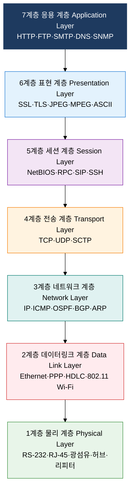

# OSI 7계층 및 TCP/IP 프로토콜 스택

## 1. 이기종 시스템 간 통신을 계층으로 표준화, OSI 7 Layer & TCP/IP 프로토콜 스택의 개요

**정의**: 이기종 컴퓨터 시스템 간 통신을 7개 계층으로 추상화하여 각 계층의 역할과 인터페이스를 표준화한 ISO/IEC 7498 참조 모델.
- 1984년 ISO(국제표준화기구)가 제정한 개방형 시스템 상호연결(OSI: Open Systems Interconnection) 표준
- 각 계층은 상하위 계층에 서비스를 제공하며, 동일 계층 간 프로토콜로 피어 통신 수행
- TCP/IP 4계층은 OSI 참조 모델을 실용적으로 구현한 인터넷 프로토콜 스택으로 현재 인터넷의 실질 표준

**특징**:
- **계층적 캡슐화**: 송신 시 상위 계층 데이터에 각 계층 헤더(및 트레일러)를 추가하는 캡슐화, 수신 시 역순으로 헤더를 제거하는 역캡슐화로 투명한 계층 간 전달 구현
- **계층 독립성**: 각 계층은 인접 계층의 서비스 인터페이스만 알면 되며 내부 구현은 독립적으로 변경 가능 — 계층별 기술 혁신과 교체 용이
- **표준 상호운용성**: 서로 다른 제조사 장비·운영체제 간에도 동일 계층 프로토콜 준수 시 투명한 통신 보장 — 벤더 종속 탈피

---

## 2. OSI 7 Layer & TCP/IP 프로토콜 스택의 핵심 구성 체계

### 가. OSI 7계층 전체 구성

| 계층 번호 | 계층명 | 핵심 기능 | PDU 명칭 | 주요 프로토콜 | 대표 장비 |
|---|---|---|---|---|---|
| **7** | 응용 계층 (Application) | 사용자 인터페이스, 응용 서비스 제공, 데이터 형식 정의 | 메시지 (Message) | HTTP, HTTPS, FTP, SMTP, POP3, DNS, SNMP, Telnet | 응용 서버, L7 스위치 |
| **6** | 표현 계층 (Presentation) | 데이터 형식 변환, 암·복호화, 압축·해제, 인코딩 | 메시지 (Message) | SSL/TLS, JPEG, MPEG, GIF, ASCII, EBCDIC, XDR | 게이트웨이 |
| **5** | 세션 계층 (Session) | 세션 수립·유지·종료, 동기화, 대화 제어, 체크포인트 | 메시지 (Message) | NetBIOS, RPC, PPTP, SIP, SSH, NFS | 게이트웨이 |
| **4** | 전송 계층 (Transport) | 종단 간 신뢰 전송, 흐름 제어, 오류 제어, 다중화 | 세그먼트 (Segment) / 데이터그램 | TCP, UDP, SCTP, DCCP | L4 스위치, 방화벽 |
| **3** | 네트워크 계층 (Network) | 논리 주소 지정(IP), 경로 선택(라우팅), 패킷 포워딩 | 패킷 (Packet) | IP, ICMP, IGMP, OSPF, BGP, RIP, ARP | 라우터, L3 스위치 |
| **2** | 데이터링크 계층 (Data Link) | 물리 주소(MAC) 지정, 프레임 구성, 오류 검출, 매체 접근 | 프레임 (Frame) | Ethernet, PPP, HDLC, 802.11, ATM, Frame Relay | 스위치, 브리지 |
| **1** | 물리 계층 (Physical) | 비트 스트림 전기·광 신호 변환, 물리 전송 매체 규정 | 비트 (Bit) | RS-232, V.35, RJ-45, 광섬유, DSL, USB | 허브, 리피터, NIC |

---

### 나. TCP/IP 4계층 매핑 + 캡슐화/역캡슐화

```mermaid
%%{init: { 'theme': 'base', 'themeVariables': { 'edgeLabelBackground': '#fff' }}}%%
flowchart LR
    subgraph TX["송신측 캡슐화 Encapsulation"]
        direction LR
        D1["애플리케이션 데이터<br/>Application Data"]
        D2["TCP/UDP 헤더 추가<br/>세그먼트 Segment"]
        D3["IP 헤더 추가<br/>패킷 Packet"]
        D4["MAC 헤더+트레일러<br/>프레임 Frame"]
        D5["비트 변환 전송<br/>Bit Stream"]
        D1 --> D2
        D2 --> D3
        D3 --> D4
        D4 --> D5
        style D1 fill:#1E3A5F,stroke:#1E3A5F,color:#fff
        style D2 fill:#FFF3E0,stroke:#F57C00,color:#000
        style D3 fill:#E0F2F1,stroke:#00796B,color:#000
        style D4 fill:#FFEBEE,stroke:#D32F2F,color:#000
        style D5 fill:#E8F5E9,stroke:#388E3C,color:#000
    end
    subgraph RX["수신측 역캡슐화 Decapsulation"]
        direction LR
        R5["비트 수신<br/>Bit Stream"]
        R4["MAC 헤더 제거<br/>프레임 역캡슐화"]
        R3["IP 헤더 제거<br/>패킷 역캡슐화"]
        R2["TCP/UDP 헤더 제거<br/>세그먼트 역캡슐화"]
        R1["원본 데이터 복원<br/>Application Data"]
        R5 --> R4
        R4 --> R3
        R3 --> R2
        R2 --> R1
        style R5 fill:#E8F5E9,stroke:#388E3C,color:#000
        style R4 fill:#FFEBEE,stroke:#D32F2F,color:#000
        style R3 fill:#E0F2F1,stroke:#00796B,color:#000
        style R2 fill:#FFF3E0,stroke:#F57C00,color:#000
        style R1 fill:#1E3A5F,stroke:#1E3A5F,color:#fff
    end
    D5 --"물리 매체 전송"--> R5
    style TX fill:#F8F9FA,stroke:#90A4AE,color:#000
    style RX fill:#F8F9FA,stroke:#90A4AE,color:#000
```

| TCP/IP 계층 | OSI 7계층 매핑 | PDU 명칭 | 주요 프로토콜 | 계층 역할 |
|---|---|---|---|---|
| **응용 계층 (Application)** | 7계층(응용) + 6계층(표현) + 5계층(세션) | 메시지 (Message) | HTTP/S, FTP, SMTP, POP3, DNS, SNMP, SSH, Telnet | 사용자 서비스 제공, 데이터 형식·세션 관리 통합 처리 |
| **전송 계층 (Transport)** | 4계층(전송) | 세그먼트 / 데이터그램 | TCP(연결 지향·신뢰), UDP(비연결·고속) | 포트 기반 다중화, TCP 3-way Handshake, 흐름·오류·혼잡 제어 |
| **인터넷 계층 (Internet)** | 3계층(네트워크) | 패킷 (Packet) | IPv4, IPv6, ICMP, IGMP, OSPF, BGP, RIP | IP 주소 기반 논리 주소 지정, 라우팅, 단편화 및 재조립 |
| **네트워크 접근 계층 (Network Access)** | 2계층(데이터링크) + 1계층(물리) | 프레임 / 비트 | Ethernet, Wi-Fi(802.11), PPP, ARP, RARP | MAC 주소 기반 프레임 전송, 물리 신호 변환 및 매체 접근 제어 |

---

## 3. OSI 7 Layer & TCP/IP 프로토콜 스택 도입의 기대효과 및 활용 방안

| 구분 | 주요 기대효과 | 활용 및 실무 적용 방안 |
|---|---|---|
| **표준 상호운용성** | 서로 다른 제조사 장비·OS 간 통신 보장으로 벤더 종속(Vendor Lock-in) 해소 및 멀티벤더 환경 구축 가능 | 라우터(Cisco)·스위치(Arista)·방화벽(Palo Alto) 혼용 환경에서 동일 프로토콜(BGP·OSPF·TCP/IP) 기반 연동 |
| **장애 계층 격리** | 7계층 모델 기반 장애 발생 계층 신속 식별로 MTTR(평균 복구 시간) 단축 및 불필요한 전체 계층 점검 제거 | Ping(3계층)·Telnet(4계층)·HTTP(7계층) 순차 테스트로 장애 계층을 30초 내 격리, 담당 팀 빠른 에스컬레이션 |
| **보안 계층 설계** | 계층별 보안 통제 적용으로 심층 방어(Defense in Depth) 구현, 단일 계층 침해 시 상위 계층 보호 유지 | 1계층(물리 잠금)·2계층(802.1X)·3계층(ACL·방화벽)·4계층(IPS)·7계층(WAF) 다층 보안 아키텍처 구성 |
| **프로토콜 독립 개발** | 계층 인터페이스 표준화로 상하위 계층 구현 변경 없이 특정 계층 프로토콜만 교체·개선 가능 | IPv4→IPv6 전환 시 상위 TCP·HTTP 계층 무변경 유지, 전송 계층에 QUIC 프로토콜 도입 시 응용 계층 영향 최소화 |
