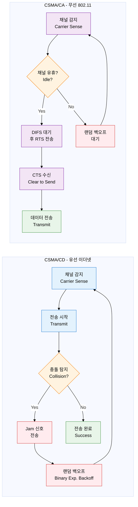

## 1. 충돌 방지와 에러 복구로 신뢰성 있는 링크 확보, L1/L2 MAC 및 에러·흐름 제어의 개요

**정의**: 공유 전송 매체에서 충돌을 방지·탐지하고, ARQ 기반 재전송으로 데이터 신뢰성을 확보하는 L1/L2 핵심 제어 메커니즘.
- 매체 접근 제어(MAC)는 여러 노드가 동일 채널을 공유할 때 전송 순서와 충돌 처리를 결정한다.
- 에러 제어(ARQ)는 프레임 손실·훼손을 탐지하고 재전송 범위를 결정하며 신뢰성 전송을 보장한다.
- 흐름 제어는 수신자 처리 용량을 초과하지 않도록 송신 속도를 조절하여 버퍼 오버플로를 방지한다.

**특징**:
- **충돌 처리 이중화**: 유선(CSMA/CD)은 충돌 탐지 후 재전송, 무선(CSMA/CA)은 전송 전 충돌 회피 — 매체 특성별 최적 전략 적용
- **파이프라인 전송**: 슬라이딩 윈도우로 ACK 대기 없이 연속 전송하여 채널 효율을 극대화 — Stop-and-Wait 대비 대폭 성능 향상
- **선택적 재전송**: Go-Back-N과 Selective Repeat ARQ로 오류 범위를 최소화하여 불필요한 재전송 트래픽 감소

---

## 2. L1/L2 MAC 및 에러·흐름 제어의 핵심 구성 체계

### 가. 매체 접근 제어 (MAC)

| 비교 항목 | CSMA/CD | CSMA/CA |
|---|---|---|
| **적용 환경** | 유선 이더넷 (IEEE 802.3) | 무선 LAN (IEEE 802.11 Wi-Fi) |
| **충돌 처리 방식** | 충돌 탐지 후 Jam 신호 → 랜덤 백오프 재전송 | 전송 전 RTS/CTS 핸드셰이크로 충돌 회피 |
| **채널 효율** | 충돌 빈번 시 효율 저하, 부하 낮으면 고효율 | 오버헤드 존재하나 충돌 없어 무선 환경 안정 |
| **동작 방식** | 전송 중 충돌 감지 가능 (신호 강도 모니터링) | 무선은 충돌 감지 불가 → 회피 우선 전략 |
| **핵심 메커니즘** | Binary Exponential Backoff (충돌 시 대기 시간 2배 증가) | DIFS 대기 + RTS/CTS + SIFS + ACK 교환 |

---

### 나. 에러 제어 및 흐름 제어 (ARQ)

```mermaid
%%{init: { 'theme': 'base', 'themeVariables': { 'edgeLabelBackground': '#fff' }}}%%
flowchart LR
    subgraph SW["Stop-and-Wait"]
        S1["프레임 1 전송"] --> S2["ACK 대기"] --> S3["프레임 2 전송"]
    end
    subgraph SLD["Sliding Window"]
        W1["프레임 1 전송"] --> W2["프레임 2 전송"] --> W3["프레임 3 전송"] --> W4["ACK 1 수신<br/>윈도우 슬라이드"]
        W4 --> W5["프레임 4 전송"]
    end
    subgraph GBN["Go-Back-N ARQ"]
        G1["프레임 1~4<br/>연속 전송"] --> G2["프레임 3 오류<br/>NAK 수신"] --> G3["프레임 3~4<br/>전체 재전송"]
    end
    subgraph SR["Selective Repeat ARQ"]
        R1["프레임 1~4<br/>연속 전송"] --> R2["프레임 3 오류<br/>NAK 수신"] --> R3["프레임 3만<br/>선택 재전송"]
    end
    style S1 fill:#E3F2FD,stroke:#1976D2,color:#000
    style S2 fill:#FFF3E0,stroke:#F57C00,color:#000
    style S3 fill:#E3F2FD,stroke:#1976D2,color:#000
    style W1 fill:#F3E5F5,stroke:#7B1FA2,color:#000
    style W2 fill:#F3E5F5,stroke:#7B1FA2,color:#000
    style W3 fill:#F3E5F5,stroke:#7B1FA2,color:#000
    style W4 fill:#E8F5E9,stroke:#388E3C,color:#000
    style W5 fill:#F3E5F5,stroke:#7B1FA2,color:#000
    style G1 fill:#E0F2F1,stroke:#00796B,color:#000
    style G2 fill:#FFEBEE,stroke:#D32F2F,color:#000
    style G3 fill:#FFF3E0,stroke:#F57C00,color:#000
    style R1 fill:#E0F2F1,stroke:#00796B,color:#000
    style R2 fill:#FFEBEE,stroke:#D32F2F,color:#000
    style R3 fill:#E8F5E9,stroke:#388E3C,color:#000
```

| ARQ 방식 | 동작 원리 | 효율성 | 수신 버퍼 | 적합 환경 |
|---|---|---|---|---|
| **Stop-and-Wait** | 1개 프레임 전송 후 ACK 수신 시까지 대기 | 매우 낮음 (RTT마다 1프레임) | 불필요 | 짧은 거리, 단순 구현 |
| **Sliding Window** | 윈도우 크기(W)만큼 연속 전송, ACK 수신 시 윈도우 전진 | 높음 (W개 파이프라인) | 필요 (W개 버퍼) | 고속·장거리 링크 |
| **Go-Back-N ARQ** | 오류 프레임 번호 N부터 이후 전체 재전송 | 중간 (오류 시 재전송 범위 큼) | 송신측만 | 단순 구현, 오류 적은 환경 |
| **Selective Repeat** | 오류 프레임만 선택하여 재전송, 나머지는 유지 | 가장 높음 (최소 재전송) | 송신·수신 모두 | 오류 빈번, 고성능 요구 |

> **슬라이딩 윈도우 핵심**: 윈도우 크기 W = 2^n - 1 (Go-Back-N), W = 2^(n-1) (Selective Repeat). n은 순서번호 비트 수.

---

## 3. L1/L2 MAC 및 에러·흐름 제어 도입의 기대효과 및 활용 방안

| 구분 | 주요 기대효과 | 활용 및 실무 적용 방안 |
|---|---|---|
| **매체 접근 제어** | 공유 매체 충돌 최소화로 네트워크 처리량 향상 및 지연 감소 | 유선망은 CSMA/CD Full-Duplex 스위치 환경, 무선망은 CSMA/CA + QoS(802.11e) 적용 |
| **오류 제어** | ARQ 기반 자동 재전송으로 데이터 무결성 보장, 상위 레이어 부담 감소 | TCP 슬라이딩 윈도우·Selective ACK(SACK) 설계에 ARQ 원리 직접 적용 |
| **흐름 제어** | 수신 버퍼 오버플로 방지, 송수신 속도 불일치 해소로 안정적 전송 보장 | 네트워크 장비 QoS 정책에서 버퍼 크기·윈도우 스케일링 파라미터 튜닝 |
| **시험·보안 활용** | 네트워크 계층 취약점 분석 및 프로토콜 설계 기초 이해 제공 | CSMA/CA RTS/CTS 비활성화 취약점 분석, ARQ 타임아웃·재전송 공격 대응 설계 |
