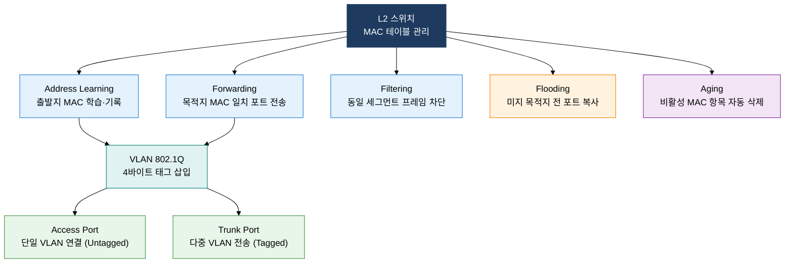
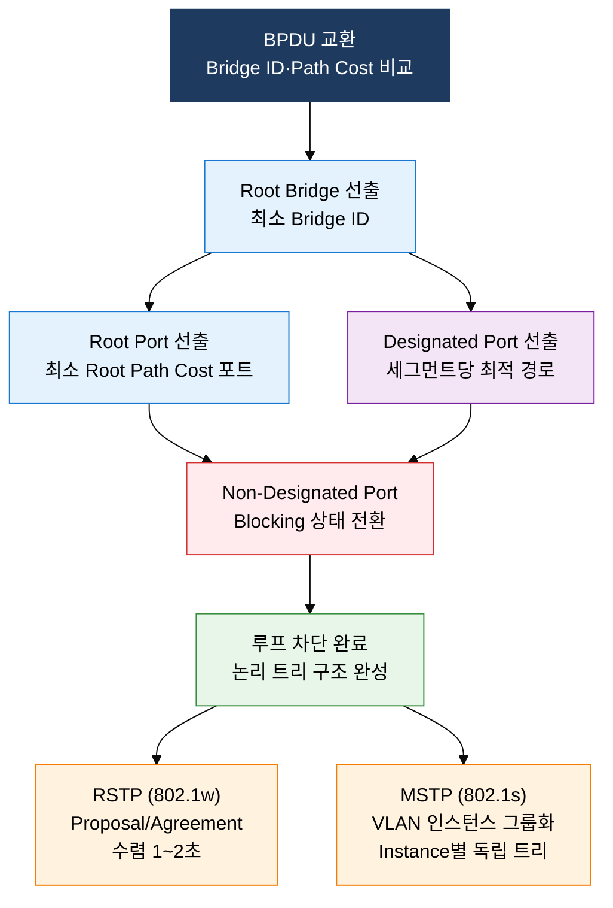

# L2 스위치·VLAN·STP

## 1. MAC 학습·VLAN 분리·STP 루프 차단으로 L2 안정화, L2 스위치·VLAN·STP의 개요

**정의**: MAC 주소 학습 기반 선택적 프레임 포워딩, IEEE 802.1Q VLAN 트렁킹, STP 루프 방지로 L2 네트워크 안정성을 확보하는 데이터링크 계층 스위칭 메커니즘.
- L2 스위치는 MAC 주소 테이블(CAM Table)을 동적으로 관리하며 불필요한 브로드캐스트를 억제한다.
- VLAN은 물리적 토폴로지와 독립적으로 논리 브로드캐스트 도메인을 분리하여 보안·성능을 향상시킨다.
- STP는 중복 경로에서 루프를 방지하고, RSTP/MSTP로 진화하며 수렴 시간과 VLAN 확장성을 개선한다.

**특징**:
- **선택적 포워딩**: MAC 테이블 기반으로 목적지 포트만 전송하여 충돌 도메인을 포트 단위로 분리 — 허브 대비 대역폭 활용률 대폭 향상
- **논리 분리(VLAN)**: IEEE 802.1Q 4바이트 태그로 물리 인프라 변경 없이 최대 4094개 독립 네트워크 구성 — 브로드캐스트 도메인 제어
- **루프 방지(STP)**: Root Bridge 선출 및 포트 역할 지정으로 논리 트리 구조 형성, RSTP는 50초 수렴을 1~2초로 단축

---

## 2. L2 스위치·VLAN·STP의 핵심 구성 체계

### 가. L2 스위치 동작 5원칙과 VLAN

| 동작명 | 설명 | 조건 | 결과 |
|---|---|---|---|
| **Address Learning** | 수신 프레임 출발지 MAC + 인입 포트를 CAM 테이블에 기록 | 모든 수신 프레임 | MAC 테이블 동적 구축 |
| **Forwarding** | 목적지 MAC이 테이블에 있으면 해당 포트로만 전송 | 목적지 MAC 일치 | 유니캐스트 선택 전달 |
| **Filtering** | 출발지·목적지가 동일 포트면 전송 차단 | 동일 세그먼트 내 통신 | 불필요한 트래픽 제거 |
| **Flooding** | 목적지 MAC 미등록 또는 브로드캐스트/멀티캐스트 | 미지 유니캐스트·브로드캐스트 | 전 포트 복사 전달 |
| **Aging** | 일정 시간(기본 300초) MAC 미사용 시 항목 삭제 | 타임아웃 경과 | 테이블 최신 상태 유지 |

> **IEEE 802.1Q 태그 구조**: TPID(2B, 0x8100) + PCP(3bit 우선순위) + DEI(1bit 폐기 지시) + VID(12bit, VLAN ID 0~4095, 유효 4094개)

---

### 나. STP·RSTP·MSTP 루프 방지 메커니즘

**STP 5가지 포트 상태**: Disabled → Blocking → Listening → Learning → Forwarding

- **Blocking**: BPDU 수신만 가능, 데이터 프레임 차단 (20초 대기)
- **Listening**: BPDU 송수신, 포트 역할 결정 중 (15초 대기, Forward Delay)
- **Learning**: MAC 주소 학습 시작, 데이터 미전송 (15초 대기, Forward Delay)
- **Forwarding**: 완전 동작 상태, 데이터 프레임 송수신
- **Disabled**: 관리자 비활성화 또는 장애 상태

| 비교 항목 | STP (802.1D) | RSTP (802.1w) | MSTP (802.1s) |
|---|---|---|---|
| **표준** | IEEE 802.1D-1998 | IEEE 802.1w-2001 | IEEE 802.1s-2002 |
| **수렴 시간** | 30~50초 (MaxAge + 2×ForwardDelay) | 1~2초 (Proposal/Agreement 핸드셰이크) | 1~2초 (RSTP 기반) |
| **VLAN 지원** | 단일 인스턴스 (모든 VLAN 공유) | 단일 인스턴스 (PVST+는 Cisco 확장) | 다중 VLAN 인스턴스 그룹화 |
| **포트 상태** | 5가지 (Disabled/Blocking/Listening/Learning/Forwarding) | 3가지 (Discarding/Learning/Forwarding) | 3가지 (RSTP 준용) |
| **특징** | TCN(토폴로지 변경 알림) 루트까지 전파 | Edge Port/P2P 링크 즉시 Forwarding | MST Region 내 인스턴스별 독립 로드밸런싱 |

> **Bridge ID 구성**: Priority(4bit, 기본 32768) + VLAN ID(12bit) + MAC 주소(6B). `spanning-tree vlan [id] priority [값]`으로 Root Bridge 강제 지정.

**RSTP 핵심 개선 사항**:
- **Proposal/Agreement 핸드셰이크**: 업스트림 Designated Port가 Proposal 전송 → 하위 스위치 비edge 포트를 즉시 Discarding 전환 후 Agreement 응답 → 즉각 Forwarding 전환. Timer 대기 불필요.
- **Edge Port(PortFast)**: 단말 연결 포트로 즉시 Forwarding 진입. BPDU 수신 시 자동으로 일반 STP 포트로 복귀 (BPDUGuard 결합 시 포트 Err-Disable 처리로 공격 방어).
- **P2P 링크 자동 감지**: Full-Duplex 포트를 P2P로 자동 인식하여 빠른 수렴 적용.

**MSTP 구성 요소**:
- **MST Region**: 동일 Region Name·Revision Number·VLAN 매핑 테이블을 공유하는 스위치 그룹
- **IST (Internal Spanning Tree)**: Region 내 기본 인스턴스(Instance 0), 외부 RSTP와 통신
- **MSTI (Multiple Spanning Tree Instance)**: VLAN 그룹을 인스턴스에 매핑하여 독립 로드밸런싱 (예: VLAN 10~20 → Instance 1, VLAN 30~40 → Instance 2)

---

## 3. L2 스위치·VLAN·STP 도입의 기대효과 및 활용 방안

| 구분 | 주요 기대효과 | 활용 및 실무 적용 방안 |
|---|---|---|
| **보안·격리** | VLAN 분리로 부서·시스템 간 브로드캐스트 및 무단 접근 차단, 침해 사고 확산 범위 최소화 | 관리망·서버망·사용자망 VLAN 분리, 802.1X 포트 인증 결합하여 VLAN 동적 할당 구현 |
| **가용성** | STP/RSTP 루프 방지로 브로드캐스트 스톰 근절, 이중화 링크에서 빠른 장애 전환 보장 | 코어·액세스 계층 이중 업링크 구성 + RSTP PortFast/BPDUGuard 적용, MSTP로 링크 로드밸런싱 |
| **성능** | MAC 기반 선택적 포워딩으로 불필요한 트래픽 제거, 충돌 도메인 포트 단위 분리로 전이중 통신 | 802.1Q 트렁킹 + 802.3ad LACP 링크 집성으로 업링크 대역폭 확장, QoS PCP 우선순위 태깅 |
| **운영·확장** | 물리 배선 변경 없이 VLAN 재구성으로 조직 변화 신속 대응, 네트워크 세분화 비용 절감 | VTP(VLAN Trunking Protocol) 또는 MLAG 기반 캠퍼스 네트워크 통합 관리, SDN 컨트롤러 연계 자동화 |
