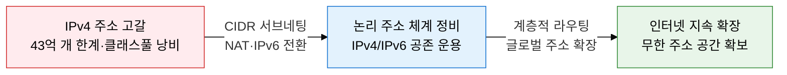
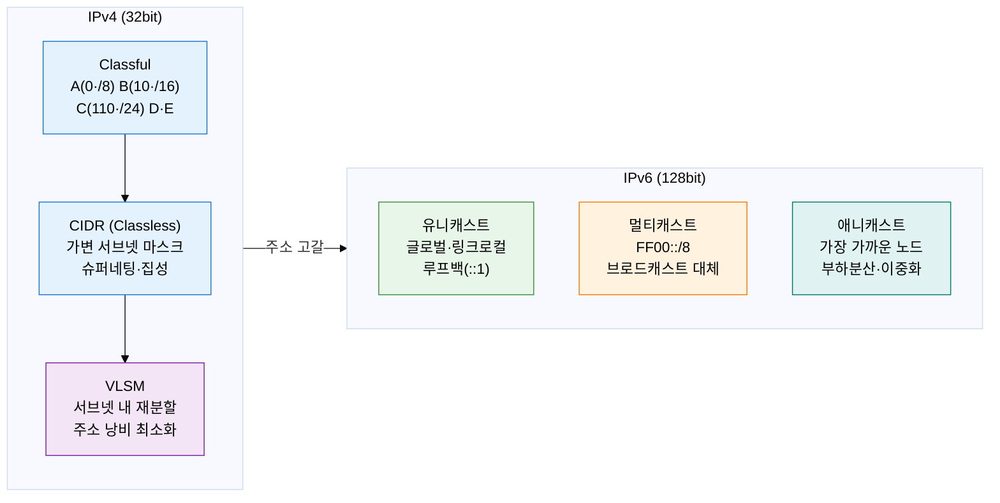
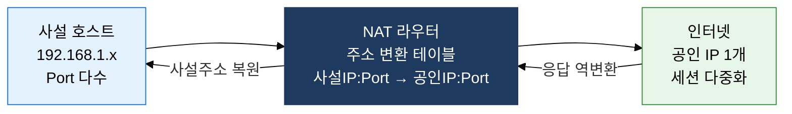

# L3 IP 주소 체계 (IPv4/IPv6/NAT)

## 1. 논리 주소 체계와 IPv4 고갈 극복 전략, L3 IP 주소 체계의 개요

**정의**: 네트워크 계층에서 논리적 엔드포인트를 식별하고, CIDR 서브네팅·NAT·IPv6 전환 기술로 IPv4 주소 고갈을 극복하는 인터넷 주소 관리 체계.
- IPv4(32비트)는 CIDR과 NAT로 수명을 연장하며, IPv6(128비트)로의 단계적 전환이 진행 중이다.
- VLSM 기반 서브네팅은 주소 공간 낭비를 최소화하고 라우팅 테이블 효율을 향상시킨다.
- NAT/PAT는 사설 주소 공간에서 공인 주소를 공유하여 IPv4 고갈을 현실적으로 완화한다.

**특징**:
- **계층적 주소 설계**: 네트워크/호스트 비트 분리로 계층적 라우팅 가능, VLSM으로 서브넷 크기 최적 할당
- **주소 절약 메커니즘**: NAT/PAT로 단일 공인 IP에 수천 사설 노드 연결, RFC 1918 사설 주소 활용
- **IPv6 미래 대비**: 128비트 주소 공간(3.4×10^38개), IPsec 기본 탑재, 이동성·자동 설정 기능 강화

---

## 2. L3 IP 주소 체계의 핵심 구성 체계

### 가. IPv4·IPv6 주소 체계와 서브네팅

**CIDR 서브네팅 핵심**: 네트워크 주소 = IP AND 서브넷 마스크. /26 = 255.255.255.192, 호스트 수 = 2^6 - 2 = 62개.

| 비교 항목 | IPv4 | IPv6 |
|---|---|---|
| **주소 길이** | 32비트 (4옥텟 점 십진수) | 128비트 (8그룹 콜론 16진수) |
| **주소 공간** | 약 43억 개 (2^32) | 약 3.4×10^38개 (2^128) |
| **헤더 크기** | 20~60바이트 (가변, 옵션 포함) | 40바이트 고정 (확장 헤더 별도) |
| **브로드캐스트** | 지원 (서브넷 브로드캐스트) | 미지원 → 멀티캐스트·애니캐스트로 대체 |
| **보안** | IPsec 선택 사항 | IPsec 기본 내장, AH·ESP 지원 |
| **자동 설정** | DHCP 필요 | SLAAC (Stateless Address Auto-Configuration) 기본 지원 |

> **RFC 1918 사설 주소**: 10.0.0.0/8, 172.16.0.0/12, 192.168.0.0/16 — 인터넷 라우팅 불가, NAT 필수.

---

### 나. IPv4→IPv6 전환 기술과 NAT/PAT

**IPv4 주소 고갈 대응 역사**: IANA는 2011년 2월 마지막 /8 블록을 각 RIR에 배분 완료. APNIC·RIPE NCC·ARIN·LACNIC 순서로 IPv4 주소 소진. 현재 IPv4는 중고 주소 거래 시장과 NAT/CGN(Carrier-Grade NAT)으로 연명 중.

**IPv4→IPv6 전환 3대 기술**

| 전환 기술 | 동작 원리 | 장점 | 단점 | 적용 시점 |
|---|---|---|---|---|
| **듀얼 스택** | 장비에 IPv4·IPv6 주소 동시 할당, 상대방에 따라 프로토콜 선택 | 완전 호환·단계적 전환 가능 | 장비 자원 2배 소요 | IPv6 초기 도입 단계 |
| **터널링** | IPv6 패킷을 IPv4 헤더로 캡슐화 전송 (6in4, Teredo, ISATAP) | 기존 IPv4 인프라 활용 | 캡슐화 오버헤드·MTU 문제 | IPv4 망이 지배적인 과도기 |
| **변환(NAT64/DNS64)** | IPv6 전용 클라이언트 ↔ IPv4 서버 간 주소·프로토콜 변환 | IPv6 전용 환경에서 IPv4 접근 | 상태 저장 변환 복잡도 증가 | IPv6 주도 전환 완료 단계 |

**NAT 유형 비교**

| NAT 유형 | 동작 방식 | 변환 대상 | 세션 수 | 주요 용도 |
|---|---|---|---|---|
| **Static NAT** | 사설 IP 1:1 → 공인 IP 고정 매핑 | IP 주소만 변환 | 1:1 고정 | 내부 서버 외부 노출 (웹·메일) |
| **Dynamic NAT** | 공인 IP 풀에서 동적 할당, 세션 종료 시 반납 | IP 주소만 변환 | 풀 크기 내 | 다수 호스트 인터넷 접속 |
| **PAT(NAPT)** | 공인 IP 1개 + 포트 번호로 다수 사설 호스트 다중화 | IP + 포트 모두 변환 | 최대 65535 포트 | 가정·기업 인터넷 공유 (가장 일반적) |

> **NAT 테이블 동작**: 내부 출발지 IP:Port → 공인 IP:변환Port 매핑 저장. 응답 수신 시 역방향 변환 후 내부 전달. 세션 타임아웃(TCP 300초, UDP 30초) 시 항목 제거.

**NAT ALG (Application Layer Gateway) 주요 고려 사항**:
- FTP Active 모드: 데이터 채널 포트 협상 내용이 페이로드에 포함 → ALG가 페이로드 내부 IP:Port도 변환 필요
- SIP/VoIP: SDP(Session Description Protocol) 내 미디어 주소·포트를 NAT가 인식·변환하지 않으면 음성 불통 발생
- H.323: 복잡한 포트 협상 구조로 ALG 또는 STUN/TURN/ICE 기반 NAT 투과 기술 병행 필요

**IPv6 주소 자동 설정 (SLAAC)**:
- 라우터가 RA(Router Advertisement) 메시지로 /64 접두사 광고
- 호스트는 EUI-64(인터페이스 ID = MAC 48비트 확장) 또는 임시 주소(RFC 4941)로 자동 완성
- DHCPv6 Stateful 또는 Stateless(RDNSS 옵션)로 DNS 정보 추가 배포 가능

---

## 3. L3 IP 주소 체계 도입의 기대효과 및 활용 방안

| 구분 | 주요 기대효과 | 활용 및 실무 적용 방안 |
|---|---|---|
| **주소 효율** | CIDR·VLSM으로 주소 낭비 최소화, 계층적 요약으로 라우팅 테이블 크기 감소 | 부서·기능별 서브넷 설계 시 VLSM 적용, BGP 요약 광고로 ISP 라우팅 테이블 최적화 |
| **IPv4 수명 연장** | NAT/PAT로 소수 공인 IP에 대규모 사설망 수용, 공인 IP 비용 절감 | 기업 DMZ는 Static NAT(서버 공개), 내부망은 PAT 적용, ALG로 FTP·SIP NAT 투과 처리 |
| **IPv6 전환** | 128비트 주소로 IoT·모바일 폭발적 증가 수용, IPsec 기본 제공으로 보안 강화 | 듀얼 스택으로 단계적 전환, DNS64·NAT64 배치로 IPv6 전용 클라이언트 IPv4 서비스 접근 보장 |
| **보안·가시성** | NAT로 내부 토폴로지 은폐, RFC 1918 사설 주소는 외부 직접 접근 차단 | NAT 로그 기반 세션 추적·보안 감사, IP 주소 관리(IPAM) 시스템으로 자산 현황 실시간 관리 |
