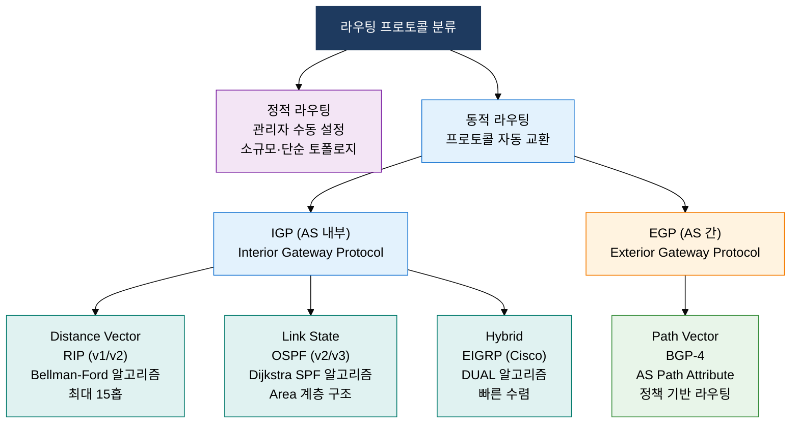
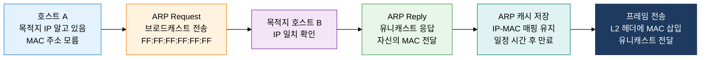

## 1. 최적 경로를 동적으로 탐색·갱신하는 라우팅 체계, L3 라우팅 프로토콜의 개요

**정의**: 네트워크 토폴로지 정보를 인접 라우터와 교환하고 알고리즘으로 최적 경로를 계산·갱신하며, ARP·ICMP·IGMP 보조 프로토콜로 주소 해석·진단·멀티캐스트 그룹을 지원하는 L3 라우팅 체계.
- 동적 라우팅은 토폴로지 변화를 자동 감지하여 새 경로로 수렴하며, 정적 라우팅 대비 운영 부담을 최소화한다.
- IGP(내부 게이트웨이 프로토콜)는 단일 AS 내 최적 경로를, EGP/BGP는 AS 간 정책 기반 라우팅을 담당한다.
- ARP·ICMP·IGMP는 IP 계층의 주소 해석, 오류 보고, 그룹 관리 기능을 제공하는 필수 보조 프로토콜이다.

**특징**:
- **알고리즘 다양성**: Distance Vector(Bellman-Ford), Link State(Dijkstra), Path Vector(BGP) — 규모·목적에 맞는 알고리즘 선택
- **계층적 설계**: IGP(RIP/OSPF)와 EGP(BGP) 분리로 AS 내·외부 라우팅 정책 독립 관리, 확장성 보장
- **빠른 수렴**: OSPF LSA 플러딩 + SPF 재계산으로 링크 장애 후 수초 내 대체 경로 적용

---

## 2. L3 라우팅 프로토콜의 핵심 구성 체계

### 가. 라우팅 프로토콜 분류 (RIP·OSPF·BGP)

**OSPF Area 구조**: Backbone(Area 0) ↔ Regular Area(ABR 연결) / ASBR(외부 AS 재분배) / Stub Area(외부 경로 차단)

**RIP 루프 방지 메커니즘**:
- **Split Horizon**: 경로 학습한 인터페이스로 동일 경로 재광고 금지
- **Poison Reverse**: 루프 방지를 위해 학습된 경로를 메트릭 16(무한대)으로 역광고
- **Holddown Timer**: 경로 소멸 후 일정 시간 동안 업데이트 무시하여 루프 방지

| 비교 항목 | RIP (v2) | OSPF (v2) | BGP-4 |
|---|---|---|---|
| **알고리즘** | Bellman-Ford (Distance Vector) | Dijkstra SPF (Link State) | Path Vector (AS Path) |
| **적용 범위** | IGP, 소규모 AS 내부 | IGP, 중대형 기업·ISP AS 내부 | EGP, ISP 간 인터넷 AS 연결 |
| **메트릭** | 홉 카운트 (최대 15홉) | Cost (대역폭 기반, 10^8/BW) | AS Path 길이 + MED/Local Pref 정책 |
| **수렴 속도** | 느림 (180초 타임아웃 + 전파 지연) | 빠름 (LSA 플러딩 + SPF 즉시 재계산) | 느림 (정책 우선, BGP 속성 협상) |
| **규모** | 소규모 (15홉 한계) | 대규모 (Area 계층화로 확장) | 인터넷 전체 (수십만 BGP 경로) |

---

### 나. 보조 프로토콜 (ARP·ICMP·IGMP)

**ICMP 주요 메시지 및 동작**:
- **ping (Echo Request/Reply)**: Type 8(요청)/Type 0(응답), 왕복 지연(RTT) 측정 및 호스트 생존 확인
- **Traceroute**: TTL을 1부터 1씩 증가시켜 전송, 경유 라우터마다 ICMP Time Exceeded(Type 11) 수신으로 경로 추적
- **Destination Unreachable (Type 3)**: 도달 불가 사유 코드(Net/Host/Port/Protocol Unreachable 등) 포함
- **Redirect (Type 5)**: 라우터가 더 나은 게이트웨이로 호스트 경로 재지정

**IGMP 멀티캐스트 그룹 관리**:
- **IGMP v1/v2 Join**: 호스트가 멀티캐스트 그룹 가입 요청 (224.x.x.x 클래스 D)
- **IGMP v2 Leave**: 그룹 탈퇴 명시 메시지로 즉시 탈퇴, v1 대비 트래픽 조기 차단
- **IGMP Querier 선출**: 가장 낮은 IP의 라우터가 Querier 역할, 주기적 Membership Query 전송
- **IGMP Snooping**: 스위치가 IGMP 패킷 감시하여 멀티캐스트 프레임을 필요 포트만 전달

| 비교 항목 | ARP | ICMP | IGMP |
|---|---|---|---|
| **목적** | IP 주소 → MAC 주소 변환 (L3→L2 주소 매핑) | IP 계층 오류 보고·진단·제어 메시지 전달 | 멀티캐스트 그룹 가입·탈퇴·관리 |
| **계층** | L2·L3 경계 (Ethernet 프레임 내 별도 프로토콜) | L3 (IP 데이터그램 내 캡슐화) | L3 (IP 프로토콜 번호 2) |
| **주요 메시지** | Request(브로드캐스트) / Reply(유니캐스트) / Gratuitous ARP | Echo Req/Reply, Time Exceeded, Dest Unreachable, Redirect | Membership Query, Report(Join), Leave |
| **활용** | 게이트웨이·호스트 MAC 해석, ARP 스푸핑 탐지 | ping·Traceroute 네트워크 진단, 방화벽 ICMP 정책 설정 | IPTV·화상회의 멀티캐스트 스트리밍, IGMP Snooping으로 스위치 최적화 |

> **Gratuitous ARP**: 자신의 IP로 ARP Request 전송. 목적: IP 충돌 감지, ARP 캐시 갱신, FHRP(HSRP/VRRP) Failover 시 신속한 MAC 업데이트.

---

## 3. L3 라우팅 프로토콜 도입의 기대효과 및 활용 방안

| 구분 | 주요 기대효과 | 활용 및 실무 적용 방안 |
|---|---|---|
| **가용성** | OSPF·BGP 동적 수렴으로 링크 장애 시 수초 내 자동 우회 경로 전환, 서비스 중단 최소화 | 코어 라우터 이중화 + OSPF BFD(Bidirectional Forwarding Detection)로 100ms 수준 장애 감지·전환 |
| **확장성** | OSPF Area 계층화로 대규모 기업망 라우팅 테이블 분산, BGP 경로 요약으로 인터넷 확장성 보장 | ISP 연결 시 BGP 멀티홈(두 ISP 이상 연결) 구성, 인바운드·아웃바운드 트래픽 엔지니어링 정책 적용 |
| **보안·통제** | BGP AS Path 필터로 경로 하이재킹 방어, ARP 인스펙션·ICMP Rate Limiting으로 L3 공격 대응 | Dynamic ARP Inspection(DAI)·IP Source Guard로 ARP 스푸핑 차단, BGP RPKI로 AS 경로 진위 검증 |
| **운영 효율** | 동적 라우팅 자동화로 수동 정적 경로 관리 부담 제거, IGMP Snooping으로 멀티캐스트 트래픽 최적 배포 | 네트워크 자동화 플랫폼(Ansible/NAPALM) 연계 OSPF/BGP 설정 관리, IPAM·NMS 통합 경로 가시성 확보 |
